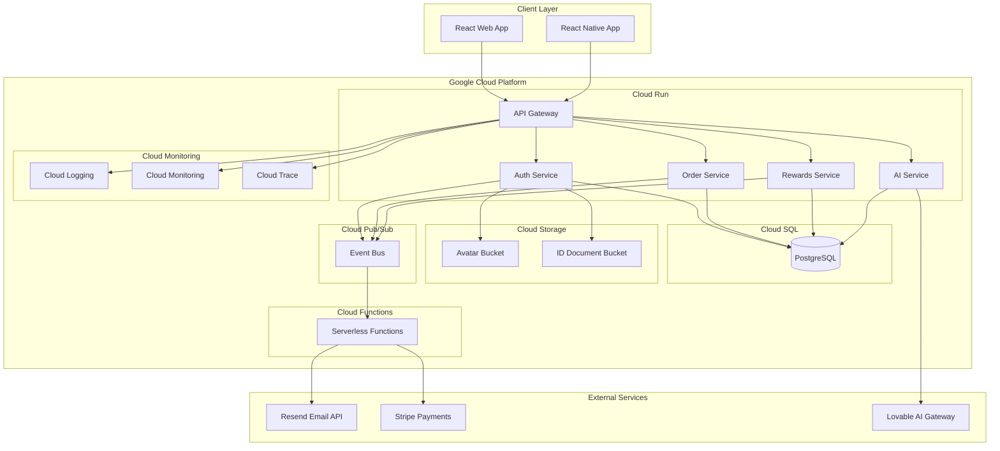
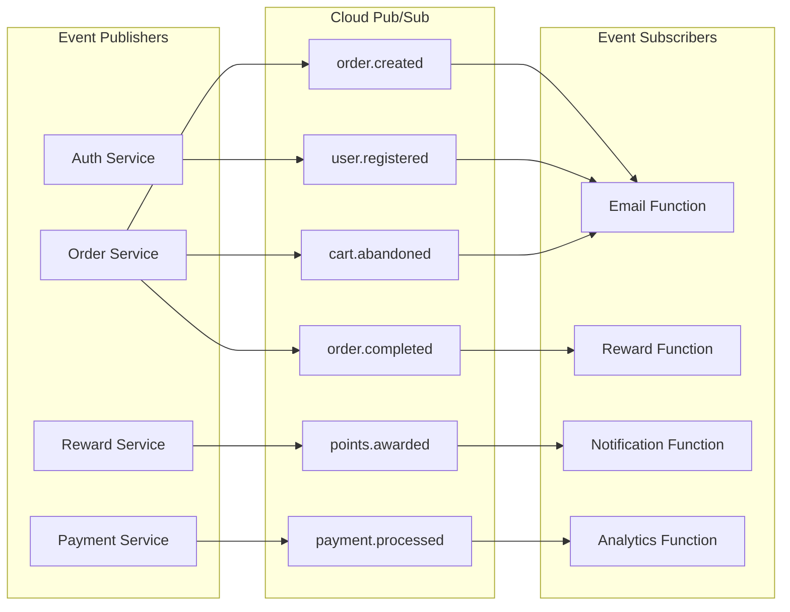
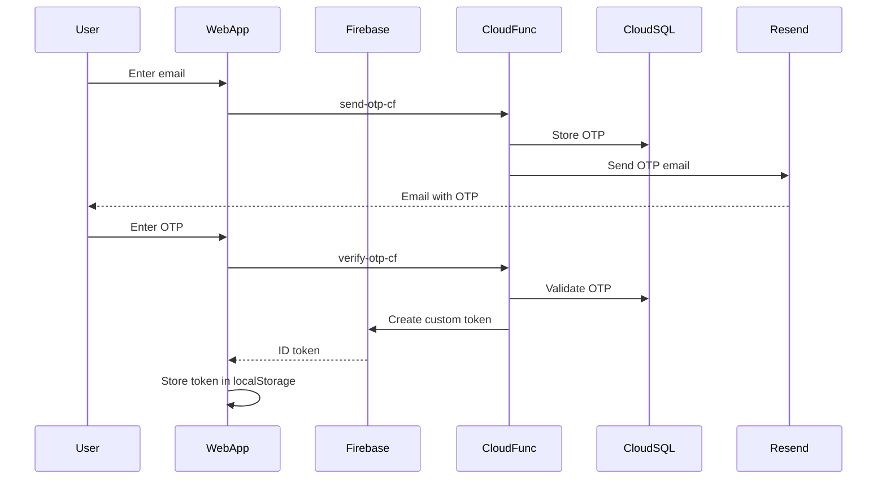

# Pours Consumer - Master Technical Architecture Specification

**Document Version:** 1.0  
**Last Updated:** 2025-11-25  
**Status:** Production Architecture  
**Platform:** React Web Application with React Native Mobile (Planned)

---

## Document Information

### Purpose
This document consolidates all technical architecture specifications for the Pours Consumer application, covering 26 epics spanning authentication, venue management, product discovery, ordering, profile management, rewards, payments, compliance, sobriety monitoring, social features, and AI enhancements.

### Scope
- **Frontend Architecture:** React web application with future React Native mobile app
- **Backend Architecture:** Migration from Supabase to Google Cloud Platform (GCP)
- **Database:** Transition from Supabase PostgreSQL to Cloud SQL PostgreSQL
- **Event-Driven Architecture:** Implementation of event-based ecosystem using Google Cloud Pub/Sub
- **AI Integration:** Lovable AI with google/gemini-2.5-flash model
- **Security & Compliance:** GDPR, CCPA, PCI-DSS, SOX-2, HIPAA compliance

### Epic Coverage

This specification covers the following 26 Jira epics:

| Epic ID | Epic Name | Status |
|---------|-----------|--------|
| BPC-1 | Core Authentication & User Management | ✅ Implemented |
| BPC-2 | Venue Search & Discovery | ✅ Implemented |
| BPC-3 | Selected Venue Management | ✅ Implemented |
| BPC-4 | Product Catalog Management | ✅ Implemented |
| BPC-5 | Product Search & Filtering | ✅ Implemented |
| BPC-6 | Age Verification | ✅ Implemented |
| BPC-7 | Loyalty & Rewards Program | ✅ Implemented |
| BPC-8 | Shopping Cart Management | ✅ Implemented |
| BPC-9 | Checkout Process | ✅ Implemented |
| BPC-10 | Order Management | ⚠️ Partial |
| BPC-11 | Manage Profile | ⚠️ Partial |
| BPC-12 | Payment Management | 🔴 Not Implemented |
| BPC-13 | Order History & Tracking | ✅ Implemented |
| BPC-14 | Account Dashboard Analytics | ✅ Implemented |
| BPC-15 | Biometric Security Settings | 🔴 Not Implemented |
| BPC-16 | Sobriety Monitoring | ✅ Implemented |
| BPC-17 | Stripe Payment Integration | 🔴 Not Implemented |
| BPC-18 | Privacy & Compliance | ⚠️ Partial |
| BPC-19 | Venue Partnership | ✅ Implemented |
| BPC-20 | Social Drinking & Group Orders | 🔴 Not Implemented |
| BPC-21 | AI Sobriety Advisor | 🔴 Not Implemented |
| BPC-22 | Voice-Activated Ordering | 🔴 Not Implemented |
| BPC-23 | AI Allergen Guardian | 🔴 Not Implemented |
| BPC-24 | Smart Venue Discovery | 🔴 Not Implemented |
| BPC-25 | AI Order Assistant for Group Orders | 🔴 Not Implemented |
| BPC-26 | AI Receipt Analytics | 🔴 Not Implemented |

---

## Table of Contents

1. [System Architecture Overview](#1-system-architecture-overview)
2. [Technology Stack](#2-technology-stack)
3. [GCP Migration Strategy](#3-gcp-migration-strategy)
4. [Cloud SQL PostgreSQL Architecture](#4-cloud-sql-postgresql-architecture)
5. [Event-Driven Architecture](#5-event-driven-architecture)
6. [Authentication & Authorization (BPC-1)](#6-authentication--authorization-bpc-1)
7. [Venue Management (BPC-2, BPC-3)](#7-venue-management-bpc-2-bpc-3)
8. [Product Catalog & Discovery (BPC-4, BPC-5)](#8-product-catalog--discovery-bpc-4-bpc-5)
9. [Age Verification (BPC-6)](#9-age-verification-bpc-6)
10. [Shopping Cart & Checkout (BPC-8, BPC-9)](#10-shopping-cart--checkout-bpc-8-bpc-9)
11. [Order Management (BPC-10, BPC-13)](#11-order-management-bpc-10-bpc-13)
12. [User Profile & Preferences (BPC-11)](#12-user-profile--preferences-bpc-11)
13. [Payment Management (BPC-12, BPC-17)](#13-payment-management-bpc-12-bpc-17)
14. [Loyalty & Rewards (BPC-7)](#14-loyalty--rewards-bpc-7)
15. [Account Dashboard Analytics (BPC-14)](#15-account-dashboard-analytics-bpc-14)
16. [Sobriety Monitoring (BPC-16)](#16-sobriety-monitoring-bpc-16)
17. [Biometric Security (BPC-15)](#17-biometric-security-bpc-15)
18. [Privacy & Compliance (BPC-18)](#18-privacy--compliance-bpc-18)
19. [Social Drinking & Group Orders (BPC-20)](#19-social-drinking--group-orders-bpc-20)
20. [AI Enhancement Suite (BPC-21 to BPC-26)](#20-ai-enhancement-suite-bpc-21-to-bpc-26)
21. [Database Schema & Design](#21-database-schema--design)
22. [API Design & Edge Functions](#22-api-design--edge-functions)
23. [Frontend Architecture](#23-frontend-architecture)
24. [State Management](#24-state-management)
25. [Security Architecture](#25-security-architecture)
26. [Performance Optimization](#26-performance-optimization)
27. [React Native Migration](#27-react-native-migration)
28. [DevOps & Infrastructure](#28-devops--infrastructure)

---

## 1. System Architecture Overview

### 1.1 High-Level Architecture Diagram



### 1.2 Current State (Supabase)

**Current Architecture Components:**
- Supabase Auth for authentication
- Supabase PostgreSQL for database
- Supabase Storage for file storage
- Supabase Edge Functions for serverless logic
- Resend.com for transactional emails
- Frontend: React + TypeScript + Vite
- State Management: React Context + React Query

**Current Limitations:**
- Vendor lock-in to Supabase ecosystem
- Limited control over infrastructure scaling
- No native event-driven architecture support
- Complex cross-region replication
- Limited observability and monitoring
- No multi-cloud strategy

### 1.3 Target State (GCP Free Tier)

**Target Architecture Components:**
- Cloud SQL PostgreSQL (f1-micro instance - free tier eligible)
- Cloud Run for containerized services (2 million requests/month free)
- Cloud Functions for event-driven logic (2 million invocations/month free)
- Cloud Storage for file storage (5 GB free)
- Cloud Pub/Sub for event bus (10 GB messages/month free)
- Cloud Logging & Monitoring (50 GB logs/month free)
- Lovable AI Gateway for AI features

**Benefits:**
- Cost-effective with GCP Free Tier
- Event-driven architecture support
- Better observability and monitoring
- Multi-cloud capabilities
- Enterprise-grade security and compliance
- Scalability path beyond free tier

---

## 2. Technology Stack

### 2.1 Frontend Stack

| Layer | Technology | Version | Purpose |
|-------|-----------|---------|---------|
| **Framework** | React | 18.3.1 | UI rendering and component composition |
| **Language** | TypeScript | 5.x | Type safety and developer experience |
| **Build Tool** | Vite | 5.x | Fast development and optimized builds |
| **Routing** | React Router | 6.26.2 | Client-side routing |
| **Styling** | Tailwind CSS | 3.x | Utility-first CSS framework |
| **State Management** | React Context + React Query | 5.56.2 | Global state and server state |
| **Form Management** | React Hook Form | 7.53.0 | Form validation and handling |
| **Schema Validation** | Zod | 3.23.8 | Runtime type validation |
| **UI Components** | shadcn/ui + Radix UI | Latest | Accessible component library |
| **Icons** | Lucide React | 0.462.0 | Icon library |
| **Charts** | Recharts | 2.12.7 | Data visualization |
| **Notifications** | Sonner | 1.5.0 | Toast notifications |
| **Date Handling** | date-fns | 4.1.0 | Date manipulation |

### 2.2 Backend Stack (Current - Supabase)

| Layer | Technology | Purpose |
|-------|-----------|---------|
| **Database** | Supabase PostgreSQL | Relational database |
| **Auth** | Supabase Auth | User authentication |
| **Storage** | Supabase Storage | File storage |
| **Edge Functions** | Deno Runtime | Serverless functions |
| **Email** | Resend API | Transactional emails |

### 2.3 Backend Stack (Target - GCP)

| Layer | Technology | Version | Purpose |
|-------|-----------|---------|---------|
| **Database** | Cloud SQL PostgreSQL | 15.x | Managed PostgreSQL database |
| **Compute** | Cloud Run | Gen2 | Containerized microservices |
| **Serverless** | Cloud Functions | 2nd Gen | Event-driven functions |
| **Event Bus** | Cloud Pub/Sub | Latest | Message queue and event streaming |
| **Storage** | Cloud Storage | Latest | Object storage for files |
| **Caching** | Memorystore Redis | Latest | In-memory caching layer |
| **API Gateway** | Cloud Endpoints | Latest | API management and security |
| **Auth** | Firebase Auth | Latest | User authentication |
| **Email** | Resend API | Latest | Transactional emails |
| **Payments** | Stripe API | Latest | Payment processing |
| **AI** | Lovable AI Gateway | Latest | AI features (gemini-2.5-flash) |

### 2.4 Mobile Stack (Planned)

| Layer | Technology | Version | Purpose |
|-------|-----------|---------|---------|
| **Framework** | React Native | 0.73+ | Cross-platform mobile development |
| **Language** | TypeScript | 5.x | Type safety |
| **Navigation** | React Navigation | 6.x | Mobile navigation |
| **State Management** | React Context + React Query | Latest | Global and server state |
| **Biometrics** | react-native-biometrics | Latest | Fingerprint/Face ID auth |
| **Health Data** | react-native-health | Latest | iOS HealthKit integration |
| **Health Data** | react-native-google-fit | Latest | Android Google Fit integration |
| **Camera** | react-native-camera | Latest | ID scanning, QR codes |
| **Voice** | react-native-voice | Latest | Voice-activated ordering |

---

## 3. GCP Migration Strategy

### 3.1 Migration Phases

#### Phase 1: Infrastructure Setup (Week 1-2)
**Objectives:**
- Set up GCP project and enable necessary APIs
- Configure Cloud SQL PostgreSQL instance (f1-micro)
- Set up Cloud Storage buckets
- Configure Cloud Pub/Sub topics and subscriptions
- Set up Cloud Run and Cloud Functions environments

**Deliverables:**
- GCP project with all required APIs enabled
- Cloud SQL instance running PostgreSQL 15
- Storage buckets for avatars and ID documents
- Pub/Sub topics for all event types
- CI/CD pipeline configured for GCP deployment

#### Phase 2: Database Migration (Week 3-4)
**Objectives:**
- Export schema from Supabase PostgreSQL
- Adapt schema for Cloud SQL (remove Supabase-specific extensions)
- Migrate data using `pg_dump` and `pg_restore`
- Validate data integrity and relationships
- Update database connection strings

**Key Tasks:**
```bash
# Export from Supabase
pg_dump -h db.zkhawnmbfmbnzspfgkje.supabase.co \
  -U postgres \
  -d postgres \
  --schema=public \
  --no-owner \
  --no-acl \
  -f supabase_export.sql

# Import to Cloud SQL
psql -h <CLOUD_SQL_IP> \
  -U postgres \
  -d pours_consumer \
  -f supabase_export.sql
```

**Data Validation:**
- Row count verification for all tables
- Foreign key integrity checks
- RLS policy recreation (using Cloud SQL security features)
- Function and trigger recreation

#### Phase 3: Auth Migration (Week 5-6)
**Objectives:**
- Migrate from Supabase Auth to Firebase Auth
- Preserve existing user accounts
- Implement OTP authentication with Firebase
- Update frontend auth hooks
- Test authentication flows

**Migration Steps:**
1. Export user data from Supabase Auth
2. Create Firebase project and enable Auth
3. Bulk import users to Firebase Auth
4. Update auth hooks to use Firebase SDK
5. Implement dual-auth period for rollback safety
6. Deprecate Supabase Auth

#### Phase 4: Edge Functions to Cloud Functions (Week 7-8)
**Objectives:**
- Convert Supabase Edge Functions (Deno) to Cloud Functions (Node.js)
- Implement event-driven triggers using Pub/Sub
- Deploy and test all functions
- Update frontend API calls

**Function Migration Map:**
| Supabase Edge Function | Cloud Function | Trigger Type |
|------------------------|----------------|--------------|
| send-otp | send-otp-cf | HTTP |
| verify-otp | verify-otp-cf | HTTP |
| send-order-confirmation | send-order-confirmation-cf | Pub/Sub (order.created) |
| award-loyalty-points | award-loyalty-points-cf | Pub/Sub (order.completed) |
| send-abandoned-cart-email | send-abandoned-cart-cf | HTTP |
| send-abandoned-cart-reminders | abandoned-cart-scheduler-cf | Cloud Scheduler |

#### Phase 5: Storage Migration (Week 9)
**Objectives:**
- Migrate avatars from Supabase Storage to Cloud Storage
- Migrate ID documents to Cloud Storage
- Update file URLs and access patterns
- Test upload/download functionality

**Migration Script:**
```typescript
// Migrate files from Supabase Storage to Cloud Storage
async function migrateStorage() {
  const supabaseBuckets = ['avatars', 'id-documents'];
  
  for (const bucket of supabaseBuckets) {
    const { data: files } = await supabase.storage
      .from(bucket)
      .list();
    
    for (const file of files) {
      const { data: blob } = await supabase.storage
        .from(bucket)
        .download(file.name);
      
      await gcsStorage
        .bucket(`pours-consumer-${bucket}`)
        .file(file.name)
        .save(blob);
    }
  }
}
```

#### Phase 6: Testing & Validation (Week 10)
**Objectives:**
- End-to-end testing of all features
- Performance testing and optimization
- Security audit and compliance review
- Rollback plan validation

#### Phase 7: Cutover & Monitoring (Week 11-12)
**Objectives:**
- Blue-green deployment
- DNS cutover
- Monitor error rates and performance
- 24/7 monitoring for first 72 hours
- Decommission Supabase resources

### 3.2 GCP Free Tier Resource Allocation

| Resource | Free Tier Limit | Usage Estimate | Monitoring Alert |
|----------|-----------------|----------------|------------------|
| Cloud SQL (f1-micro) | 1 instance | 1 database instance | >80% capacity |
| Cloud Run | 2M requests/month | ~500K requests/month | >1.5M requests |
| Cloud Functions | 2M invocations/month | ~1M invocations/month | >1.5M invocations |
| Cloud Storage | 5 GB | ~2 GB (avatars + docs) | >4 GB |
| Cloud Pub/Sub | 10 GB messages/month | ~5 GB | >8 GB |
| Cloud Logging | 50 GB logs/month | ~20 GB | >40 GB |
| Networking Egress | 1 GB/month NA | ~500 MB | >800 MB |

### 3.3 Cost Optimization Strategies

**Free Tier Maximization:**
- Use f1-micro Cloud SQL instance (always free)
- Optimize Cloud Run to stay under 2M requests/month
- Implement request batching to reduce function invocations
- Use Cloud CDN for static assets (reduces egress)
- Enable Cloud Storage lifecycle policies for old data

**Beyond Free Tier:**
- Implement Cloud SQL connection pooling (PgBouncer)
- Use Cloud Run min instances = 0 (scale to zero)
- Enable Cloud Functions concurrent execution
- Implement caching with Memorystore Redis (free tier)

---

## 4. Cloud SQL PostgreSQL Architecture

### 4.1 Database Instance Configuration

**Instance Specifications (Free Tier):**
```yaml
Instance Type: db-f1-micro
vCPUs: 1 shared core
RAM: 614 MB
Storage: 10 GB SSD
Backups: 7 days (automated)
High Availability: No (not free tier eligible)
Read Replicas: No (not free tier eligible)
Region: us-central1 (Iowa - free tier eligible)
```

**Connection Configuration:**
```typescript
// Cloud SQL connection using pg library
import { Pool } from 'pg';

const pool = new Pool({
  user: process.env.CLOUD_SQL_USER,
  password: process.env.CLOUD_SQL_PASSWORD,
  database: process.env.CLOUD_SQL_DATABASE,
  host: process.env.CLOUD_SQL_HOST, // Cloud SQL Proxy or public IP
  port: 5432,
  max: 10, // Max connections (conserve resources on f1-micro)
  idleTimeoutMillis: 30000,
  connectionTimeoutMillis: 2000,
});

export const db = {
  query: (text: string, params?: any[]) => pool.query(text, params),
  getClient: () => pool.connect(),
};
```

**Connection Pooling with PgBouncer:**
```yaml
# PgBouncer configuration for Cloud SQL
[databases]
pours_consumer = host=/cloudsql/PROJECT_ID:REGION:INSTANCE_NAME

[pgbouncer]
pool_mode = transaction
max_client_conn = 100
default_pool_size = 10
reserve_pool_size = 5
```

### 4.2 Database Schema Design

**Schema Organization:**
```sql
-- Public schema for application tables
CREATE SCHEMA IF NOT EXISTS public;

-- Event schema for event sourcing
CREATE SCHEMA IF NOT EXISTS events;

-- Audit schema for compliance logging
CREATE SCHEMA IF NOT EXISTS audit;
```

**Key Tables (26 Epics):**
1. **Authentication & User Management (BPC-1)**
   - `users` (Firebase Auth sync table)
   - `profiles`
   - `user_rewards`
   - `otp_codes`

2. **Venue Management (BPC-2, BPC-3)**
   - `venues`
   - `cities`
   - `venue_categories`

3. **Product Catalog (BPC-4, BPC-5)**
   - `products`
   - `product_categories`

4. **Shopping & Orders (BPC-8, BPC-9, BPC-10, BPC-13)**
   - `orders`
   - `order_items`
   - `order_status_history`
   - `abandoned_carts`

5. **Payments (BPC-12, BPC-17)**
   - `payment_methods`
   - `payment_transactions`

6. **Rewards & Loyalty (BPC-7)**
   - `reward_tiers`
   - `rewards`
   - `reward_redemptions`
   - `points_transactions`
   - `referrals`
   - `check_ins`

7. **Sobriety Monitoring (BPC-16)**
   - `drinking_sessions`
   - `drink_records`
   - `biometric_readings`
   - `user_biometrics`
   - `sobriety_alerts`

8. **Social & Group Orders (BPC-20)**
   - `buddy_lists`
   - `buddy_list_members`
   - `group_orders`
   - `group_order_participants`
   - `drink_assignments`

9. **Privacy & Compliance (BPC-18)**
   - `audit_logs`
   - `user_consents`
   - `data_retention_requests`

10. **AI Interactions (BPC-21 to BPC-26)**
    - `ai_conversations`
    - `ai_sobriety_interactions`
    - `ai_intervention_effectiveness`
    - `user_taste_profiles`
    - `product_interactions`
    - `allergen_scans`
    - `voice_commands`

### 4.3 Database Migrations

**Migration Tool:** Flyway or Liquibase

**Migration Structure:**
```
db/migrations/
├── V1__initial_schema.sql
├── V2__add_user_rewards.sql
├── V3__add_sobriety_monitoring.sql
├── V4__add_social_features.sql
├── V5__add_ai_tables.sql
├── V6__add_event_sourcing.sql
└── ...
```

**Migration Execution:**
```bash
# Run migrations on Cloud SQL
flyway -url=jdbc:postgresql://CLOUD_SQL_IP:5432/pours_consumer \
  -user=postgres \
  -password=$CLOUD_SQL_PASSWORD \
  migrate
```

### 4.4 Row-Level Security (RLS) Alternative

Since Cloud SQL doesn't have Supabase's built-in RLS, implement application-level security:

**Strategy 1: Middleware Security Checks**
```typescript
// Middleware to enforce row-level security
async function enforceRLS(req, res, next) {
  const { userId } = req.auth; // From Firebase Auth
  const { table, operation } = req.body;
  
  // Define RLS policies
  const policies = {
    profiles: {
      select: (row) => row.user_id === userId,
      update: (row) => row.user_id === userId,
      delete: () => false, // Profiles can't be deleted
    },
    orders: {
      select: (row) => row.user_id === userId || row.guest_email === req.auth.email,
      insert: (row) => row.user_id === userId,
      update: (row) => row.user_id === userId,
    },
    // ... more policies
  };
  
  // Enforce policy before executing query
  if (!policies[table][operation](req.body.data)) {
    return res.status(403).json({ error: 'Forbidden' });
  }
  
  next();
}
```

**Strategy 2: PostgreSQL Policies (Manual Setup)**
```sql
-- Create RLS policies in Cloud SQL (manual alternative)
CREATE POLICY "Users can view their own profile"
  ON profiles
  FOR SELECT
  USING (user_id = current_setting('app.current_user')::uuid);

-- Set user context before queries
SET app.current_user = 'user-uuid-here';
```

---

## 5. Event-Driven Architecture

### 5.1 Event Bus (Cloud Pub/Sub)

**Event Architecture:**


### 5.2 Event Types & Schemas

**Event Naming Convention:** `{domain}.{event_type}`

| Event Name | Trigger | Payload | Subscribers |
|------------|---------|---------|-------------|
| `user.registered` | User signs up | `{ userId, email, firstName, lastName }` | send-welcome-email, create-reward-profile |
| `user.login` | User signs in | `{ userId, loginMethod, timestamp }` | update-analytics, check-rewards-birthday |
| `order.created` | Order placed | `{ orderId, userId, venueId, items[], total }` | send-order-confirmation, update-inventory |
| `order.preparing` | Order status change | `{ orderId, status, timestamp }` | send-push-notification |
| `order.ready` | Order ready | `{ orderId, tableNumber, timestamp }` | send-sms-notification |
| `order.completed` | Order delivered | `{ orderId, userId, total, timestamp }` | award-loyalty-points, request-review |
| `cart.abandoned` | Cart inactive 1hr | `{ userId, sessionId, cartId, items[], total }` | send-abandoned-cart-email |
| `points.awarded` | Loyalty points | `{ userId, points, reason, transactionId }` | send-points-notification, check-tier-upgrade |
| `points.redeemed` | Reward redeemed | `{ userId, rewardId, pointsSpent }` | send-reward-confirmation |
| `payment.processed` | Payment success | `{ orderId, amount, paymentMethod }` | update-order-status, send-receipt |
| `session.started` | Drinking session | `{ userId, sessionId, venueId }` | initialize-bac-tracking |
| `session.alert` | BAC threshold | `{ userId, sessionId, bac, alertType }` | send-safety-alert, notify-bartender |
| `session.ended` | Session complete | `{ userId, sessionId, drinks, duration, peakBac }` | generate-session-summary |

### 5.3 Event Publishing

**Cloud Function Publisher:**
```typescript
import { PubSub } from '@google-cloud/pubsub';

const pubsub = new PubSub();

export async function publishEvent(
  topicName: string,
  eventData: any
) {
  const topic = pubsub.topic(topicName);
  
  const message = {
    data: Buffer.from(JSON.stringify(eventData)),
    attributes: {
      eventType: topicName,
      timestamp: new Date().toISOString(),
      source: 'pours-consumer-api',
    },
  };
  
  try {
    const messageId = await topic.publishMessage(message);
    console.log(`Event published: ${topicName}, messageId: ${messageId}`);
    return messageId;
  } catch (error) {
    console.error(`Failed to publish event: ${topicName}`, error);
    throw error;
  }
}

// Example: Publish order created event
await publishEvent('order.created', {
  orderId: 'order-123',
  userId: 'user-456',
  venueId: 'venue-789',
  items: [...],
  total: 42.99,
  timestamp: new Date().toISOString(),
});
```

### 5.4 Event Subscription

**Cloud Function Subscriber:**
```typescript
import { CloudEvent } from '@google-cloud/functions-framework';

// Cloud Function triggered by Pub/Sub
export async function onOrderCreated(
  cloudEvent: CloudEvent<MessagePublishedData>
) {
  const message = cloudEvent.data.message;
  const eventData = JSON.parse(
    Buffer.from(message.data, 'base64').toString()
  );
  
  const { orderId, userId, items, total } = eventData;
  
  // Process order created event
  await sendOrderConfirmationEmail(userId, orderId);
  await updateInventory(items);
  
  console.log(`Processed order.created event: ${orderId}`);
}
```

**Deployment Configuration:**
```yaml
# Cloud Function configuration
functions:
  - name: on-order-created
    runtime: nodejs20
    entryPoint: onOrderCreated
    trigger:
      eventType: google.pubsub.topic.publish
      resource: projects/PROJECT_ID/topics/order.created
    environmentVariables:
      RESEND_API_KEY: ${RESEND_API_KEY}
      CLOUD_SQL_CONNECTION: ${CLOUD_SQL_CONNECTION}
```

### 5.5 Event Sourcing Pattern

**Event Store Table:**
```sql
-- Event sourcing table for audit and replay
CREATE TABLE events.event_store (
  id UUID PRIMARY KEY DEFAULT gen_random_uuid(),
  event_type TEXT NOT NULL,
  aggregate_id TEXT NOT NULL,
  aggregate_type TEXT NOT NULL,
  event_data JSONB NOT NULL,
  metadata JSONB,
  version INTEGER NOT NULL,
  created_at TIMESTAMP WITH TIME ZONE DEFAULT now(),
  UNIQUE (aggregate_id, version)
);

CREATE INDEX idx_event_store_aggregate ON events.event_store(aggregate_id, version);
CREATE INDEX idx_event_store_type ON events.event_store(event_type);
CREATE INDEX idx_event_store_created_at ON events.event_store(created_at DESC);
```

**Event Sourcing Implementation:**
```typescript
// Store event in event store and publish to Pub/Sub
async function storeAndPublishEvent(
  eventType: string,
  aggregateId: string,
  aggregateType: string,
  eventData: any
) {
  // Get current version
  const { rows } = await db.query(
    `SELECT COALESCE(MAX(version), 0) as max_version 
     FROM events.event_store 
     WHERE aggregate_id = $1`,
    [aggregateId]
  );
  
  const nextVersion = rows[0].max_version + 1;
  
  // Store in event store
  await db.query(
    `INSERT INTO events.event_store 
     (event_type, aggregate_id, aggregate_type, event_data, version)
     VALUES ($1, $2, $3, $4, $5)`,
    [eventType, aggregateId, aggregateType, eventData, nextVersion]
  );
  
  // Publish to Pub/Sub
  await publishEvent(eventType, {
    ...eventData,
    aggregateId,
    aggregateType,
    version: nextVersion,
  });
}
```

### 5.6 Dead Letter Queue

**DLQ Configuration:**
```typescript
// Create dead letter topic
const dlqTopic = await pubsub.createTopic('dlq-failed-events');

// Create subscription with DLQ
await topic.createSubscription('order-created-sub', {
  deadLetterPolicy: {
    deadLetterTopic: dlqTopic[0].name,
    maxDeliveryAttempts: 5,
  },
  retryPolicy: {
    minimumBackoff: { seconds: 10 },
    maximumBackoff: { seconds: 600 },
  },
});
```

---

## 6. Authentication & Authorization (BPC-1)

### 6.1 Authentication Architecture

**Auth Flow (Firebase Auth):**


### 6.2 Firebase Auth Configuration

**Firebase Auth Setup:**
```typescript
import { initializeApp } from 'firebase/app';
import { getAuth, signInWithCustomToken } from 'firebase/auth';

const firebaseConfig = {
  apiKey: process.env.FIREBASE_API_KEY,
  authDomain: process.env.FIREBASE_AUTH_DOMAIN,
  projectId: process.env.FIREBASE_PROJECT_ID,
};

const app = initializeApp(firebaseConfig);
export const auth = getAuth(app);

// Sign in with custom token after OTP verification
export async function signInWithOTP(customToken: string) {
  const userCredential = await signInWithCustomToken(auth, customToken);
  return userCredential.user;
}
```

### 6.3 Auth Hooks (Frontend)

**useAuth Hook:**
```typescript
// src/hooks/useAuth.ts
import { useEffect, useState } from 'react';
import { onAuthStateChanged, User } from 'firebase/auth';
import { auth } from '@/lib/firebase';

export const useAuth = () => {
  const [user, setUser] = useState<User | null>(null);
  const [loading, setLoading] = useState(true);
  
  useEffect(() => {
    const unsubscribe = onAuthStateChanged(auth, (user) => {
      setUser(user);
      setLoading(false);
    });
    
    return unsubscribe;
  }, []);
  
  return {
    user,
    loading,
    isAuthenticated: !!user,
    userId: user?.uid,
  };
};
```

### 6.4 Protected Routes

**Route Guard:**
```typescript
// src/components/ProtectedRoute.tsx
import { Navigate } from 'react-router-dom';
import { useAuth } from '@/hooks/useAuth';

export const ProtectedRoute = ({ children }: { children: React.ReactNode }) => {
  const { isAuthenticated, loading } = useAuth();
  
  if (loading) {
    return <div>Loading...</div>;
  }
  
  if (!isAuthenticated) {
    return <Navigate to="/auth" replace />;
  }
  
  return <>{children}</>;
};
```

### 6.5 Advanced Auth Features

**Passkey Authentication (BPC-1, US-AUTH.11 to US-AUTH.20):**
```typescript
// WebAuthn implementation for passkey authentication
import { startRegistration, startAuthentication } from '@simplewebauthn/browser';

export async function registerPasskey(userId: string) {
  // Request registration options from backend
  const options = await fetch('/api/auth/passkey/register-options', {
    method: 'POST',
    headers: { 'Content-Type': 'application/json' },
    body: JSON.stringify({ userId }),
  }).then(res => res.json());
  
  // Start WebAuthn registration
  const credential = await startRegistration(options);
  
  // Verify registration on backend
  const verification = await fetch('/api/auth/passkey/register-verify', {
    method: 'POST',
    headers: { 'Content-Type': 'application/json' },
    body: JSON.stringify({ userId, credential }),
  }).then(res => res.json());
  
  return verification.verified;
}

export async function authenticateWithPasskey() {
  // Request authentication options
  const options = await fetch('/api/auth/passkey/auth-options')
    .then(res => res.json());
  
  // Start WebAuthn authentication
  const credential = await startAuthentication(options);
  
  // Verify authentication on backend
  const verification = await fetch('/api/auth/passkey/auth-verify', {
    method: 'POST',
    headers: { 'Content-Type': 'application/json' },
    body: JSON.stringify({ credential }),
  }).then(res => res.json());
  
  return verification;
}
```

**Social Media OAuth (BPC-1, US-AUTH.13):**
```typescript
import { 
  signInWithPopup, 
  GoogleAuthProvider,
  FacebookAuthProvider,
  OAuthProvider, // For Apple and Microsoft
} from 'firebase/auth';

export async function signInWithGoogle() {
  const provider = new GoogleAuthProvider();
  const result = await signInWithPopup(auth, provider);
  return result.user;
}

export async function signInWithApple() {
  const provider = new OAuthProvider('apple.com');
  const result = await signInWithPopup(auth, provider);
  return result.user;
}
```

---

## 7. Venue Management (BPC-2, BPC-3)

### 7.1 Venue Search Architecture

**Search Implementation:**
```typescript
// Cloud Function for venue search
export async function searchVenues(searchQuery: string, userLocation?: { lat: number, lon: number }) {
  let query = `
    SELECT v.*, c.name as city_name
    FROM venues v
    JOIN cities c ON v.city_id = c.id
    WHERE v.is_active = true
  `;
  
  const params: any[] = [];
  
  // Text search
  if (searchQuery) {
    query += ` AND (
      v.name ILIKE $${params.length + 1} OR
      v.address ILIKE $${params.length + 1} OR
      v.description ILIKE $${params.length + 1}
    )`;
    params.push(`%${searchQuery}%`);
  }
  
  const { rows } = await db.query(query, params);
  
  // Calculate distance if user location provided
  if (userLocation) {
    rows.forEach(venue => {
      venue.distance = calculateDistance(
        userLocation.lat,
        userLocation.lon,
        venue.latitude,
        venue.longitude
      );
    });
    rows.sort((a, b) => a.distance - b.distance);
  }
  
  return rows;
}

// Haversine distance calculation
function calculateDistance(lat1: number, lon1: number, lat2: number, lon2: number): number {
  const R = 3959; // Earth radius in miles
  const dLat = (lat2 - lat1) * Math.PI / 180;
  const dLon = (lon2 - lon1) * Math.PI / 180;
  const a = 
    Math.sin(dLat/2) * Math.sin(dLat/2) +
    Math.cos(lat1 * Math.PI / 180) * Math.cos(lat2 * Math.PI / 180) *
    Math.sin(dLon/2) * Math.sin(dLon/2);
  const c = 2 * Math.atan2(Math.sqrt(a), Math.sqrt(1-a));
  return R * c;
}
```

### 7.2 Venue Selection Management

**Selected Venue State:**
```typescript
// src/contexts/VenueContext.tsx
interface VenueContextType {
  selectedVenue: Venue | null;
  setSelectedVenue: (venue: Venue) => void;
  clearVenue: () => void;
}

export const VenueProvider: React.FC = ({ children }) => {
  const [selectedVenue, setSelectedVenueState] = useState<Venue | null>(null);
  const { clearCart } = useCart();
  
  const setSelectedVenue = (venue: Venue) => {
    if (selectedVenue && selectedVenue.id !== venue.id) {
      // Warn user about cart clearing
      if (confirm('Changing venue will clear your cart. Continue?')) {
        clearCart();
        setSelectedVenueState(venue);
        localStorage.setItem('selectedVenue', JSON.stringify(venue));
      }
    } else {
      setSelectedVenueState(venue);
      localStorage.setItem('selectedVenue', JSON.stringify(venue));
    }
  };
  
  // Restore venue on mount
  useEffect(() => {
    const stored = localStorage.getItem('selectedVenue');
    if (stored) {
      setSelectedVenueState(JSON.parse(stored));
    }
  }, []);
  
  return (
    <VenueContext.Provider value={{ selectedVenue, setSelectedVenue, clearVenue }}>
      {children}
    </VenueContext.Provider>
  );
};
```

---

## 8. Product Catalog & Discovery (BPC-4, BPC-5)

### 8.1 Product Search & Filtering

**Search Implementation:**
```typescript
// Cloud Function for product search
export async function searchProducts(params: {
  searchQuery?: string;
  venueId: string;
  categoryId?: string;
  tags?: string[];
  priceMin?: number;
  priceMax?: number;
  abvMin?: number;
  abvMax?: number;
  sortBy?: 'price' | 'name' | 'abv';
  sortOrder?: 'asc' | 'desc';
}) {
  let query = `
    SELECT p.*, pc.name as category_name
    FROM products p
    JOIN product_categories pc ON p.category_id = pc.id
    WHERE p.venue_id = $1 AND p.is_available = true
  `;
  
  const queryParams: any[] = [params.venueId];
  let paramIndex = 2;
  
  // Text search
  if (params.searchQuery) {
    query += ` AND (
      p.name ILIKE $${paramIndex} OR
      p.description ILIKE $${paramIndex} OR
      p.allergy_information ILIKE $${paramIndex}
    )`;
    queryParams.push(`%${params.searchQuery}%`);
    paramIndex++;
  }
  
  // Category filter
  if (params.categoryId) {
    query += ` AND p.category_id = $${paramIndex}`;
    queryParams.push(params.categoryId);
    paramIndex++;
  }
  
  // Tag filter
  if (params.tags && params.tags.length > 0) {
    query += ` AND p.tags && $${paramIndex}::text[]`;
    queryParams.push(params.tags);
    paramIndex++;
  }
  
  // Price range filter
  if (params.priceMin !== undefined) {
    query += ` AND p.price >= $${paramIndex}`;
    queryParams.push(params.priceMin);
    paramIndex++;
  }
  if (params.priceMax !== undefined) {
    query += ` AND p.price <= $${paramIndex}`;
    queryParams.push(params.priceMax);
    paramIndex++;
  }
  
  // ABV range filter
  if (params.abvMin !== undefined) {
    query += ` AND p.alcohol_content >= $${paramIndex}`;
    queryParams.push(params.abvMin);
    paramIndex++;
  }
  if (params.abvMax !== undefined) {
    query += ` AND p.alcohol_content <= $${paramIndex}`;
    queryParams.push(params.abvMax);
    paramIndex++;
  }
  
  // Sorting
  const sortField = params.sortBy || 'name';
  const sortOrder = params.sortOrder || 'asc';
  query += ` ORDER BY p.${sortField} ${sortOrder.toUpperCase()}`;
  
  const { rows } = await db.query(query, queryParams);
  return rows;
}
```

---

## 9. Age Verification (BPC-6)

### 9.1 Age Verification Architecture

**Age Gate Modal:**
```typescript
// src/hooks/useAgeVerification.ts
export const useAgeVerification = () => {
  const [isVerified, setIsVerified] = useState(false);
  const [showModal, setShowModal] = useState(false);
  
  useEffect(() => {
    const verified = localStorage.getItem('ageVerified');
    if (!verified) {
      setShowModal(true);
    } else {
      setIsVerified(true);
    }
  }, []);
  
  const verifyAge = (dateOfBirth: Date) => {
    const age = calculateAge(dateOfBirth);
    if (age >= 21) {
      localStorage.setItem('ageVerified', 'true');
      localStorage.setItem('ageVerifiedAt', new Date().toISOString());
      setIsVerified(true);
      setShowModal(false);
      return true;
    }
    return false;
  };
  
  return { isVerified, showModal, verifyAge };
};
```

**Server-Side Age Verification (Future):**
```typescript
// Cloud Function to record age verification for audit
export async function recordAgeVerification(data: {
  userId?: string;
  sessionId: string;
  dateOfBirth: string;
  verificationMethod: 'dob_simple' | 'id_scan';
  ipAddress: string;
}) {
  await db.query(
    `INSERT INTO age_verifications 
     (user_id, session_id, date_of_birth, verification_method, ip_address)
     VALUES ($1, $2, $3, $4, $5)`,
    [data.userId, data.sessionId, data.dateOfBirth, data.verificationMethod, data.ipAddress]
  );
  
  // Publish event
  await publishEvent('age.verified', data);
}
```

---

## 10. Shopping Cart & Checkout (BPC-8, BPC-9)

### 10.1 Cart State Management

**Enhanced Cart Hook:**
```typescript
// src/hooks/useEnhancedCart.ts
import { useLocalStorage } from '@/hooks/useLocalStorage';

interface CartItem {
  product: Product;
  quantity: number;
}

export const useEnhancedCart = () => {
  const { user } = useAuth();
  const [localCart, setLocalCart] = useLocalStorage<CartItem[]>('cart', []);
  const [cloudCart, setCloudCart] = useState<CartItem[]>([]);
  
  // Use cloud cart for authenticated users, local cart for guests
  const cart = user ? cloudCart : localCart;
  const setCart = user ? setCloudCart : setLocalCart;
  
  // Sync cart with Cloud SQL for authenticated users
  useEffect(() => {
    if (user) {
      syncCartWithBackend();
    }
  }, [user]);
  
  const addToCart = async (product: Product, quantity: number = 1) => {
    const existingItem = cart.find(item => item.product.id === product.id);
    
    if (existingItem) {
      updateQuantity(product.id, existingItem.quantity + quantity);
    } else {
      const newCart = [...cart, { product, quantity }];
      setCart(newCart);
      
      if (user) {
        await saveCartToBackend(newCart);
      }
    }
    
    toast.success(`${product.name} added to cart`);
  };
  
  const removeFromCart = async (productId: string) => {
    const newCart = cart.filter(item => item.product.id !== productId);
    setCart(newCart);
    
    if (user) {
      await saveCartToBackend(newCart);
    }
  };
  
  const updateQuantity = async (productId: string, quantity: number) => {
    if (quantity <= 0) {
      removeFromCart(productId);
      return;
    }
    
    const newCart = cart.map(item =>
      item.product.id === productId ? { ...item, quantity } : item
    );
    setCart(newCart);
    
    if (user) {
      await saveCartToBackend(newCart);
    }
  };
  
  const clearCart = async () => {
    setCart([]);
    if (user) {
      await saveCartToBackend([]);
    }
  };
  
  const calculateTotal = () => {
    return cart.reduce((total, item) => total + item.product.price * item.quantity, 0);
  };
  
  return {
    cart,
    addToCart,
    removeFromCart,
    updateQuantity,
    clearCart,
    total: calculateTotal(),
    itemCount: cart.reduce((count, item) => count + item.quantity, 0),
  };
};
```

### 10.2 Abandoned Cart Recovery

**Abandoned Cart Detection:**
```typescript
// Cloud Function triggered by Cloud Scheduler (every hour)
export async function detectAbandonedCarts() {
  const oneHourAgo = new Date(Date.now() - 60 * 60 * 1000);
  
  const { rows: abandonedCarts } = await db.query(
    `SELECT * FROM abandoned_carts
     WHERE created_at < $1
     AND converted_to_order = false
     AND opted_out = false
     AND first_reminder_sent_at IS NULL`,
    [oneHourAgo]
  );
  
  for (const cart of abandonedCarts) {
    await publishEvent('cart.abandoned', {
      cartId: cart.id,
      userId: cart.user_id,
      sessionId: cart.session_id,
      guestEmail: cart.guest_email,
      items: cart.cart_data,
      total: cart.total_amount,
    });
  }
}

// Cloud Function subscriber for abandoned cart event
export async function onCartAbandoned(eventData: any) {
  const { cartId, userId, guestEmail, items, total } = eventData;
  
  // Send abandoned cart email
  await resend.emails.send({
    from: 'Pours+ <noreply@pours.com>',
    to: guestEmail || await getUserEmail(userId),
    subject: 'Your cart is waiting for you!',
    html: generateAbandonedCartEmail(items, total, cartId),
  });
  
  // Update cart record
  await db.query(
    `UPDATE abandoned_carts
     SET first_reminder_sent_at = now()
     WHERE id = $1`,
    [cartId]
  );
}
```

### 10.3 Checkout Process

**Order Creation:**
```typescript
// Cloud Function to create order
export async function createOrder(data: {
  userId?: string;
  guestEmail?: string;
  guestName?: string;
  venueId: string;
  items: OrderItem[];
  specialInstructions?: string;
  tableNumber?: string;
  paymentMethod: 'cash' | 'card';
}) {
  const client = await db.getClient();
  
  try {
    await client.query('BEGIN');
    
    // Calculate total
    const total = data.items.reduce((sum, item) => sum + item.unit_price * item.quantity, 0);
    
    // Insert order
    const { rows: [order] } = await client.query(
      `INSERT INTO orders 
       (user_id, guest_email, guest_name, venue_id, total_amount, special_instructions, table_number, status)
       VALUES ($1, $2, $3, $4, $5, $6, $7, 'pending')
       RETURNING *`,
      [data.userId, data.guestEmail, data.guestName, data.venueId, total, data.specialInstructions, data.tableNumber]
    );
    
    // Insert order items
    for (const item of data.items) {
      await client.query(
        `INSERT INTO order_items (order_id, product_id, quantity, unit_price, total_price)
         VALUES ($1, $2, $3, $4, $5)`,
        [order.id, item.product_id, item.quantity, item.unit_price, item.total_price]
      );
    }
    
    await client.query('COMMIT');
    
    // Publish order created event
    await publishEvent('order.created', {
      orderId: order.id,
      userId: data.userId,
      venueId: data.venueId,
      items: data.items,
      total,
    });
    
    return order;
  } catch (error) {
    await client.query('ROLLBACK');
    throw error;
  } finally {
    client.release();
  }
}
```

---

## 11. Order Management (BPC-10, BPC-13)

### 11.1 Order Status Tracking

**Real-Time Order Updates (Cloud Pub/Sub):**
```typescript
// Publish order status change event
export async function updateOrderStatus(orderId: string, newStatus: string) {
  await db.query(
    `UPDATE orders SET status = $1, updated_at = now() WHERE id = $2`,
    [newStatus, orderId]
  );
  
  // Publish event
  await publishEvent(`order.${newStatus}`, {
    orderId,
    status: newStatus,
    timestamp: new Date().toISOString(),
  });
}

// Frontend: Subscribe to order status updates via WebSocket or polling
export const useRealtimeOrderStatus = (orderId: string) => {
  const [status, setStatus] = useState<string>('pending');
  
  useEffect(() => {
    // Poll for order status every 10 seconds
    const interval = setInterval(async () => {
      const response = await fetch(`/api/orders/${orderId}/status`);
      const data = await response.json();
      setStatus(data.status);
    }, 10000);
    
    return () => clearInterval(interval);
  }, [orderId]);
  
  return { status };
};
```

### 11.2 Order History

**Order History Query:**
```typescript
// Cloud Function to fetch order history
export async function getUserOrders(userId: string, filters?: {
  status?: string;
  startDate?: Date;
  endDate?: Date;
  venueId?: string;
}) {
  let query = `
    SELECT o.*, v.name as venue_name, 
           json_agg(json_build_object(
             'product_id', oi.product_id,
             'product_name', p.name,
             'quantity', oi.quantity,
             'unit_price', oi.unit_price,
             'total_price', oi.total_price
           )) as items
    FROM orders o
    JOIN venues v ON o.venue_id = v.id
    LEFT JOIN order_items oi ON o.id = oi.order_id
    LEFT JOIN products p ON oi.product_id = p.id
    WHERE o.user_id = $1
  `;
  
  const params: any[] = [userId];
  let paramIndex = 2;
  
  if (filters?.status) {
    query += ` AND o.status = $${paramIndex}`;
    params.push(filters.status);
    paramIndex++;
  }
  
  if (filters?.startDate) {
    query += ` AND o.created_at >= $${paramIndex}`;
    params.push(filters.startDate);
    paramIndex++;
  }
  
  if (filters?.endDate) {
    query += ` AND o.created_at <= $${paramIndex}`;
    params.push(filters.endDate);
    paramIndex++;
  }
  
  query += ` GROUP BY o.id, v.name ORDER BY o.created_at DESC`;
  
  const { rows } = await db.query(query, params);
  return rows;
}
```

---

## 12. User Profile & Preferences (BPC-11)

### 12.1 Profile Management

**Update Profile:**
```typescript
// Cloud Function to update profile
export async function updateProfile(userId: string, updates: Partial<Profile>) {
  const fields = Object.keys(updates);
  const values = Object.values(updates);
  
  const setClause = fields.map((field, index) => `${field} = $${index + 2}`).join(', ');
  
  const { rows: [profile] } = await db.query(
    `UPDATE profiles SET ${setClause}, updated_at = now() WHERE user_id = $1 RETURNING *`,
    [userId, ...values]
  );
  
  return profile;
}
```

### 12.2 Avatar Upload (Cloud Storage)

**Avatar Upload:**
```typescript
import { Storage } from '@google-cloud/storage';

const storage = new Storage();
const avatarBucket = storage.bucket('pours-consumer-avatars');

export async function uploadAvatar(userId: string, file: Buffer, mimetype: string) {
  const fileExtension = mimetype.split('/')[1];
  const fileName = `${userId}.${fileExtension}`;
  const blob = avatarBucket.file(fileName);
  
  await blob.save(file, {
    metadata: { contentType: mimetype },
  });
  
  // Make file publicly accessible
  await blob.makePublic();
  
  const publicUrl = `https://storage.googleapis.com/pours-consumer-avatars/${fileName}`;
  
  // Update profile with avatar URL
  await db.query(
    `UPDATE profiles SET avatar_url = $1 WHERE user_id = $2`,
    [publicUrl, userId]
  );
  
  return publicUrl;
}
```

### 12.3 Preference Center

**User Preferences Schema:**
```sql
-- User preferences table
CREATE TABLE user_preferences (
  id UUID PRIMARY KEY DEFAULT gen_random_uuid(),
  user_id UUID NOT NULL UNIQUE REFERENCES profiles(user_id),
  
  -- Notification preferences
  email_notifications BOOLEAN DEFAULT true,
  sms_notifications BOOLEAN DEFAULT false,
  push_notifications BOOLEAN DEFAULT true,
  
  -- Marketing preferences
  marketing_emails BOOLEAN DEFAULT true,
  promotional_sms BOOLEAN DEFAULT false,
  
  -- Privacy preferences
  data_sharing BOOLEAN DEFAULT false,
  analytics_tracking BOOLEAN DEFAULT true,
  
  -- Feature preferences
  sobriety_monitoring_enabled BOOLEAN DEFAULT false,
  biometric_authentication BOOLEAN DEFAULT false,
  
  created_at TIMESTAMP WITH TIME ZONE DEFAULT now(),
  updated_at TIMESTAMP WITH TIME ZONE DEFAULT now()
);
```

---

## 13. Payment Management (BPC-12, BPC-17)

### 13.1 Stripe Integration

**Stripe Setup:**
```typescript
import Stripe from 'stripe';

const stripe = new Stripe(process.env.STRIPE_SECRET_KEY!, {
  apiVersion: '2023-10-16',
});

// Create Stripe customer
export async function createStripeCustomer(userId: string, email: string) {
  const customer = await stripe.customers.create({
    email,
    metadata: { userId },
  });
  
  await db.query(
    `UPDATE profiles SET stripe_customer_id = $1 WHERE user_id = $2`,
    [customer.id, userId]
  );
  
  return customer;
}

// Add payment method
export async function addPaymentMethod(userId: string, paymentMethodId: string) {
  const { rows: [profile] } = await db.query(
    `SELECT stripe_customer_id FROM profiles WHERE user_id = $1`,
    [userId]
  );
  
  const paymentMethod = await stripe.paymentMethods.attach(paymentMethodId, {
    customer: profile.stripe_customer_id,
  });
  
  // Store payment method reference in database
  await db.query(
    `INSERT INTO payment_methods (user_id, stripe_payment_method_id, type, last4, exp_month, exp_year)
     VALUES ($1, $2, $3, $4, $5, $6)`,
    [userId, paymentMethod.id, paymentMethod.type, paymentMethod.card?.last4, paymentMethod.card?.exp_month, paymentMethod.card?.exp_year]
  );
  
  return paymentMethod;
}

// Process payment
export async function processPayment(orderId: string, paymentMethodId: string, amount: number) {
  const { rows: [order] } = await db.query(
    `SELECT o.*, p.stripe_customer_id 
     FROM orders o
     JOIN profiles p ON o.user_id = p.user_id
     WHERE o.id = $1`,
    [orderId]
  );
  
  const paymentIntent = await stripe.paymentIntents.create({
    amount: Math.round(amount * 100), // Convert to cents
    currency: 'usd',
    customer: order.stripe_customer_id,
    payment_method: paymentMethodId,
    confirm: true,
  });
  
  // Store transaction
  await db.query(
    `INSERT INTO payment_transactions 
     (order_id, stripe_payment_intent_id, amount, status)
     VALUES ($1, $2, $3, $4)`,
    [orderId, paymentIntent.id, amount, paymentIntent.status]
  );
  
  // Publish event
  await publishEvent('payment.processed', {
    orderId,
    amount,
    paymentIntentId: paymentIntent.id,
    status: paymentIntent.status,
  });
  
  return paymentIntent;
}
```

---

## 14. Loyalty & Rewards (BPC-7)

### 14.1 Points System

**Award Points:**
```typescript
// Cloud Function subscriber for order.completed event
export async function awardLoyaltyPoints(eventData: any) {
  const { orderId, userId, total } = eventData;
  
  // Calculate points (1 point per $1 spent)
  const points = Math.floor(total);
  
  // Award points
  await db.query(
    `UPDATE user_rewards 
     SET total_points = total_points + $1,
         available_points = available_points + $1
     WHERE user_id = $2`,
    [points, userId]
  );
  
  // Record transaction
  await db.query(
    `INSERT INTO points_transactions 
     (user_id, points, transaction_type, reason, order_id)
     VALUES ($1, $2, 'earned', 'Order purchase', $3)`,
    [userId, points, orderId]
  );
  
  // Check for tier upgrade
  await checkTierUpgrade(userId);
  
  // Publish event
  await publishEvent('points.awarded', {
    userId,
    points,
    reason: 'Order purchase',
    orderId,
  });
}
```

### 14.2 Tier Management

**Tier Upgrade Check:**
```typescript
export async function checkTierUpgrade(userId: string) {
  const { rows: [userRewards] } = await db.query(
    `SELECT total_points, reward_tier_id FROM user_rewards WHERE user_id = $1`,
    [userId]
  );
  
  const { rows: tiers } = await db.query(
    `SELECT * FROM reward_tiers WHERE is_active = true ORDER BY minimum_points DESC`
  );
  
  // Find highest eligible tier
  const eligibleTier = tiers.find(tier => userRewards.total_points >= tier.minimum_points);
  
  if (eligibleTier && eligibleTier.id !== userRewards.reward_tier_id) {
    await db.query(
      `UPDATE user_rewards SET reward_tier_id = $1 WHERE user_id = $2`,
      [eligibleTier.id, userId]
    );
    
    // Publish tier upgrade event
    await publishEvent('tier.upgraded', {
      userId,
      newTierId: eligibleTier.id,
      tierName: eligibleTier.name,
    });
  }
}
```

---

## 15. Account Dashboard Analytics (BPC-14)

### 15.1 Analytics Queries

**Spending Trends:**
```typescript
export async function getSpendingTrends(userId: string, period: 'week' | 'month' | 'year') {
  const interval = period === 'week' ? '7 days' : period === 'month' ? '30 days' : '365 days';
  
  const { rows } = await db.query(
    `SELECT 
       DATE_TRUNC('day', created_at) as date,
       SUM(total_amount) as total,
       COUNT(*) as order_count
     FROM orders
     WHERE user_id = $1
     AND created_at >= NOW() - INTERVAL '${interval}'
     GROUP BY DATE_TRUNC('day', created_at)
     ORDER BY date ASC`,
    [userId]
  );
  
  return rows;
}
```

**Order Volume:**
```typescript
export async function getOrderVolume(userId: string, period: 'week' | 'month' | 'year') {
  const interval = period === 'week' ? '7 days' : period === 'month' ? '30 days' : '365 days';
  
  const { rows } = await db.query(
    `SELECT 
       DATE_TRUNC('day', created_at) as date,
       COUNT(*) as count
     FROM orders
     WHERE user_id = $1
     AND created_at >= NOW() - INTERVAL '${interval}'
     GROUP BY DATE_TRUNC('day', created_at)
     ORDER BY date ASC`,
    [userId]
  );
  
  return rows;
}
```

---

## 16. Sobriety Monitoring (BPC-16)

### 16.1 BAC Calculation

**BAC Calculation Function:**
```sql
-- PostgreSQL function for BAC calculation (Widmark formula)
CREATE OR REPLACE FUNCTION calculate_bac(
  alcohol_grams NUMERIC,
  weight_kg NUMERIC,
  gender TEXT,
  hours_elapsed NUMERIC DEFAULT 0
) RETURNS NUMERIC AS $$
DECLARE
  body_water_ratio NUMERIC;
  bac NUMERIC;
BEGIN
  body_water_ratio := CASE 
    WHEN gender = 'male' THEN 0.58
    WHEN gender = 'female' THEN 0.49
    ELSE 0.53
  END;
  
  bac := (alcohol_grams / (weight_kg * body_water_ratio * 1000)) - (0.015 * hours_elapsed);
  
  RETURN GREATEST(bac, 0);
END;
$$ LANGUAGE plpgsql;
```

### 16.2 Drinking Session Tracking

**Start Session:**
```typescript
export async function startDrinkingSession(userId: string, venueId: string) {
  const { rows: [session] } = await db.query(
    `INSERT INTO drinking_sessions (user_id, venue_id, status)
     VALUES ($1, $2, 'active')
     RETURNING *`,
    [userId, venueId]
  );
  
  await publishEvent('session.started', {
    sessionId: session.id,
    userId,
    venueId,
  });
  
  return session;
}
```

**Record Drink:**
```typescript
export async function recordDrink(data: {
  userId: string;
  sessionId: string;
  productId: string;
  alcoholContent: number;
  volumeMl: number;
}) {
  const alcoholMl = data.volumeMl * (data.alcoholContent / 100);
  
  await db.query(
    `INSERT INTO drink_records 
     (user_id, session_id, product_id, alcohol_content, volume_ml, alcohol_ml)
     VALUES ($1, $2, $3, $4, $5, $6)`,
    [data.userId, data.sessionId, data.productId, data.alcoholContent, data.volumeMl, alcoholMl]
  );
  
  // Update session BAC
  await updateSessionBAC(data.sessionId);
}

export async function updateSessionBAC(sessionId: string) {
  await db.query(`SELECT update_session_bac($1)`, [sessionId]);
  
  const { rows: [session] } = await db.query(
    `SELECT * FROM drinking_sessions WHERE id = $1`,
    [sessionId]
  );
  
  // Check for alerts
  if (session.estimated_bac > 0.08) {
    await createSobrietyAlert(session.user_id, session.id, session.estimated_bac, 'legal_limit_exceeded');
  }
}
```

---

## 17. Biometric Security (BPC-15)

### 17.1 React Native Biometric Integration

**Biometric Authentication:**
```typescript
// React Native implementation
import ReactNativeBiometrics from 'react-native-biometrics';

const rnBiometrics = new ReactNativeBiometrics();

export async function checkBiometricAvailability() {
  const { available, biometryType } = await rnBiometrics.isSensorAvailable();
  return { available, biometryType }; // 'FaceID', 'TouchID', 'Biometrics'
}

export async function authenticateWithBiometrics() {
  const { success } = await rnBiometrics.simplePrompt({
    promptMessage: 'Confirm your identity',
  });
  return success;
}

export async function createBiometricKeys() {
  const { publicKey } = await rnBiometrics.createKeys();
  return publicKey;
}
```

### 17.2 Health Data Integration (iOS & Android)

**iOS HealthKit Integration:**
```typescript
import AppleHealthKit from 'react-native-health';

export async function requestHealthKitPermissions() {
  const permissions = {
    permissions: {
      read: [
        AppleHealthKit.Constants.Permissions.HeartRate,
        AppleHealthKit.Constants.Permissions.BloodPressureSystolic,
        AppleHealthKit.Constants.Permissions.BloodPressureDiastolic,
      ],
      write: [],
    },
  };
  
  AppleHealthKit.initHealthKit(permissions, (err) => {
    if (err) {
      console.error('Error initializing HealthKit:', err);
    }
  });
}

export async function getLatestHeartRate() {
  return new Promise((resolve, reject) => {
    AppleHealthKit.getLatestHeartRateSample({}, (err, result) => {
      if (err) reject(err);
      resolve(result.value);
    });
  });
}
```

**Android Google Fit Integration:**
```typescript
import GoogleFit from 'react-native-google-fit';

export async function requestGoogleFitPermissions() {
  const options = {
    scopes: [
      Scopes.FITNESS_ACTIVITY_READ,
      Scopes.FITNESS_BODY_READ,
    ],
  };
  
  GoogleFit.authorize(options);
}

export async function getLatestHeartRate() {
  const today = new Date();
  const lastWeek = new Date(today.getTime() - 7 * 24 * 60 * 60 * 1000);
  
  const options = {
    startDate: lastWeek.toISOString(),
    endDate: today.toISOString(),
  };
  
  const samples = await GoogleFit.getHeartRateSamples(options);
  return samples[samples.length - 1]?.value;
}
```

---

## 18. Privacy & Compliance (BPC-18)

### 18.1 Audit Logging

**Audit Log Schema:**
```sql
CREATE TABLE audit.audit_logs (
  id UUID PRIMARY KEY DEFAULT gen_random_uuid(),
  user_id UUID,
  action TEXT NOT NULL,
  resource_type TEXT NOT NULL,
  resource_id TEXT,
  changes JSONB,
  ip_address TEXT,
  user_agent TEXT,
  created_at TIMESTAMP WITH TIME ZONE DEFAULT now()
);

CREATE INDEX idx_audit_logs_user ON audit.audit_logs(user_id);
CREATE INDEX idx_audit_logs_created_at ON audit.audit_logs(created_at DESC);
```

**Audit Logging Function:**
```typescript
export async function logAuditEvent(event: {
  userId?: string;
  action: string;
  resourceType: string;
  resourceId?: string;
  changes?: any;
  ipAddress: string;
  userAgent: string;
}) {
  await db.query(
    `INSERT INTO audit.audit_logs 
     (user_id, action, resource_type, resource_id, changes, ip_address, user_agent)
     VALUES ($1, $2, $3, $4, $5, $6, $7)`,
    [event.userId, event.action, event.resourceType, event.resourceId, JSON.stringify(event.changes), event.ipAddress, event.userAgent]
  );
}
```

### 18.2 Data Retention & Deletion

**GDPR Data Export:**
```typescript
export async function exportUserData(userId: string) {
  const data = {
    profile: await db.query(`SELECT * FROM profiles WHERE user_id = $1`, [userId]),
    orders: await db.query(`SELECT * FROM orders WHERE user_id = $1`, [userId]),
    rewards: await db.query(`SELECT * FROM user_rewards WHERE user_id = $1`, [userId]),
    // ... export all user data
  };
  
  return data;
}
```

**GDPR Data Deletion:**
```typescript
export async function deleteUserData(userId: string) {
  const client = await db.getClient();
  
  try {
    await client.query('BEGIN');
    
    // Anonymize orders instead of deleting (for accounting)
    await client.query(
      `UPDATE orders SET user_id = NULL WHERE user_id = $1`,
      [userId]
    );
    
    // Delete personal data
    await client.query(`DELETE FROM profiles WHERE user_id = $1`, [userId]);
    await client.query(`DELETE FROM user_rewards WHERE user_id = $1`, [userId]);
    await client.query(`DELETE FROM user_biometrics WHERE user_id = $1`, [userId]);
    
    await client.query('COMMIT');
    
    // Log deletion
    await logAuditEvent({
      userId,
      action: 'user.data_deleted',
      resourceType: 'user',
      resourceId: userId,
      ipAddress: 'system',
      userAgent: 'gdpr-deletion',
    });
  } catch (error) {
    await client.query('ROLLBACK');
    throw error;
  } finally {
    client.release();
  }
}
```

---

## 19. Social Drinking & Group Orders (BPC-20)

### 19.1 Buddy List Management

**Buddy List Schema:**
```sql
CREATE TABLE buddy_lists (
  id UUID PRIMARY KEY DEFAULT gen_random_uuid(),
  user_id UUID NOT NULL REFERENCES profiles(user_id),
  name TEXT NOT NULL,
  created_at TIMESTAMP WITH TIME ZONE DEFAULT now(),
  updated_at TIMESTAMP WITH TIME ZONE DEFAULT now()
);

CREATE TABLE buddy_list_members (
  id UUID PRIMARY KEY DEFAULT gen_random_uuid(),
  buddy_list_id UUID NOT NULL REFERENCES buddy_lists(id) ON DELETE CASCADE,
  member_user_id UUID NOT NULL REFERENCES profiles(user_id),
  nickname TEXT,
  added_at TIMESTAMP WITH TIME ZONE DEFAULT now()
);
```

### 19.2 Group Order Management

**Group Order Schema:**
```sql
CREATE TABLE group_orders (
  id UUID PRIMARY KEY DEFAULT gen_random_uuid(),
  organizer_user_id UUID NOT NULL REFERENCES profiles(user_id),
  venue_id UUID NOT NULL REFERENCES venues(id),
  status TEXT NOT NULL DEFAULT 'open',
  created_at TIMESTAMP WITH TIME ZONE DEFAULT now(),
  completed_at TIMESTAMP WITH TIME ZONE
);

CREATE TABLE group_order_participants (
  id UUID PRIMARY KEY DEFAULT gen_random_uuid(),
  group_order_id UUID NOT NULL REFERENCES group_orders(id) ON DELETE CASCADE,
  user_id UUID NOT NULL REFERENCES profiles(user_id),
  joined_at TIMESTAMP WITH TIME ZONE DEFAULT now()
);

CREATE TABLE drink_assignments (
  id UUID PRIMARY KEY DEFAULT gen_random_uuid(),
  group_order_id UUID NOT NULL REFERENCES group_orders(id) ON DELETE CASCADE,
  assigned_by_user_id UUID NOT NULL REFERENCES profiles(user_id),
  assigned_to_user_id UUID NOT NULL REFERENCES profiles(user_id),
  product_id UUID NOT NULL REFERENCES products(id),
  quantity INTEGER NOT NULL DEFAULT 1,
  status TEXT NOT NULL DEFAULT 'pending',
  accepted_at TIMESTAMP WITH TIME ZONE,
  rejected_at TIMESTAMP WITH TIME ZONE,
  created_at TIMESTAMP WITH TIME ZONE DEFAULT now()
);
```

---

## 20. AI Enhancement Suite (BPC-21 to BPC-26)

### 20.1 Lovable AI Integration

**AI Gateway Configuration:**
```typescript
const LOVABLE_AI_ENDPOINT = 'https://ai.gateway.lovable.dev/v1/chat/completions';
const AI_MODEL = 'google/gemini-2.5-flash';

export async function callLovableAI(messages: any[], tools?: any[]) {
  const response = await fetch(LOVABLE_AI_ENDPOINT, {
    method: 'POST',
    headers: {
      'Content-Type': 'application/json',
      'Authorization': `Bearer ${process.env.LOVABLE_API_KEY}`,
    },
    body: JSON.stringify({
      model: AI_MODEL,
      messages,
      tools,
      temperature: 0.7,
    }),
  });
  
  return await response.json();
}
```

### 20.2 AI Sobriety Advisor (BPC-21)

**Sobriety Advisor Implementation:**
```typescript
export async function getSobrietyAdvice(data: {
  userId: string;
  currentBAC: number;
  drinkHistory: any[];
  userBiometrics: any;
}) {
  const messages = [
    {
      role: 'system',
      content: `You are an AI sobriety advisor. Provide personalized safety advice based on the user's current BAC, drinking history, and biometrics. Be supportive but firm when necessary.`,
    },
    {
      role: 'user',
      content: `Current BAC: ${data.currentBAC}. Recent drinks: ${JSON.stringify(data.drinkHistory)}. User weight: ${data.userBiometrics.weight_kg}kg, gender: ${data.userBiometrics.gender}.`,
    },
  ];
  
  const tools = [
    {
      type: 'function',
      function: {
        name: 'send_safety_alert',
        description: 'Send a safety alert to the user',
        parameters: {
          type: 'object',
          properties: {
            alertType: { type: 'string', enum: ['warning', 'critical'] },
            message: { type: 'string' },
            suggestedActions: { type: 'array', items: { type: 'string' } },
          },
          required: ['alertType', 'message', 'suggestedActions'],
        },
      },
    },
  ];
  
  const response = await callLovableAI(messages, tools);
  
  // Store interaction
  await db.query(
    `INSERT INTO ai_sobriety_interactions 
     (user_id, current_bac, advice_given, tool_calls)
     VALUES ($1, $2, $3, $4)`,
    [data.userId, data.currentBAC, response.choices[0].message.content, JSON.stringify(response.choices[0].message.tool_calls)]
  );
  
  return response;
}
```

### 20.3 Voice-Activated Ordering (BPC-22)

**Voice Command Processing:**
```typescript
import Voice from '@react-native-voice/voice';

export async function processVoiceOrder(transcript: string, userId: string, venueId: string) {
  const messages = [
    {
      role: 'system',
      content: `You are an AI bartender assistant. Parse voice orders and extract product names and quantities.`,
    },
    {
      role: 'user',
      content: `Parse this order: "${transcript}"`,
    },
  ];
  
  const tools = [
    {
      type: 'function',
      function: {
        name: 'add_to_order',
        description: 'Add items to the order',
        parameters: {
          type: 'object',
          properties: {
            items: {
              type: 'array',
              items: {
                type: 'object',
                properties: {
                  productName: { type: 'string' },
                  quantity: { type: 'number' },
                },
              },
            },
          },
          required: ['items'],
        },
      },
    },
  ];
  
  const response = await callLovableAI(messages, tools);
  
  // Process tool calls
  if (response.choices[0].message.tool_calls) {
    const toolCall = response.choices[0].message.tool_calls[0];
    const items = JSON.parse(toolCall.function.arguments).items;
    
    // Search for products
    for (const item of items) {
      const products = await searchProducts({
        searchQuery: item.productName,
        venueId,
      });
      
      if (products.length > 0) {
        // Add to cart logic
        console.log(`Adding ${item.quantity}x ${products[0].name}`);
      }
    }
  }
  
  return response;
}
```

### 20.4 AI Allergen Guardian (BPC-23)

**Allergen Scanning:**
```typescript
export async function scanAllergens(productId: string, userAllergens: string[]) {
  const { rows: [product] } = await db.query(
    `SELECT name, description, allergy_information FROM products WHERE id = $1`,
    [productId]
  );
  
  const messages = [
    {
      role: 'system',
      content: `You are an allergen detection AI. Analyze product information and detect potential allergens. Be cautious and flag any uncertainty.`,
    },
    {
      role: 'user',
      content: `Product: ${product.name}. Ingredients/Description: ${product.description}. Allergy info: ${product.allergy_information}. User allergens: ${userAllergens.join(', ')}. Detect any risks.`,
    },
  ];
  
  const tools = [
    {
      type: 'function',
      function: {
        name: 'flag_allergen_risk',
        description: 'Flag allergen risks',
        parameters: {
          type: 'object',
          properties: {
            riskLevel: { type: 'string', enum: ['none', 'low', 'medium', 'high'] },
            detectedAllergens: { type: 'array', items: { type: 'string' } },
            warning: { type: 'string' },
          },
          required: ['riskLevel', 'detectedAllergens'],
        },
      },
    },
  ];
  
  const response = await callLovableAI(messages, tools);
  
  return response;
}
```

---

## 21. Database Schema & Design

### 21.1 Core Tables Summary

| Table Name | Purpose | Epic(s) |
|------------|---------|---------|
| `profiles` | User profile information | BPC-1, BPC-11 |
| `user_rewards` | Loyalty points and tier | BPC-7 |
| `otp_codes` | OTP verification codes | BPC-1 |
| `venues` | Venue information | BPC-2, BPC-3 |
| `cities` | City/location data | BPC-2 |
| `venue_categories` | Venue categorization | BPC-2 |
| `products` | Product catalog | BPC-4, BPC-5 |
| `product_categories` | Product categorization | BPC-4, BPC-5 |
| `orders` | Customer orders | BPC-9, BPC-10, BPC-13 |
| `order_items` | Order line items | BPC-9, BPC-10 |
| `order_status_history` | Order status tracking | BPC-13 |
| `abandoned_carts` | Cart recovery | BPC-8 |
| `payment_methods` | Stored payment methods | BPC-12, BPC-17 |
| `payment_transactions` | Payment records | BPC-12, BPC-17 |
| `reward_tiers` | Loyalty tiers | BPC-7 |
| `rewards` | Available rewards | BPC-7 |
| `reward_redemptions` | Reward redemptions | BPC-7 |
| `points_transactions` | Points history | BPC-7 |
| `referrals` | Referral tracking | BPC-7 |
| `check_ins` | Venue check-ins | BPC-7 |
| `drinking_sessions` | Sobriety session tracking | BPC-16 |
| `drink_records` | Drink consumption log | BPC-16 |
| `biometric_readings` | Health vitals | BPC-16 |
| `user_biometrics` | User health baseline | BPC-16 |
| `sobriety_alerts` | BAC alerts | BPC-16 |
| `buddy_lists` | Social connections | BPC-20 |
| `buddy_list_members` | Buddy list members | BPC-20 |
| `group_orders` | Group order management | BPC-20 |
| `group_order_participants` | Group order members | BPC-20 |
| `drink_assignments` | Drink gifting | BPC-20 |
| `audit_logs` | Compliance audit trail | BPC-18 |
| `user_consents` | GDPR consent tracking | BPC-18 |
| `data_retention_requests` | Data deletion requests | BPC-18 |
| `ai_conversations` | AI chat history | BPC-21 to BPC-26 |
| `ai_sobriety_interactions` | AI sobriety advice log | BPC-21 |
| `user_taste_profiles` | AI product preferences | BPC-24 |
| `product_interactions` | AI recommendation data | BPC-24 |
| `allergen_scans` | AI allergen detection | BPC-23 |
| `voice_commands` | Voice order history | BPC-22 |

### 21.2 Database Indexes

**Performance Indexes:**
```sql
-- Frequently queried columns
CREATE INDEX idx_profiles_user_id ON profiles(user_id);
CREATE INDEX idx_orders_user_id ON orders(user_id);
CREATE INDEX idx_orders_venue_id ON orders(venue_id);
CREATE INDEX idx_orders_status ON orders(status);
CREATE INDEX idx_orders_created_at ON orders(created_at DESC);
CREATE INDEX idx_products_venue_id ON products(venue_id);
CREATE INDEX idx_products_category_id ON products(category_id);
CREATE INDEX idx_products_is_available ON products(is_available);

-- Full-text search indexes
CREATE INDEX idx_products_name_search ON products USING gin(to_tsvector('english', name));
CREATE INDEX idx_venues_name_search ON venues USING gin(to_tsvector('english', name));

-- Geo-spatial indexes
CREATE INDEX idx_venues_location ON venues USING gist(ll_to_earth(latitude, longitude));

-- Array indexes
CREATE INDEX idx_products_tags ON products USING gin(tags);
```

---

## 22. API Design & Edge Functions

### 22.1 API Endpoints

**Cloud Run API Gateway:**
```
GET    /api/auth/send-otp
POST   /api/auth/verify-otp
GET    /api/auth/session

GET    /api/venues
GET    /api/venues/:id
POST   /api/venues/search

GET    /api/products
GET    /api/products/:id
POST   /api/products/search

POST   /api/cart/add
PUT    /api/cart/update
DELETE /api/cart/remove
GET    /api/cart

POST   /api/orders
GET    /api/orders/:id
GET    /api/orders

GET    /api/profile
PUT    /api/profile
POST   /api/profile/avatar

GET    /api/rewards
POST   /api/rewards/redeem

POST   /api/payments/add-method
GET    /api/payments/methods
POST   /api/payments/process

GET    /api/sobriety/session
POST   /api/sobriety/session/start
POST   /api/sobriety/session/end
POST   /api/sobriety/drink

POST   /api/ai/sobriety-advisor
POST   /api/ai/voice-order
POST   /api/ai/allergen-scan
```

### 22.2 Cloud Functions

**Deployed Cloud Functions:**
- `send-otp-cf`: Send OTP verification codes
- `verify-otp-cf`: Verify OTP and create auth token
- `send-order-confirmation-cf`: Send order confirmation email (Pub/Sub: order.created)
- `award-loyalty-points-cf`: Award points after order completion (Pub/Sub: order.completed)
- `send-abandoned-cart-cf`: Send abandoned cart email (Pub/Sub: cart.abandoned)
- `abandoned-cart-scheduler-cf`: Detect abandoned carts (Cloud Scheduler: hourly)
- `ai-sobriety-advisor-cf`: AI sobriety advice (HTTP)
- `ai-voice-order-cf`: Voice order processing (HTTP)
- `ai-allergen-scan-cf`: Allergen detection (HTTP)

---

## 23. Frontend Architecture

### 23.1 Component Structure (Atomic Design)

```
src/components/
├── atoms/
│   ├── Button.tsx
│   ├── Input.tsx
│   ├── Badge.tsx
│   └── ...
├── molecules/
│   ├── CartWithIcon.tsx
│   ├── NavigationItem.tsx
│   ├── ProfileNavItem.tsx
│   └── ...
├── organisms/
│   ├── HeroSection.tsx
│   ├── Navigation.tsx
│   ├── ProfileSidebarNav.tsx
│   └── ...
├── templates/
│   ├── MainLayout.tsx
│   ├── ProfileLayout.tsx
│   └── ...
├── pages/
│   ├── Index.tsx
│   ├── Menu.tsx
│   ├── Checkout.tsx
│   └── ...
```

### 23.2 State Management

**Global State (React Context):**
- AuthContext: User authentication state
- ProfileContext: User profile data
- VenueContext: Selected venue state
- CartContext: Shopping cart state

**Server State (React Query):**
- Product queries
- Order queries
- Rewards queries
- Analytics queries

---

## 24. State Management

### 24.1 React Query Configuration

```typescript
import { QueryClient, QueryClientProvider } from '@tanstack/react-query';

const queryClient = new QueryClient({
  defaultOptions: {
    queries: {
      staleTime: 5 * 60 * 1000, // 5 minutes
      cacheTime: 10 * 60 * 1000, // 10 minutes
      refetchOnWindowFocus: false,
    },
  },
});

export function AppProviders({ children }: { children: React.ReactNode }) {
  return (
    <QueryClientProvider client={queryClient}>
      {children}
    </QueryClientProvider>
  );
}
```

---

## 25. Security Architecture

### 25.1 Authentication Security

- Firebase Auth with custom token generation
- JWT tokens with expiration
- Refresh token rotation
- Session invalidation on sign-out
- Secure cookie storage (httpOnly, secure, sameSite)

### 25.2 API Security

- HTTPS required for all requests
- Rate limiting (Cloud Armor)
- CORS configuration
- Request validation (Zod schemas)
- SQL injection prevention (parameterized queries)
- XSS prevention (React auto-escaping + CSP headers)

### 25.3 Data Security

- Encryption at rest (Cloud SQL default)
- Encryption in transit (TLS 1.3)
- PII encryption for sensitive fields
- Row-level security (application-level)
- Audit logging for sensitive operations

---

## 26. Performance Optimization

### 26.1 Frontend Optimization

- Code splitting with React.lazy
- Image optimization with next-gen formats (WebP, AVIF)
- CDN for static assets (Cloud CDN)
- Service worker for offline support
- React virtualization for long lists

### 26.2 Backend Optimization

- Database connection pooling (PgBouncer)
- Query optimization and indexing
- Caching with Memorystore Redis
- Batch operations to reduce queries
- CDN caching for API responses

---

## 27. React Native Migration

### 27.1 Migration Strategy

**Phase 1: Core Features (Month 1-2)**
- Authentication (OTP, biometric)
- Venue search and selection
- Product browsing and cart
- Checkout and order management

**Phase 2: Advanced Features (Month 3-4)**
- Sobriety monitoring with health data
- Voice-activated ordering
- Push notifications
- Offline mode

**Phase 3: AI Features (Month 5-6)**
- AI Sobriety Advisor
- AI Allergen Guardian
- Smart recommendations

---

## 28. DevOps & Infrastructure

### 28.1 CI/CD Pipeline

**GitHub Actions Workflow:**
```yaml
name: Deploy to GCP

on:
  push:
    branches: [main]

jobs:
  deploy-frontend:
    runs-on: ubuntu-latest
    steps:
      - uses: actions/checkout@v2
      - name: Build React app
        run: npm run build
      - name: Deploy to Cloud Storage
        run: gsutil -m rsync -r dist gs://pours-consumer-frontend
      
  deploy-api:
    runs-on: ubuntu-latest
    steps:
      - uses: actions/checkout@v2
      - name: Build Docker image
        run: docker build -t gcr.io/PROJECT_ID/api:$GITHUB_SHA .
      - name: Push to Container Registry
        run: docker push gcr.io/PROJECT_ID/api:$GITHUB_SHA
      - name: Deploy to Cloud Run
        run: gcloud run deploy api --image gcr.io/PROJECT_ID/api:$GITHUB_SHA
      
  deploy-functions:
    runs-on: ubuntu-latest
    steps:
      - uses: actions/checkout@v2
      - name: Deploy Cloud Functions
        run: gcloud functions deploy send-otp-cf --runtime nodejs20 --trigger-http
```

### 28.2 Monitoring & Observability

**Cloud Monitoring:**
- Cloud Logging for centralized logs
- Cloud Monitoring for metrics and alerts
- Cloud Trace for distributed tracing
- Error Reporting for exception tracking

**Custom Metrics:**
- API response times
- Database query performance
- Event processing latency
- User session analytics

---

## Appendix A: Migration Checklist

- [ ] Set up GCP project and enable APIs
- [ ] Create Cloud SQL PostgreSQL instance
- [ ] Export Supabase schema and data
- [ ] Import data to Cloud SQL
- [ ] Set up Firebase Auth
- [ ] Migrate user accounts
- [ ] Convert Edge Functions to Cloud Functions
- [ ] Set up Cloud Pub/Sub topics
- [ ] Migrate storage buckets
- [ ] Update frontend API calls
- [ ] Configure Cloud Run services
- [ ] Set up CI/CD pipeline
- [ ] Configure monitoring and alerts
- [ ] Perform end-to-end testing
- [ ] Execute cutover
- [ ] Monitor for 72 hours
- [ ] Decommission Supabase

---

## Appendix B: Glossary

**BAC**: Blood Alcohol Content  
**BPC**: Business Pours Consumer (Jira epic prefix)  
**CDN**: Content Delivery Network  
**GDPR**: General Data Protection Regulation  
**GCP**: Google Cloud Platform  
**OTP**: One-Time Password  
**PCI-DSS**: Payment Card Industry Data Security Standard  
**RLS**: Row-Level Security  
**SOX**: Sarbanes-Oxley Act

---

**End of Document**
