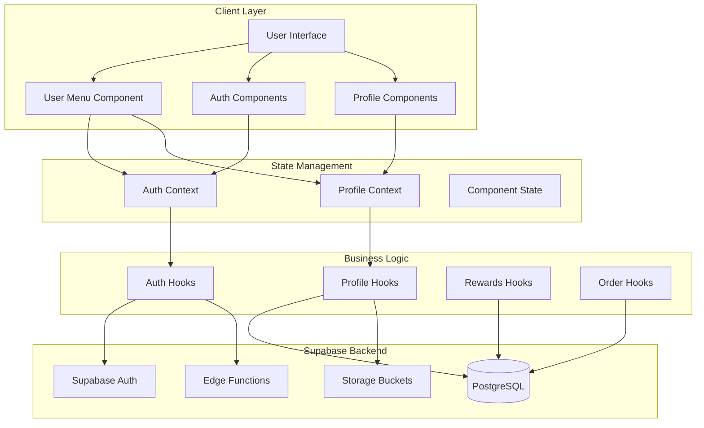
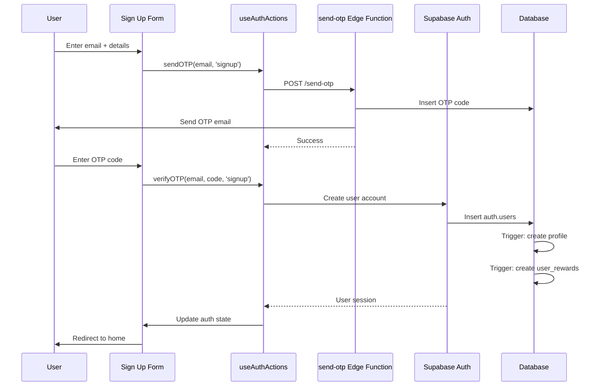
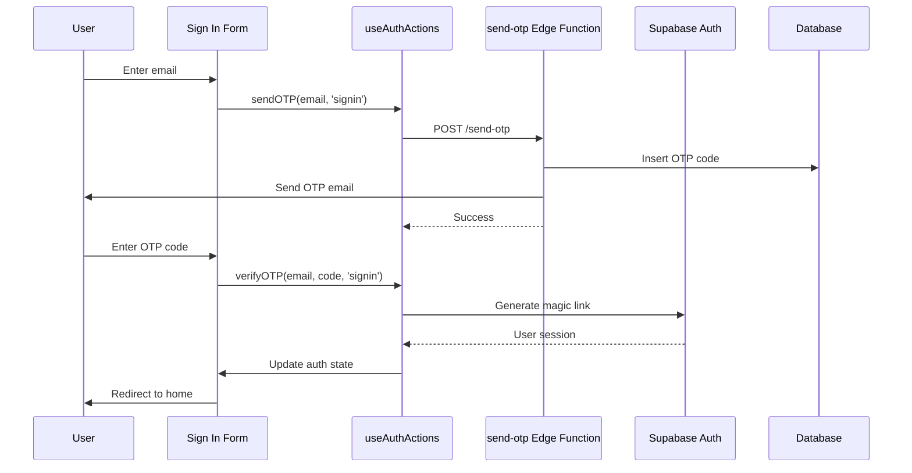
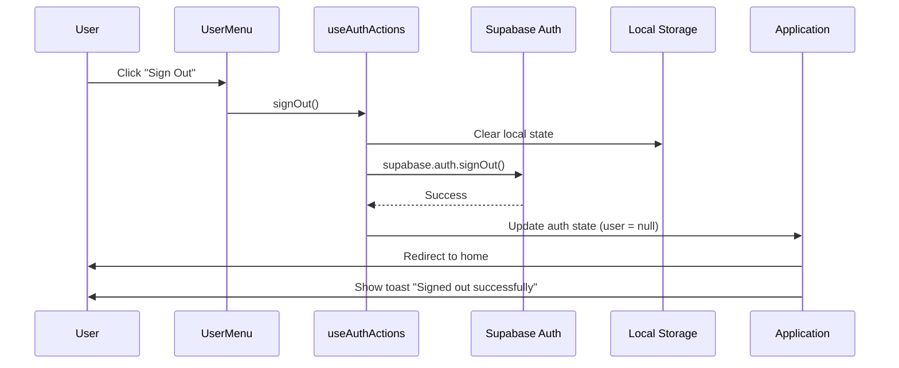
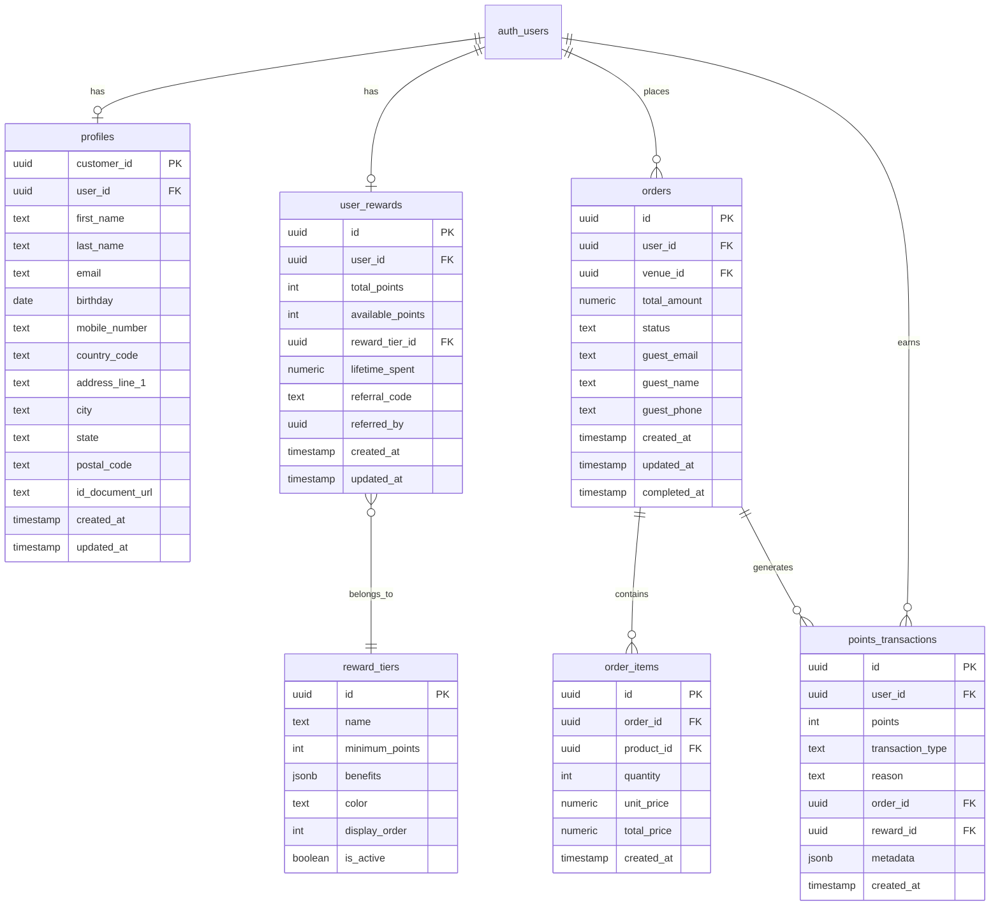
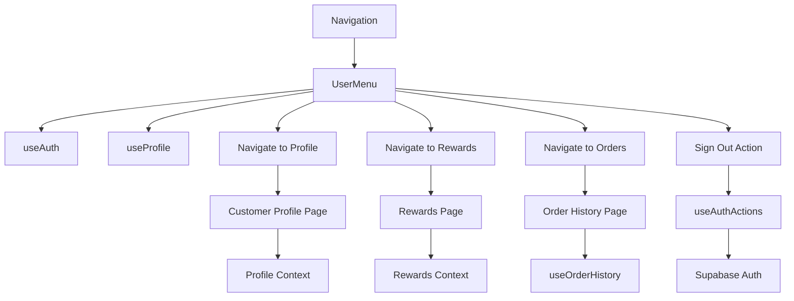

# User Management System - Technical Architecture

## Document Information
- **System Area**: User Management & Authentication
- **Version**: 1.0
- **Last Updated**: 2025-11-22
- **Status**: Technical Specification
- **Platform**: React Web Application (Future: React Native)

---

## Table of Contents
1. [System Overview](#system-overview)
2. [Architecture Components](#architecture-components)
3. [Authentication & Authorization](#authentication--authorization)
4. [User Profile Management](#user-profile-management)
5. [User Menu & Navigation](#user-menu--navigation)
6. [Rewards System Integration](#rewards-system-integration)
7. [Order History Integration](#order-history-integration)
8. [Data Architecture](#data-architecture)
9. [API Design](#api-design)
10. [Security Architecture](#security-architecture)
11. [State Management](#state-management)
12. [Component Architecture](#component-architecture)
13. [Performance Considerations](#performance-considerations)
14. [Migration to React Native](#migration-to-react-native)

---

## System Overview

### Purpose
The User Management System provides comprehensive functionality for user authentication, profile management, navigation, and access to user-specific features including rewards tracking and order history.

### Scope
This architecture document covers:
- **User Authentication**: Sign up, sign in, OTP verification, password management, session management
- **User Profile**: Profile data, avatar management, personal information, preferences
- **User Menu**: Navigation dropdown with user context and quick access to key features
- **Profile Settings**: Comprehensive profile editing, password updates, biometric settings, payment management
- **Rewards Integration**: Points balance, tier status, redemption options
- **Order History Integration**: Past orders, order details, re-ordering
- **Sign Out**: Session termination and cleanup

### Key Features
- Email/OTP authentication with demo mode
- Real-time profile data synchronization
- Avatar upload with Supabase Storage
- Dropdown menu with user context
- Navigation to Profile Settings, Rewards, Order History
- Secure sign out with state cleanup
- Role-based access control (future enhancement)

---

## Architecture Components

### High-Level Architecture



### Component Hierarchy

```
App
├── AuthProvider
│   ├── ProfileProvider
│   │   ├── Navigation
│   │   │   └── UserMenu
│   │   │       ├── Avatar
│   │   │       ├── UserInfo
│   │   │       └── MenuItems
│   │   │           ├── Profile Settings Link
│   │   │           ├── Rewards Link
│   │   │           ├── Order History Link
│   │   │           └── Sign Out Button
│   │   ├── CustomerProfile (Profile Settings Page)
│   │   │   ├── ProfileSummary
│   │   │   ├── AccountDashboard
│   │   │   ├── ManageProfile
│   │   │   ├── OrderHistory
│   │   │   ├── ManagePayments
│   │   │   ├── UpdatePassword
│   │   │   ├── RewardsSection
│   │   │   └── BiometricSettings
│   │   ├── Rewards (Rewards Page)
│   │   └── OrderHistory (Order History Page)
│   └── Auth (Authentication Page)
└── ProtectedRoute (Route Guard)
```

---

## Authentication & Authorization

### Authentication Flow

#### Sign Up Flow


#### Sign In Flow


#### Session Management
```typescript
// Auth state management
interface AuthState {
  user: User | null;
  session: Session | null;
  loading: boolean;
}

// Session lifecycle
1. Initial Load: Check for existing session
2. Sign In: Create new session
3. Session Refresh: Auto-refresh tokens
4. Sign Out: Destroy session
5. Session Expiry: Auto-logout
```

### Authorization Levels

```typescript
// User roles (future enhancement)
enum UserRole {
  GUEST = 'guest',
  USER = 'user',
  PREMIUM = 'premium',
  ADMIN = 'admin'
}

// Route protection
interface RouteGuard {
  requiresAuth: boolean;
  allowedRoles?: UserRole[];
  redirectTo?: string;
}
```

### Authentication Components

**Sign Up Form**
```typescript
// src/components/auth/SignUpForm.tsx
interface SignUpFormData {
  email: string;
  firstName: string;
  lastName: string;
  birthdate: string;
  mobileNumber: string;
  countryCode: string;
  joinRewards: boolean;
  referralCode?: string;
}
```

**Sign In Form**
```typescript
// src/components/auth/SignInForm.tsx
interface SignInFormData {
  email: string;
}
```

**OTP Form**
```typescript
// src/components/auth/OTPForm.tsx
interface OTPFormProps {
  email: string;
  type: 'signup' | 'signin';
  onVerified: () => void;
  additionalData?: UserSignUpData;
}
```

### Authentication Hooks

**useAuth**
```typescript
// src/hooks/useAuth.ts
export const useAuth = () => {
  const { user, session, loading } = useAuthState();
  
  return {
    user,
    session,
    loading,
    isAuthenticated: !!user,
    userId: user?.id
  };
};
```

**useAuthActions**
```typescript
// src/hooks/useAuthActions.ts
export const useAuthActions = () => {
  return {
    sendOTP: async (email: string, type: AuthType) => {},
    verifyOTP: async (email: string, code: string, type: AuthType) => {},
    createDemoSession: async (email: string) => {},
    resetPassword: async (email: string) => {},
    updatePassword: async (newPassword: string) => {},
    signOut: async () => {}
  };
};
```

**useAuthState**
```typescript
// src/hooks/useAuthState.ts
export const useAuthState = () => {
  const [user, setUser] = useState<User | null>(null);
  const [session, setSession] = useState<Session | null>(null);
  const [loading, setLoading] = useState(true);
  
  useEffect(() => {
    // Listen to auth state changes
    const { data: { subscription } } = supabase.auth.onAuthStateChange(
      (event, session) => {
        setSession(session);
        setUser(session?.user ?? null);
        setLoading(false);
      }
    );
    
    return () => subscription.unsubscribe();
  }, []);
  
  return { user, session, loading };
};
```

---

## User Profile Management

### Profile Data Structure

```typescript
// Database: profiles table
interface Profile {
  customer_id: string;           // UUID, primary key
  user_id: string;               // UUID, references auth.users
  
  // Personal Information
  first_name: string | null;
  last_name: string | null;
  email: string | null;
  birthday: Date | null;
  gender: string | null;
  
  // Contact Information
  country_code: string | null;
  mobile_number: string | null;
  home_phone: string | null;
  work_phone: string | null;
  
  // Address
  address_line_1: string | null;
  address_line_2: string | null;
  city: string | null;
  state: string | null;
  postal_code: string | null;
  
  // Identity & Verification
  external_id: string | null;
  id_document_url: string | null; // Link to storage bucket
  
  // Metadata
  created_at: Date;
  updated_at: Date;
}
```

### Profile Context

```typescript
// src/contexts/ProfileContext.tsx
interface ProfileContextType {
  profile: Profile | null;
  loading: boolean;
  error: Error | null;
  
  // Actions
  updateProfile: (data: Partial<Profile>) => Promise<void>;
  uploadAvatar: (file: File) => Promise<string>;
  deleteAvatar: () => Promise<void>;
  refreshProfile: () => Promise<void>;
}

export const ProfileProvider: React.FC = ({ children }) => {
  const { user } = useAuth();
  const [profile, setProfile] = useState<Profile | null>(null);
  const [loading, setLoading] = useState(true);
  
  // Fetch profile on mount and user change
  useEffect(() => {
    if (user) {
      fetchProfile(user.id);
    }
  }, [user]);
  
  return (
    <ProfileContext.Provider value={contextValue}>
      {children}
    </ProfileContext.Provider>
  );
};
```

### Profile Hooks

**useProfile**
```typescript
// src/hooks/useUserProfile.ts
export const useProfile = () => {
  const context = useContext(ProfileContext);
  
  if (!context) {
    throw new Error('useProfile must be used within ProfileProvider');
  }
  
  return context;
};
```

**Avatar Management**
```typescript
// Avatar storage in Supabase Storage bucket: 'avatars'
export const useAvatarUpload = () => {
  const uploadAvatar = async (file: File, userId: string) => {
    // Validate file
    if (!file.type.startsWith('image/')) {
      throw new Error('File must be an image');
    }
    
    if (file.size > 5 * 1024 * 1024) { // 5MB limit
      throw new Error('File size must be less than 5MB');
    }
    
    // Upload to Supabase Storage
    const fileExt = file.name.split('.').pop();
    const fileName = `${userId}.${fileExt}`;
    const filePath = `${userId}/${fileName}`;
    
    const { error: uploadError } = await supabase.storage
      .from('avatars')
      .upload(filePath, file, { upsert: true });
    
    if (uploadError) throw uploadError;
    
    // Get public URL
    const { data } = supabase.storage
      .from('avatars')
      .getPublicUrl(filePath);
    
    return data.publicUrl;
  };
  
  return { uploadAvatar };
};
```

### Profile Components

**Profile Summary**
```typescript
// src/components/profile/ProfileSummary.tsx
// Displays overview of user profile with avatar, name, email, rewards tier
```

**Manage Profile**
```typescript
// src/components/profile/ManageProfile.tsx
// Form for editing personal information, contact details, address
```

**Avatar Upload**
```typescript
// src/components/profile/AvatarUpload.tsx
// Drag-and-drop or file picker for avatar upload with preview
```

---

## User Menu & Navigation

### User Menu Component Architecture

```typescript
// src/components/UserMenu.tsx
interface UserMenuProps {
  onLoginClick?: () => void;
}

export const UserMenu: React.FC<UserMenuProps> = ({ onLoginClick }) => {
  const { user, isAuthenticated } = useAuth();
  const { profile } = useProfile();
  const navigate = useNavigate();
  const { toast } = useToast();
  const { signOut } = useAuthActions();
  
  // Menu items configuration
  const menuItems = [
    {
      id: 'profile',
      icon: Settings,
      label: 'Profile Settings',
      path: '/profile',
      onClick: () => navigate('/profile')
    },
    {
      id: 'rewards',
      icon: Gift,
      label: 'Rewards',
      path: '/rewards',
      onClick: () => navigate('/rewards')
    },
    {
      id: 'orders',
      icon: Clock,
      label: 'Order History',
      path: '/profile?section=orders',
      onClick: () => navigate('/profile?section=orders')
    },
    {
      id: 'signout',
      icon: LogOut,
      label: 'Sign Out',
      variant: 'destructive',
      onClick: handleSignOut
    }
  ];
  
  return (
    <DropdownMenu>
      <DropdownMenuTrigger>
        <Avatar>
          {profile?.avatar_url ? (
            <AvatarImage src={profile.avatar_url} />
          ) : (
            <AvatarFallback>{getInitials()}</AvatarFallback>
          )}
        </Avatar>
      </DropdownMenuTrigger>
      
      <DropdownMenuContent>
        <DropdownMenuLabel>
          <div>{getUserDisplayName()}</div>
          <div className="text-sm text-muted-foreground">
            {user?.email}
          </div>
        </DropdownMenuLabel>
        
        <DropdownMenuSeparator />
        
        {menuItems.map((item) => (
          <DropdownMenuItem key={item.id} onClick={item.onClick}>
            <item.icon className="mr-2 h-4 w-4" />
            <span>{item.label}</span>
          </DropdownMenuItem>
        ))}
      </DropdownMenuContent>
    </DropdownMenu>
  );
};
```

### Menu Item Types

```typescript
interface MenuItem {
  id: string;
  icon: LucideIcon;
  label: string;
  path?: string;
  onClick: () => void;
  variant?: 'default' | 'destructive';
  badge?: string | number;
  requiresAuth?: boolean;
}
```

### User Display Logic

```typescript
// Display name priority:
// 1. First name + Last name from profile
// 2. Email username (before @)
// 3. User ID substring
const getUserDisplayName = () => {
  if (profile?.first_name && profile?.last_name) {
    return `${profile.first_name} ${profile.last_name}`;
  }
  
  if (profile?.first_name) {
    return profile.first_name;
  }
  
  if (user?.email) {
    return user.email.split('@')[0];
  }
  
  return user?.id.substring(0, 8) || 'User';
};

// Avatar initials
const getInitials = () => {
  if (profile?.first_name && profile?.last_name) {
    return `${profile.first_name[0]}${profile.last_name[0]}`.toUpperCase();
  }
  
  if (profile?.first_name) {
    return profile.first_name[0].toUpperCase();
  }
  
  if (user?.email) {
    return user.email[0].toUpperCase();
  }
  
  return 'U';
};
```

### Sign Out Flow



**Sign Out Implementation**
```typescript
const handleSignOut = async () => {
  try {
    // Clear auth state
    await signOut();
    
    // Clear any cached data
    localStorage.removeItem('selectedVenue');
    sessionStorage.clear();
    
    // Show confirmation
    toast({
      title: "Signed out",
      description: "You have been signed out successfully.",
    });
    
    // Redirect to home
    navigate('/');
  } catch (error) {
    console.error('Sign out error:', error);
    toast({
      title: "Error",
      description: "Failed to sign out. Please try again.",
      variant: "destructive",
    });
  }
};
```

---

## Rewards System Integration

### Rewards Data Structure

```typescript
// Database: user_rewards table
interface UserRewards {
  id: string;
  user_id: string;
  total_points: number;
  available_points: number;
  reward_tier_id: string | null;
  lifetime_spent: number;
  referral_code: string | null;
  referred_by: string | null;
  birthday: Date | null;
  anniversary_date: Date | null;
  social_sharing_enabled: boolean;
  created_at: Date;
  updated_at: Date;
}

// Database: reward_tiers table
interface RewardTier {
  id: string;
  name: string;
  minimum_points: number;
  benefits: any;
  color: string | null;
  display_order: number;
  is_active: boolean;
  created_at: Date;
  updated_at: Date;
}

// Database: points_transactions table
interface PointsTransaction {
  id: string;
  user_id: string;
  points: number;
  transaction_type: 'earned' | 'spent' | 'expired' | 'adjusted';
  reason: string;
  order_id: string | null;
  reward_id: string | null;
  metadata: any;
  created_at: Date;
}
```

### Rewards Context

```typescript
// Context for rewards state
interface RewardsContextType {
  rewards: UserRewards | null;
  currentTier: RewardTier | null;
  nextTier: RewardTier | null;
  progressToNextTier: number;
  transactions: PointsTransaction[];
  loading: boolean;
  
  // Actions
  earnPoints: (points: number, reason: string) => Promise<void>;
  redeemReward: (rewardId: string) => Promise<void>;
  refreshRewards: () => Promise<void>;
}
```

### Rewards Hooks

**useRewards**
```typescript
// src/hooks/useRewards.ts
export const useRewards = () => {
  const { user } = useAuth();
  const [rewards, setRewards] = useState<UserRewards | null>(null);
  const [currentTier, setCurrentTier] = useState<RewardTier | null>(null);
  
  // Fetch rewards data
  useEffect(() => {
    if (user) {
      fetchRewardsData(user.id);
    }
  }, [user]);
  
  // Calculate progress to next tier
  const progressToNextTier = useMemo(() => {
    if (!rewards || !currentTier || !nextTier) return 0;
    const currentPoints = rewards.total_points - currentTier.minimum_points;
    const pointsNeeded = nextTier.minimum_points - currentTier.minimum_points;
    return Math.min((currentPoints / pointsNeeded) * 100, 100);
  }, [rewards, currentTier, nextTier]);
  
  return {
    rewards,
    currentTier,
    nextTier,
    progressToNextTier,
    loading
  };
};
```

### Rewards Display in User Menu

```typescript
// Optional: Show points badge in menu
<DropdownMenuItem onClick={() => navigate('/rewards')}>
  <Gift className="mr-2 h-4 w-4" />
  <span>Rewards</span>
  {rewards && (
    <Badge variant="secondary" className="ml-auto">
      {rewards.available_points} pts
    </Badge>
  )}
</DropdownMenuItem>
```

---

## Order History Integration

### Order Data Structure

```typescript
// Database: orders table
interface Order {
  id: string;
  user_id: string | null;
  venue_id: string;
  total_amount: number;
  status: OrderStatus;
  
  // Guest checkout fields
  guest_email: string | null;
  guest_name: string | null;
  guest_phone: string | null;
  
  // Order details
  table_number: string | null;
  special_instructions: string | null;
  assigned_bartender: string | null;
  bartender_notes: string | null;
  
  // Timestamps
  created_at: Date;
  updated_at: Date;
  received_at: Date | null;
  preparing_at: Date | null;
  ready_at: Date | null;
  completed_at: Date | null;
}

// Database: order_items table
interface OrderItem {
  id: string;
  order_id: string;
  product_id: string;
  quantity: number;
  unit_price: number;
  total_price: number;
  created_at: Date;
}

// Database: order_status_history table
interface OrderStatusHistory {
  id: string;
  order_id: string;
  status: OrderStatus;
  previous_status: OrderStatus | null;
  duration_seconds: number | null;
  changed_at: Date;
  changed_by_user_id: string | null;
  notes: string | null;
}

type OrderStatus = 
  | 'pending'
  | 'received'
  | 'preparing'
  | 'ready'
  | 'completed'
  | 'cancelled';
```

### Order History Hooks

**useOrderHistory**
```typescript
// src/hooks/useOrderHistory.ts
export const useOrderHistory = () => {
  const { user } = useAuth();
  const [orders, setOrders] = useState<Order[]>([]);
  const [loading, setLoading] = useState(true);
  
  // Fetch order history
  useEffect(() => {
    if (user) {
      fetchOrders(user.id);
    }
  }, [user]);
  
  // Filter and sort orders
  const filterOrders = (
    status?: OrderStatus,
    dateFrom?: Date,
    dateTo?: Date
  ) => {
    return orders.filter(order => {
      if (status && order.status !== status) return false;
      if (dateFrom && new Date(order.created_at) < dateFrom) return false;
      if (dateTo && new Date(order.created_at) > dateTo) return false;
      return true;
    });
  };
  
  return {
    orders,
    loading,
    filterOrders,
    refreshOrders: () => fetchOrders(user.id)
  };
};
```

### Order History Display in User Menu

```typescript
// Optional: Show recent order count badge
<DropdownMenuItem onClick={() => navigate('/profile?section=orders')}>
  <Clock className="mr-2 h-4 w-4" />
  <span>Order History</span>
  {recentOrdersCount > 0 && (
    <Badge variant="secondary" className="ml-auto">
      {recentOrdersCount}
    </Badge>
  )}
</DropdownMenuItem>
```

---

## Data Architecture

### Database Schema



### Row Level Security (RLS) Policies

**profiles table**
```sql
-- Users can view their own profile
CREATE POLICY "Users can view their own profile"
ON profiles FOR SELECT
USING (auth.uid() = user_id);

-- Users can update their own profile
CREATE POLICY "Users can update their own profile"
ON profiles FOR UPDATE
USING (auth.uid() = user_id);

-- Users can create their own profile
CREATE POLICY "Users can create their own profile"
ON profiles FOR INSERT
WITH CHECK (auth.uid() = user_id);
```

**user_rewards table**
```sql
-- Users can view their own rewards profile
CREATE POLICY "Users can view their own rewards profile"
ON user_rewards FOR SELECT
USING (auth.uid() = user_id);

-- Users can update their own rewards profile
CREATE POLICY "Users can update their own rewards profile"
ON user_rewards FOR UPDATE
USING (auth.uid() = user_id);
```

**orders table**
```sql
-- Users can view their own orders (authenticated and guest)
CREATE POLICY "Users can view their own orders"
ON orders FOR SELECT
USING (
  auth.uid() = user_id 
  OR (user_id IS NULL AND guest_email IS NOT NULL)
);

-- Users can create orders
CREATE POLICY "Users can create their own orders"
ON orders FOR INSERT
WITH CHECK (
  auth.uid() = user_id 
  OR (user_id IS NULL AND guest_email IS NOT NULL AND guest_email <> '')
);
```

### Database Triggers

**Auto-create profile on user signup**
```sql
CREATE OR REPLACE FUNCTION public.handle_new_user()
RETURNS TRIGGER AS $$
BEGIN
  -- Insert into profiles table
  INSERT INTO public.profiles (user_id, first_name, last_name, email)
  VALUES (
    NEW.id,
    NEW.raw_user_meta_data ->> 'first_name',
    NEW.raw_user_meta_data ->> 'last_name',
    NEW.email
  );
  
  -- Insert into user_rewards table with default values
  INSERT INTO public.user_rewards (user_id, total_points, available_points)
  VALUES (NEW.id, 0, 0);
  
  RETURN NEW;
END;
$$ LANGUAGE plpgsql SECURITY DEFINER;

CREATE TRIGGER on_auth_user_created
  AFTER INSERT ON auth.users
  FOR EACH ROW
  EXECUTE FUNCTION public.handle_new_user();
```

**Auto-update timestamps**
```sql
CREATE OR REPLACE FUNCTION public.update_updated_at_column()
RETURNS TRIGGER AS $$
BEGIN
  NEW.updated_at = NOW();
  RETURN NEW;
END;
$$ LANGUAGE plpgsql;

CREATE TRIGGER update_profiles_updated_at
  BEFORE UPDATE ON profiles
  FOR EACH ROW
  EXECUTE FUNCTION public.update_updated_at_column();

CREATE TRIGGER update_user_rewards_updated_at
  BEFORE UPDATE ON user_rewards
  FOR EACH ROW
  EXECUTE FUNCTION public.update_updated_at_column();
```

---

## API Design

### Edge Functions

**send-otp**
```typescript
// supabase/functions/send-otp/index.ts
// Purpose: Send OTP code via email for authentication
// Method: POST
// Auth: Public (verify_jwt = false)
// Body: { email: string, type: 'signup' | 'signin' }
// Response: { success: boolean }
```

**verify-otp**
```typescript
// supabase/functions/verify-otp/index.ts
// Purpose: Verify OTP code and create/authenticate user
// Method: POST
// Auth: Public (verify_jwt = false)
// Body: { 
//   email: string, 
//   code: string, 
//   type: 'signup' | 'signin',
//   additionalData?: UserSignUpData 
// }
// Response: { 
//   success: boolean, 
//   user?: User,
//   session?: Session 
// }
```

**validate-email**
```typescript
// supabase/functions/validate-email/index.ts
// Purpose: Validate email format and check if available
// Method: POST
// Auth: Public (verify_jwt = false)
// Body: { email: string }
// Response: { 
//   valid: boolean, 
//   available: boolean,
//   reason?: string 
// }
```

### Supabase Client Methods

**Authentication**
```typescript
// Sign in with OTP (magic link)
const { data, error } = await supabase.auth.signInWithOtp({
  email,
  options: {
    emailRedirectTo: `${window.location.origin}/auth/callback`
  }
});

// Sign out
const { error } = await supabase.auth.signOut();

// Get current session
const { data: { session } } = await supabase.auth.getSession();

// Listen to auth changes
const { data: { subscription } } = supabase.auth.onAuthStateChange(
  (event, session) => {
    // Handle auth state changes
  }
);
```

**Profile Management**
```typescript
// Fetch profile
const { data: profile, error } = await supabase
  .from('profiles')
  .select('*')
  .eq('user_id', userId)
  .single();

// Update profile
const { error } = await supabase
  .from('profiles')
  .update({
    first_name: 'John',
    last_name: 'Doe',
    mobile_number: '+1234567890'
  })
  .eq('user_id', userId);

// Upload avatar
const { error } = await supabase.storage
  .from('avatars')
  .upload(`${userId}/avatar.png`, file, { upsert: true });

// Get avatar URL
const { data } = supabase.storage
  .from('avatars')
  .getPublicUrl(`${userId}/avatar.png`);
```

**Rewards**
```typescript
// Fetch user rewards
const { data: rewards, error } = await supabase
  .from('user_rewards')
  .select(`
    *,
    reward_tier:reward_tiers(*)
  `)
  .eq('user_id', userId)
  .single();

// Fetch points transactions
const { data: transactions, error } = await supabase
  .from('points_transactions')
  .select('*')
  .eq('user_id', userId)
  .order('created_at', { ascending: false })
  .limit(50);
```

**Orders**
```typescript
// Fetch order history
const { data: orders, error } = await supabase
  .from('orders')
  .select(`
    *,
    order_items(
      *,
      product:products(*)
    ),
    venue:venues(*)
  `)
  .eq('user_id', userId)
  .order('created_at', { ascending: false });

// Fetch single order with details
const { data: order, error } = await supabase
  .from('orders')
  .select(`
    *,
    order_items(*),
    order_status_history(*)
  `)
  .eq('id', orderId)
  .single();
```

---

## Security Architecture

### Authentication Security

**Password Security**
- Minimum 8 characters
- Must include uppercase, lowercase, number, special character
- Password history tracking (last 5 passwords)
- Bcrypt hashing with salt rounds
- Never store passwords in plain text

**OTP Security**
- 6-digit random code
- 5-minute expiration
- Single-use tokens
- Rate limiting (max 3 requests per email per hour)
- Automatic cleanup of expired codes

**Session Security**
- JWT tokens with expiration
- Secure HTTP-only cookies
- Auto-refresh tokens before expiration
- Session invalidation on sign out
- Concurrent session management

### Authorization Security

**Row Level Security (RLS)**
- Enabled on all user-facing tables
- Users can only access their own data
- Service role bypasses RLS for admin operations
- Guest users can access orders via email matching

**API Security**
- Edge functions protected by JWT verification
- Public endpoints explicitly configured
- Rate limiting on sensitive operations
- Input validation and sanitization
- CORS properly configured

### Data Security

**Personal Information**
- Sensitive data encrypted at rest
- ID documents stored in private storage bucket
- Payment information never stored (use Stripe)
- Email addresses normalized and validated
- Phone numbers validated and formatted

**Storage Security**
- Avatar bucket: Public read, authenticated write
- ID documents bucket: Private, owner access only
- RLS policies on storage.objects
- File type validation
- File size limits enforced

### Audit & Compliance

**Security Logging**
```typescript
// Log security events
interface SecurityEvent {
  event_type: 'login' | 'logout' | 'password_change' | 'profile_update';
  user_id: string;
  ip_address: string;
  user_agent: string;
  metadata: any;
  created_at: Date;
}

// Audit trail for compliance
const logSecurityEvent = async (event: SecurityEvent) => {
  await supabase.from('security_events').insert(event);
};
```

**GDPR Compliance**
- Right to access (data export)
- Right to erasure (account deletion)
- Right to rectification (profile updates)
- Data portability
- Consent management

---

## State Management

### Context Providers Hierarchy

```typescript
// src/App.tsx
function App() {
  return (
    <QueryClientProvider client={queryClient}>
      <AuthProvider>
        <ProfileProvider>
          <Toaster />
          <Sonner />
          <TooltipProvider>
            <Router />
          </TooltipProvider>
        </ProfileProvider>
      </AuthProvider>
    </QueryClientProvider>
  );
}
```

### Auth Context

```typescript
// src/contexts/AuthContext.tsx
interface AuthContextType {
  user: User | null;
  session: Session | null;
  loading: boolean;
  signOut: () => Promise<void>;
}

export const AuthContext = createContext<AuthContextType | undefined>(undefined);

export const AuthProvider: React.FC<{ children: ReactNode }> = ({ children }) => {
  const [user, setUser] = useState<User | null>(null);
  const [session, setSession] = useState<Session | null>(null);
  const [loading, setLoading] = useState(true);
  
  useEffect(() => {
    // Initialize auth state
    supabase.auth.getSession().then(({ data: { session } }) => {
      setSession(session);
      setUser(session?.user ?? null);
      setLoading(false);
    });
    
    // Listen for auth changes
    const { data: { subscription } } = supabase.auth.onAuthStateChange(
      (_event, session) => {
        setSession(session);
        setUser(session?.user ?? null);
      }
    );
    
    return () => subscription.unsubscribe();
  }, []);
  
  const signOut = async () => {
    await supabase.auth.signOut();
    setUser(null);
    setSession(null);
  };
  
  return (
    <AuthContext.Provider value={{ user, session, loading, signOut }}>
      {children}
    </AuthContext.Provider>
  );
};
```

### Profile Context

```typescript
// src/contexts/ProfileContext.tsx
interface ProfileContextType {
  profile: Profile | null;
  loading: boolean;
  error: Error | null;
  updateProfile: (data: Partial<Profile>) => Promise<void>;
  uploadAvatar: (file: File) => Promise<string>;
  refreshProfile: () => Promise<void>;
}

export const ProfileContext = createContext<ProfileContextType | undefined>(undefined);

export const ProfileProvider: React.FC<{ children: ReactNode }> = ({ children }) => {
  const { user } = useAuth();
  const [profile, setProfile] = useState<Profile | null>(null);
  const [loading, setLoading] = useState(false);
  const [error, setError] = useState<Error | null>(null);
  
  // Fetch profile when user changes
  useEffect(() => {
    if (user) {
      fetchProfile();
    } else {
      setProfile(null);
    }
  }, [user]);
  
  const fetchProfile = async () => {
    if (!user) return;
    
    setLoading(true);
    try {
      const { data, error } = await supabase
        .from('profiles')
        .select('*')
        .eq('user_id', user.id)
        .single();
      
      if (error) throw error;
      setProfile(data);
      setError(null);
    } catch (err) {
      setError(err as Error);
    } finally {
      setLoading(false);
    }
  };
  
  const updateProfile = async (updates: Partial<Profile>) => {
    if (!user) throw new Error('Not authenticated');
    
    const { error } = await supabase
      .from('profiles')
      .update(updates)
      .eq('user_id', user.id);
    
    if (error) throw error;
    await fetchProfile();
  };
  
  const uploadAvatar = async (file: File) => {
    if (!user) throw new Error('Not authenticated');
    
    const fileExt = file.name.split('.').pop();
    const fileName = `${user.id}.${fileExt}`;
    const filePath = `${user.id}/${fileName}`;
    
    const { error: uploadError } = await supabase.storage
      .from('avatars')
      .upload(filePath, file, { upsert: true });
    
    if (uploadError) throw uploadError;
    
    const { data } = supabase.storage
      .from('avatars')
      .getPublicUrl(filePath);
    
    return data.publicUrl;
  };
  
  return (
    <ProfileContext.Provider 
      value={{ 
        profile, 
        loading, 
        error, 
        updateProfile, 
        uploadAvatar,
        refreshProfile: fetchProfile 
      }}
    >
      {children}
    </ProfileContext.Provider>
  );
};
```

### Local Storage Strategy

```typescript
// User preferences (non-sensitive)
interface LocalPreferences {
  theme: 'light' | 'dark' | 'system';
  selectedVenue: string | null;
  language: string;
  notificationsEnabled: boolean;
}

// Managed by hooks
export const useLocalPreferences = () => {
  const [prefs, setPrefs] = useState<LocalPreferences>(() => {
    const stored = localStorage.getItem('userPreferences');
    return stored ? JSON.parse(stored) : defaultPreferences;
  });
  
  const updatePreferences = (updates: Partial<LocalPreferences>) => {
    const newPrefs = { ...prefs, ...updates };
    setPrefs(newPrefs);
    localStorage.setItem('userPreferences', JSON.stringify(newPrefs));
  };
  
  return { preferences: prefs, updatePreferences };
};
```

---

## Component Architecture

### Atomic Design Structure

```
src/components/
├── atoms/
│   ├── Avatar.tsx
│   ├── Badge.tsx
│   └── Button.tsx
│
├── molecules/
│   ├── UserAvatar.tsx          # Avatar with fallback logic
│   ├── UserDisplayName.tsx     # Name with formatting
│   ├── MenuItem.tsx            # Single menu item
│   └── ProfileNavItem.tsx      # Profile sidebar nav item
│
├── organisms/
│   ├── UserMenu.tsx            # Main dropdown menu
│   ├── Navigation.tsx          # Top navigation bar
│   ├── ProfileSidebarNav.tsx  # Profile section sidebar
│   └── HeroSection.tsx
│
└── templates/
    ├── MainLayout.tsx          # Main app layout
    └── ProfileLayout.tsx       # Profile section layout
```

### Component Communication



### Protected Routes

```typescript
// src/components/ProtectedRoute.tsx
interface ProtectedRouteProps {
  children: React.ReactNode;
  requireAuth?: boolean;
  redirectTo?: string;
}

export const ProtectedRoute: React.FC<ProtectedRouteProps> = ({
  children,
  requireAuth = true,
  redirectTo = '/auth'
}) => {
  const { user, loading } = useAuth();
  const location = useLocation();
  
  if (loading) {
    return <LoadingSpinner />;
  }
  
  if (requireAuth && !user) {
    return <Navigate to={redirectTo} state={{ from: location }} replace />;
  }
  
  return <>{children}</>;
};

// Usage in routing
<Route
  path="/profile"
  element={
    <ProtectedRoute>
      <CustomerProfile />
    </ProtectedRoute>
  }
/>
```

### Component Props Interfaces

```typescript
// UserMenu component props
interface UserMenuProps {
  onLoginClick?: () => void;
  showBadges?: boolean;
  variant?: 'default' | 'compact';
}

// Avatar component props
interface UserAvatarProps {
  user: User;
  profile: Profile | null;
  size?: 'sm' | 'md' | 'lg';
  showStatus?: boolean;
}

// Menu item props
interface MenuItemProps {
  icon: LucideIcon;
  label: string;
  onClick: () => void;
  badge?: string | number;
  variant?: 'default' | 'destructive';
  disabled?: boolean;
}
```

---

## Performance Considerations

### Data Fetching Optimization

**React Query for Caching**
```typescript
// src/hooks/useProfile.ts with React Query
import { useQuery, useMutation, useQueryClient } from '@tanstack/react-query';

export const useProfile = () => {
  const { user } = useAuth();
  const queryClient = useQueryClient();
  
  // Fetch profile with caching
  const { data: profile, isLoading } = useQuery({
    queryKey: ['profile', user?.id],
    queryFn: () => fetchProfile(user!.id),
    enabled: !!user,
    staleTime: 5 * 60 * 1000, // 5 minutes
    cacheTime: 10 * 60 * 1000  // 10 minutes
  });
  
  // Update profile mutation
  const updateMutation = useMutation({
    mutationFn: (updates: Partial<Profile>) => 
      updateProfile(user!.id, updates),
    onSuccess: () => {
      queryClient.invalidateQueries(['profile', user?.id]);
    }
  });
  
  return {
    profile,
    loading: isLoading,
    updateProfile: updateMutation.mutate
  };
};
```

**Optimistic Updates**
```typescript
// Optimistic profile update
const updateMutation = useMutation({
  mutationFn: updateProfile,
  onMutate: async (newData) => {
    // Cancel outgoing refetches
    await queryClient.cancelQueries(['profile', user?.id]);
    
    // Snapshot previous value
    const previousProfile = queryClient.getQueryData(['profile', user?.id]);
    
    // Optimistically update
    queryClient.setQueryData(['profile', user?.id], (old) => ({
      ...old,
      ...newData
    }));
    
    return { previousProfile };
  },
  onError: (err, newData, context) => {
    // Rollback on error
    queryClient.setQueryData(
      ['profile', user?.id],
      context.previousProfile
    );
  },
  onSettled: () => {
    queryClient.invalidateQueries(['profile', user?.id]);
  }
});
```

### Component Optimization

**Memoization**
```typescript
// Memoize expensive computations
const getUserDisplayName = useMemo(() => {
  if (profile?.first_name && profile?.last_name) {
    return `${profile.first_name} ${profile.last_name}`;
  }
  return user?.email?.split('@')[0] || 'User';
}, [profile?.first_name, profile?.last_name, user?.email]);

// Memoize callback functions
const handleMenuItemClick = useCallback((path: string) => {
  navigate(path);
}, [navigate]);

// Memoize entire component
const UserAvatar = memo(({ user, profile }: UserAvatarProps) => {
  // Component implementation
});
```

**Code Splitting**
```typescript
// Lazy load profile pages
const CustomerProfile = lazy(() => import('@/pages/CustomerProfile'));
const Rewards = lazy(() => import('@/pages/Rewards'));
const OrderHistory = lazy(() => import('@/components/profile/OrderHistory'));

// Use with Suspense
<Suspense fallback={<LoadingSpinner />}>
  <CustomerProfile />
</Suspense>
```

### Image Optimization

**Avatar Loading**
```typescript
const AvatarWithFallback: React.FC<AvatarProps> = ({ src, alt }) => {
  const [imageError, setImageError] = useState(false);
  const [isLoading, setIsLoading] = useState(true);
  
  return (
    <Avatar>
      {!imageError && src ? (
        <>
          {isLoading && <AvatarSkeleton />}
          <AvatarImage
            src={src}
            alt={alt}
            onLoad={() => setIsLoading(false)}
            onError={() => {
              setImageError(true);
              setIsLoading(false);
            }}
            loading="lazy"
          />
        </>
      ) : (
        <AvatarFallback>{getInitials(alt)}</AvatarFallback>
      )}
    </Avatar>
  );
};
```

### Database Query Optimization

**Selective Field Fetching**
```typescript
// Only fetch needed fields
const { data } = await supabase
  .from('profiles')
  .select('first_name, last_name, email, avatar_url')
  .eq('user_id', userId)
  .single();

// Use joins efficiently
const { data } = await supabase
  .from('user_rewards')
  .select(`
    total_points,
    available_points,
    reward_tier:reward_tiers!inner(name, color)
  `)
  .eq('user_id', userId)
  .single();
```

**Pagination for Large Lists**
```typescript
// Paginated order history
const { data, error } = await supabase
  .from('orders')
  .select('*', { count: 'exact' })
  .eq('user_id', userId)
  .order('created_at', { ascending: false })
  .range(start, end);
```

---

## Migration to React Native

### Platform Strategy

**Current State: React Web App**
- Built with React + Vite + TypeScript
- Uses Tailwind CSS for styling
- Supabase for backend
- shadcn/ui components

**Future State: React Native Mobile App**
- Rebuild using React Native + TypeScript
- Use React Native styling (StyleSheet or styled-components)
- Maintain Supabase backend (unchanged)
- Replace web components with React Native equivalents

### Architecture Preservation

**What Transfers Directly:**
1. **Backend Infrastructure** (100% compatible)
   - Supabase database schema
   - Edge Functions
   - Storage buckets
   - RLS policies
   - Authentication system

2. **Business Logic** (Mostly compatible)
   - Authentication hooks (minor modifications)
   - Data fetching logic
   - State management patterns
   - API integration code

3. **Data Structures** (100% compatible)
   - TypeScript interfaces
   - Database types
   - API request/response types

**What Requires Rewrite:**
1. **UI Components** (Complete rewrite)
   - Replace HTML elements with React Native components
   - `<div>` → `<View>`
   - `<span>` → `<Text>`
   - `` → `<Image>`
   - `<button>` → `<TouchableOpacity>` or `<Pressable>`

2. **Styling** (Complete rewrite)
   - Remove Tailwind CSS
   - Implement StyleSheet or styled-components
   - Adapt responsive design for mobile

3. **Navigation** (Different library)
   - Replace React Router with React Navigation
   - Different navigation patterns (Stack, Tab, Drawer)

4. **Component Libraries** (Find alternatives)
   - Replace shadcn/ui with React Native equivalents
   - React Native Paper
   - React Native Elements
   - Native Base

### Migration Comparison

| Aspect | Web (Current) | React Native (Future) |
|--------|--------------|---------------------|
| **Backend** | Supabase | Supabase (unchanged) |
| **Language** | TypeScript | TypeScript |
| **UI Framework** | React | React Native |
| **Styling** | Tailwind CSS | StyleSheet/styled-components |
| **Navigation** | React Router | React Navigation |
| **Components** | HTML + shadcn/ui | React Native components |
| **State** | Context + React Query | Context + React Query (same) |
| **API Client** | Supabase JS | Supabase JS (unchanged) |
| **Storage** | localStorage | AsyncStorage |

### Component Migration Examples

**UserMenu: Web → React Native**

```tsx
// WEB (Current)
import { DropdownMenu, DropdownMenuTrigger, Avatar } from '@/components/ui';

export const UserMenu = () => {
  return (
    <DropdownMenu>
      <DropdownMenuTrigger>
        <Avatar>
          <AvatarImage src={profile?.avatar_url} />
          <AvatarFallback>{getInitials()}</AvatarFallback>
        </Avatar>
      </DropdownMenuTrigger>
      <DropdownMenuContent>
        <DropdownMenuItem onClick={handleProfileClick}>
          <Settings className="mr-2" />
          Profile Settings
        </DropdownMenuItem>
      </DropdownMenuContent>
    </DropdownMenu>
  );
};

// REACT NATIVE (Future)
import { View, TouchableOpacity, Modal, Text, Image } from 'react-native';
import { Menu } from 'react-native-paper'; // Or custom implementation

export const UserMenu = () => {
  const [visible, setVisible] = useState(false);
  
  return (
    <Menu
      visible={visible}
      onDismiss={() => setVisible(false)}
      anchor={
        <TouchableOpacity onPress={() => setVisible(true)}>
          {profile?.avatar_url ? (
            <Image 
              source={{ uri: profile.avatar_url }}
              style={styles.avatar}
            />
          ) : (
            <View style={styles.avatarFallback}>
              <Text style={styles.initials}>{getInitials()}</Text>
            </View>
          )}
        </TouchableOpacity>
      }
    >
      <Menu.Item
        onPress={handleProfileClick}
        title="Profile Settings"
        leadingIcon="cog"
      />
      <Menu.Item
        onPress={handleRewardsClick}
        title="Rewards"
        leadingIcon="gift"
      />
      <Menu.Item
        onPress={handleSignOut}
        title="Sign Out"
        leadingIcon="logout"
      />
    </Menu>
  );
};

const styles = StyleSheet.create({
  avatar: {
    width: 40,
    height: 40,
    borderRadius: 20,
  },
  avatarFallback: {
    width: 40,
    height: 40,
    borderRadius: 20,
    backgroundColor: '#e0e0e0',
    justifyContent: 'center',
    alignItems: 'center',
  },
  initials: {
    fontSize: 16,
    fontWeight: '600',
    color: '#333',
  },
});
```

### Hook Migration Example

**useAuth: Fully Compatible**

```typescript
// Works in BOTH Web and React Native
export const useAuth = () => {
  const [user, setUser] = useState<User | null>(null);
  const [session, setSession] = useState<Session | null>(null);
  
  useEffect(() => {
    supabase.auth.getSession().then(({ data: { session } }) => {
      setSession(session);
      setUser(session?.user ?? null);
    });
    
    const { data: { subscription } } = supabase.auth.onAuthStateChange(
      (event, session) => {
        setSession(session);
        setUser(session?.user ?? null);
      }
    );
    
    return () => subscription.unsubscribe();
  }, []);
  
  return { user, session, isAuthenticated: !!user };
};
```

### Storage Migration

```typescript
// WEB: localStorage
localStorage.setItem('key', 'value');
const value = localStorage.getItem('key');

// REACT NATIVE: AsyncStorage
import AsyncStorage from '@react-native-async-storage/async-storage';

await AsyncStorage.setItem('key', 'value');
const value = await AsyncStorage.getItem('key');
```

### Navigation Migration

```typescript
// WEB: React Router
import { useNavigate } from 'react-router-dom';

const navigate = useNavigate();
navigate('/profile');

// REACT NATIVE: React Navigation
import { useNavigation } from '@react-navigation/native';

const navigation = useNavigation();
navigation.navigate('Profile');
```

### Migration Phases

**Phase 1: Planning & Architecture** (1-2 weeks)
- Audit existing components
- Map component equivalents
- Design React Native architecture
- Choose component library
- Plan navigation structure

**Phase 2: Core Infrastructure** (2-3 weeks)
- Set up React Native project
- Configure Supabase client
- Implement authentication flow
- Set up navigation
- Create base layouts

**Phase 3: Feature Migration** (4-6 weeks)
- Migrate User Menu
- Migrate Profile Settings
- Migrate Rewards system
- Migrate Order History
- Implement all user management features

**Phase 4: Testing & Optimization** (2-3 weeks)
- Unit testing
- Integration testing
- Performance optimization
- Bug fixes
- UX refinement

**Phase 5: Deployment** (1 week)
- iOS App Store submission
- Google Play Store submission
- Beta testing
- Production release

### Estimated Migration Effort

| Component Area | Complexity | Estimated Time |
|---------------|-----------|----------------|
| Authentication | Medium | 1-2 weeks |
| User Profile | Medium | 1-2 weeks |
| User Menu | Low | 3-5 days |
| Rewards Integration | Medium | 1 week |
| Order History | Medium | 1 week |
| Navigation | Low | 3-5 days |
| Styling | High | 2-3 weeks |
| Testing | Medium | 2 weeks |
| **Total** | | **8-12 weeks** |

### Recommendations for React Native Migration

1. **Keep Supabase Backend Intact**
   - No changes needed to database, Edge Functions, or RLS policies
   - Same authentication system works with React Native
   - Supabase JS client fully compatible

2. **Use TypeScript Interfaces**
   - All your type definitions transfer directly
   - Maintains type safety across platforms

3. **Preserve Business Logic**
   - Extract hooks and utilities to shared modules
   - Keep Supabase integration code unchanged
   - Reuse state management patterns

4. **Choose Component Library Early**
   - React Native Paper (Material Design)
   - React Native Elements
   - Native Base
   - Or build custom components

5. **Plan Navigation First**
   - React Navigation is standard
   - Different patterns than web (Stack, Tab, Drawer)
   - Plan user flows carefully

6. **Consider Code Sharing**
   - Use monorepo structure (optional)
   - Share hooks, utilities, types
   - Keep UI components separate

---

## Appendices

### Appendix A: Component File Structure

```
src/
├── components/
│   ├── auth/
│   │   ├── SignInForm.tsx
│   │   ├── SignUpForm.tsx
│   │   └── OTPForm.tsx
│   │
│   ├── profile/
│   │   ├── ProfileSummary.tsx
│   │   ├── ManageProfile.tsx
│   │   ├── AccountDashboard.tsx
│   │   ├── OrderHistory.tsx
│   │   ├── ManagePayments.tsx
│   │   ├── UpdatePassword.tsx
│   │   ├── RewardsSection.tsx
│   │   ├── BiometricSettings.tsx
│   │   └── AvatarUpload.tsx
│   │
│   ├── UserMenu.tsx
│   ├── Navigation.tsx
│   └── ProtectedRoute.tsx
│
├── hooks/
│   ├── useAuth.ts
│   ├── useAuthActions.ts
│   ├── useAuthState.ts
│   ├── useUserProfile.ts
│   ├── useRewards.ts
│   └── useOrderHistory.ts
│
├── contexts/
│   └── ProfileContext.tsx
│
├── pages/
│   ├── Auth.tsx
│   ├── CustomerProfile.tsx
│   ├── Rewards.tsx
│   └── Index.tsx
│
└── types/
    ├── auth.ts
    ├── profile.ts
    └── user.ts
```

### Appendix B: Database Schema SQL

```sql
-- See complete schema in supabase/migrations/
-- Key tables for user management:

-- profiles
-- user_rewards
-- reward_tiers
-- points_transactions
-- orders
-- order_items
-- order_status_history
-- otp_codes
```

### Appendix C: Environment Variables

```bash
# Supabase Configuration
VITE_SUPABASE_URL=https://zkhawnmbfmbnzspfgkje.supabase.co
VITE_SUPABASE_ANON_KEY=eyJhbGciOiJIUzI1NiIsInR5cCI6IkpXVCJ9...

# Email Service (Resend)
RESEND_API_KEY=re_xxxxxxxxxxxxx

# Feature Flags (optional)
VITE_ENABLE_DEMO_MODE=true
VITE_ENABLE_BIOMETRICS=false
```

### Appendix D: Error Codes Reference

| Code | Message | Action |
|------|---------|--------|
| AUTH_001 | Invalid OTP code | Prompt user to re-enter |
| AUTH_002 | OTP expired | Resend OTP |
| AUTH_003 | User not found | Redirect to sign up |
| PROFILE_001 | Profile not found | Create profile |
| PROFILE_002 | Upload failed | Retry upload |
| REWARDS_001 | Insufficient points | Show points needed |
| ORDER_001 | Order not found | Redirect to history |

### Appendix E: UI/UX Specifications

**User Menu Dropdown**
- Width: 280px
- Max height: 400px (scrollable)
- Border radius: 8px
- Shadow: 0 4px 12px rgba(0, 0, 0, 0.15)
- Animation: Fade in 200ms, slide down 150ms

**Avatar Specifications**
- Size: 40px × 40px (default)
- Border radius: 50%
- Fallback background: hsl(var(--muted))
- Initials font: 16px, semi-bold

**Menu Items**
- Height: 44px (touch-friendly)
- Icon size: 16px
- Spacing: 8px between icon and text
- Hover: Background hsl(var(--accent))

---

## Document History

| Version | Date | Author | Changes |
|---------|------|--------|---------|
| 1.0 | 2025-11-22 | Architecture Team | Initial technical architecture document |

---

## Approvals

| Role | Name | Signature | Date |
|------|------|-----------|------|
| Technical Lead | | | |
| Product Owner | | | |
| Engineering Manager | | | |
| Security Lead | | | |

---

**Document Status**: Technical Specification  
**Next Review Date**: TBD  
**Related Documents**:
- Product Requirements Documentation
- API Documentation
- Security Guidelines
- React Native Migration Plan
