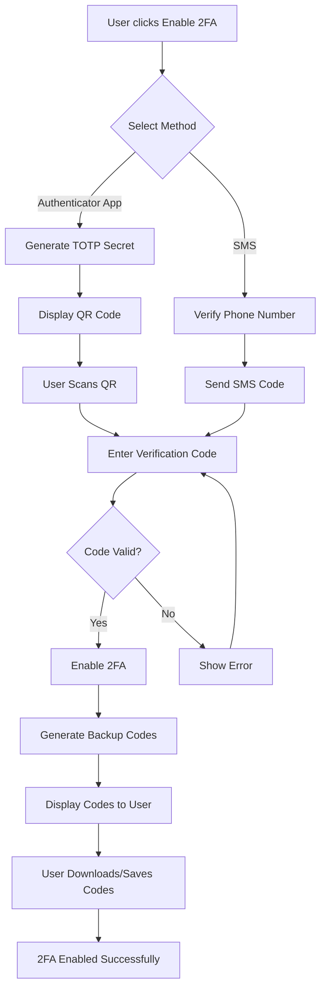

# Update Password - Product Requirements Documentation

## Document Information
- **Feature Area**: Customer Profile Management - Security & Authentication
- **Epic**: Password & Security Management
- **Version**: 1.0
- **Last Updated**: 2025-11-22
- **Status**: Draft

---

## Table of Contents
1. [Epic Overview](#epic-overview)
2. [User Stories](#user-stories)
3. [Technical Requirements](#technical-requirements)
4. [Security Considerations](#security-considerations)
5. [Non-Functional Requirements](#non-functional-requirements)
6. [Success Metrics](#success-metrics)
7. [Traceability Matrix](#traceability-matrix)
8. [Future Enhancements](#future-enhancements)

---

## Epic Overview

### EPIC-PROFILE-007: Password & Security Management

**Epic Statement**  
As a Pours Consumer user, I want comprehensive password and security management capabilities so that I can maintain control over my account security and protect my personal information.

**Business Value**
- Enhances user account security and reduces unauthorized access
- Builds user trust through robust security features
- Complies with security best practices and data protection regulations
- Reduces support tickets related to compromised accounts
- Provides users with peace of mind about their account safety

**Success Criteria**
- Users can successfully update their passwords with proper validation
- Password strength requirements are clearly communicated and enforced
- Security checks prevent unauthorized password changes
- Two-factor authentication adoption reaches target percentage
- Reduced incidents of account compromise
- High user satisfaction with security features

**Dependencies**
- Supabase Authentication system
- Email service for verification codes
- SMS service for two-factor authentication (optional)
- Authenticator app integration for TOTP (optional)

---

## User Stories

### US-PASSWORD.1: Update Password

**Story**  
As a Pours Consumer user, I want to change my account password so that I can maintain my account security and update credentials when needed.

**Priority**: High  
**Story Points**: 5  
**Sprint**: TBD

#### Acceptance Criteria

```gherkin
Feature: Update Account Password
  Epic: Password & Security Management

  Scenario: User successfully updates password
    Given I am logged in to my Pours Consumer account
    And I navigate to the "Update Password" section
    When I enter my current password correctly
    And I enter a new password that meets strength requirements
    And I confirm the new password by entering it again
    And I click "Update Password"
    Then my password should be updated successfully
    And I should see a confirmation message "Password updated successfully"
    And I should receive a confirmation email about the password change
    And I should remain logged in to my account

  Scenario: User enters incorrect current password
    Given I am on the "Update Password" section
    When I enter an incorrect current password
    And I enter a valid new password
    And I click "Update Password"
    Then I should see an error message "Current password is incorrect"
    And my password should not be updated

  Scenario: User's new password doesn't match confirmation
    Given I am on the "Update Password" section
    When I enter my current password correctly
    And I enter a new password
    And I enter a different password in the confirmation field
    And I click "Update Password"
    Then I should see an error message "Passwords do not match"
    And my password should not be updated

  Scenario: User tries to reuse current password
    Given I am on the "Update Password" section
    When I enter my current password correctly
    And I enter my current password as the new password
    And I click "Update Password"
    Then I should see an error message "New password must be different from current password"
    And my password should not be updated
```

#### Technical Requirements

**Frontend Components**
- `UpdatePassword` component with form fields:
  - Current password input (type="password")
  - New password input with visibility toggle
  - Confirm password input with visibility toggle
  - Password strength indicator (visual feedback)
  - Submit button
  - Cancel button

**Supabase Integration**
```typescript
// Update password using Supabase Auth
const { error } = await supabase.auth.updateUser({
  password: newPassword
});

// Verify current password before update
const { error: signInError } = await supabase.auth.signInWithPassword({
  email: user.email,
  password: currentPassword
});
```

**Validation Rules**
- Current password must be verified before allowing update
- New password must meet minimum strength requirements
- New password must match confirmation password
- New password cannot be the same as current password

**Email Notification**
- Send confirmation email after successful password change
- Include timestamp and device/location information
- Provide link to report unauthorized changes

---

### US-PASSWORD.2: Password Strength Validation

**Story**  
As a Pours Consumer user, I want real-time feedback on my password strength so that I can create a secure password that meets security requirements.

**Priority**: High  
**Story Points**: 3  
**Sprint**: TBD

#### Acceptance Criteria

```gherkin
Feature: Password Strength Validation
  Epic: Password & Security Management

  Scenario: User sees real-time password strength feedback
    Given I am on the "Update Password" section
    When I start typing a new password
    Then I should see a password strength indicator
    And the indicator should update in real-time as I type
    And the indicator should show strength levels (Weak, Fair, Good, Strong)
    And the indicator should use color coding (red, yellow, green)

  Scenario: Password meets minimum requirements
    Given I am entering a new password
    When my password is at least 8 characters long
    And contains at least one uppercase letter
    And contains at least one lowercase letter
    And contains at least one number
    And contains at least one special character
    Then the password strength indicator should show "Strong"
    And I should be able to submit the form

  Scenario: Password fails minimum requirements
    Given I am entering a new password
    When my password is less than 8 characters
    Or my password only contains lowercase letters
    Then the password strength indicator should show "Weak" or "Fair"
    And I should see specific feedback about missing requirements
    And the "Update Password" button should be disabled

  Scenario: User views password requirements
    Given I am on the "Update Password" section
    When I focus on the new password field
    Then I should see a list of password requirements:
      | Requirement                          |
      | At least 8 characters long           |
      | Contains uppercase letter (A-Z)      |
      | Contains lowercase letter (a-z)      |
      | Contains number (0-9)                |
      | Contains special character (!@#$%^&*)|
    And each requirement should show a checkmark when met
```

#### Technical Requirements

**Password Validation Library**
```typescript
// Use zod for password validation
import { z } from 'zod';

const passwordSchema = z.string()
  .min(8, "Password must be at least 8 characters")
  .regex(/[A-Z]/, "Password must contain at least one uppercase letter")
  .regex(/[a-z]/, "Password must contain at least one lowercase letter")
  .regex(/[0-9]/, "Password must contain at least one number")
  .regex(/[!@#$%^&*(),.?":{}|<>]/, "Password must contain at least one special character");
```

**Password Strength Calculation**
```typescript
interface PasswordStrength {
  score: number; // 0-4
  feedback: string[];
  level: 'weak' | 'fair' | 'good' | 'strong';
  color: string;
}

function calculatePasswordStrength(password: string): PasswordStrength {
  // Implementation using zxcvbn or custom logic
}
```

**UI Components**
- Progress bar showing strength (0-100%)
- Color-coded indicator (red/yellow/green)
- Real-time requirement checklist
- Specific feedback messages for improvements

---

### US-PASSWORD.3: Security Checks & Verification

**Story**  
As a Pours Consumer user, I want additional security verification when changing my password so that unauthorized users cannot easily compromise my account.

**Priority**: High  
**Story Points**: 5  
**Sprint**: TBD

#### Acceptance Criteria

```gherkin
Feature: Security Checks for Password Changes
  Epic: Password & Security Management

  Scenario: User must verify current password
    Given I am logged in to my account
    And I navigate to "Update Password"
    When I attempt to change my password
    Then I must first enter my current password
    And the current password must be verified before proceeding
    And I cannot submit without correct current password

  Scenario: Email verification for sensitive change
    Given I am updating my password
    When I submit a valid password change request
    Then I should receive a verification code via email
    And I must enter the verification code to confirm the change
    And the code should expire after 10 minutes
    And I should be able to request a new code if needed

  Scenario: Account lockout after failed attempts
    Given I am attempting to change my password
    When I enter the wrong current password 5 times
    Then my account should be temporarily locked
    And I should see a message "Too many failed attempts. Please try again in 15 minutes"
    And I should receive an email notification about the lockout
    And I should be able to recover access via password reset

  Scenario: Recent session verification
    Given I have been inactive for more than 30 minutes
    When I try to access the "Update Password" section
    Then I should be prompted to re-enter my password
    And I must verify my identity before proceeding
```

#### Technical Requirements

**Current Password Verification**
```typescript
// Verify current password before allowing update
async function verifyCurrentPassword(
  email: string,
  currentPassword: string
): Promise<boolean> {
  const { error } = await supabase.auth.signInWithPassword({
    email,
    password: currentPassword
  });
  return !error;
}
```

**Email Verification Flow**
```typescript
// Send verification code via Edge Function
const { data, error } = await supabase.functions.invoke('send-otp', {
  body: { email: user.email, type: 'password_change' }
});

// Verify code before password update
const { data, error } = await supabase.functions.invoke('verify-otp', {
  body: { email: user.email, code: verificationCode, type: 'password_change' }
});
```

**Rate Limiting**
- Track failed password verification attempts
- Implement progressive delays (exponential backoff)
- Temporary account lockout after 5 failed attempts
- 15-minute cooldown period before retry
- Email notification for security events

**Session Verification**
- Require re-authentication for password changes after 30 minutes of inactivity
- Store last activity timestamp in session storage
- Clear sensitive session data after timeout

---

### US-PASSWORD.4: Password History

**Story**  
As a Pours Consumer user, I want the system to prevent me from reusing recent passwords so that my account remains secure even if an old password is compromised.

**Priority**: Medium  
**Story Points**: 5  
**Sprint**: TBD

#### Acceptance Criteria

```gherkin
Feature: Password History Tracking
  Epic: Password & Security Management

  Scenario: User cannot reuse recent passwords
    Given I am updating my password
    When I attempt to use a password I have used in the last 5 changes
    Then I should see an error message "This password was recently used. Please choose a different password"
    And the password should not be updated

  Scenario: User can reuse old passwords after history limit
    Given I have changed my password 6 or more times
    When I attempt to use a password from more than 5 changes ago
    Then the password change should be allowed
    And the password should be updated successfully

  Scenario: Password history is maintained securely
    Given the system stores password history
    When a password is stored in history
    Then it should be stored as a secure hash (not plain text)
    And it should include a timestamp of when it was used
    And older history entries should be automatically removed after the limit is reached
```

#### Technical Requirements

**Database Schema**
```sql
-- Create password_history table
CREATE TABLE password_history (
  id UUID PRIMARY KEY DEFAULT gen_random_uuid(),
  user_id UUID NOT NULL REFERENCES auth.users(id) ON DELETE CASCADE,
  password_hash TEXT NOT NULL,
  created_at TIMESTAMP WITH TIME ZONE DEFAULT NOW(),
  CONSTRAINT fk_user FOREIGN KEY (user_id) REFERENCES auth.users(id)
);

-- Create index for efficient lookups
CREATE INDEX idx_password_history_user_created 
ON password_history(user_id, created_at DESC);

-- Enable RLS
ALTER TABLE password_history ENABLE ROW LEVEL SECURITY;

-- RLS Policy: Users cannot view their password history
CREATE POLICY "Password history is system-only"
ON password_history
FOR ALL
USING (false);
```

**Password History Logic**
```typescript
// Edge Function: check-password-history
async function checkPasswordHistory(
  userId: string,
  newPasswordHash: string
): Promise<boolean> {
  // Get last 5 password hashes
  const { data: history } = await supabase
    .from('password_history')
    .select('password_hash')
    .eq('user_id', userId)
    .order('created_at', { ascending: false })
    .limit(5);
  
  // Check if new password matches any recent password
  for (const entry of history) {
    if (await compareHash(newPasswordHash, entry.password_hash)) {
      return false; // Password was used recently
    }
  }
  
  return true; // Password is acceptable
}

// Store password in history after successful change
async function storePasswordHistory(
  userId: string,
  passwordHash: string
): Promise<void> {
  // Add new entry
  await supabase.from('password_history').insert({
    user_id: userId,
    password_hash: passwordHash
  });
  
  // Keep only last 5 entries
  const { data: allHistory } = await supabase
    .from('password_history')
    .select('id')
    .eq('user_id', userId)
    .order('created_at', { ascending: false });
  
  if (allHistory && allHistory.length > 5) {
    const toDelete = allHistory.slice(5).map(h => h.id);
    await supabase
      .from('password_history')
      .delete()
      .in('id', toDelete);
  }
}
```

**Configuration**
- History limit: 5 previous passwords (configurable)
- Hash algorithm: bcrypt with appropriate salt rounds
- Automatic cleanup of old history entries

---

### US-PASSWORD.5: Two-Factor Authentication Setup

**Story**  
As a Pours Consumer user, I want to enable two-factor authentication (2FA) for my account so that I can add an extra layer of security beyond just my password.

**Priority**: Medium  
**Story Points**: 8  
**Sprint**: TBD

#### Acceptance Criteria

```gherkin
Feature: Two-Factor Authentication Setup
  Epic: Password & Security Management

  Scenario: User enables 2FA via authenticator app
    Given I am on the "Security Settings" or "Update Password" section
    And I have not yet enabled 2FA
    When I click "Enable Two-Factor Authentication"
    And I select "Authenticator App" as the 2FA method
    Then I should see a QR code to scan with my authenticator app
    And I should see a manual setup key as an alternative
    And I should be prompted to enter a verification code from the app
    When I enter the correct verification code
    Then 2FA should be enabled on my account
    And I should see backup recovery codes
    And I should be able to download or copy the recovery codes

  Scenario: User enables 2FA via SMS
    Given I am on the security settings
    And I have a verified mobile number
    When I click "Enable Two-Factor Authentication"
    And I select "SMS" as the 2FA method
    Then I should receive a verification code via SMS
    When I enter the correct code
    Then 2FA should be enabled on my account
    And I should see backup recovery codes

  Scenario: User logs in with 2FA enabled
    Given I have 2FA enabled on my account
    When I enter my correct email and password on the login page
    Then I should be prompted to enter my 2FA code
    When I enter the correct 2FA code from my authenticator app
    Then I should be logged in successfully

  Scenario: User disables 2FA
    Given I have 2FA enabled
    And I am on the security settings
    When I click "Disable Two-Factor Authentication"
    And I enter my password to confirm
    And I enter a valid 2FA code
    Then 2FA should be disabled on my account
    And I should receive a confirmation email

  Scenario: User uses backup recovery code
    Given I have 2FA enabled but cannot access my authenticator app
    When I attempt to log in with my password
    And I click "Use recovery code instead"
    And I enter a valid recovery code
    Then I should be logged in successfully
    And that recovery code should be marked as used
    And I should be warned to generate new recovery codes
```

#### Technical Requirements

**Database Schema**
```sql
-- Add 2FA fields to profiles table
ALTER TABLE profiles 
ADD COLUMN two_factor_enabled BOOLEAN DEFAULT FALSE,
ADD COLUMN two_factor_method TEXT CHECK (two_factor_method IN ('totp', 'sms')),
ADD COLUMN two_factor_secret TEXT, -- Encrypted TOTP secret
ADD COLUMN two_factor_backup_codes TEXT[]; -- Array of encrypted backup codes

-- Create 2FA verification table for temporary codes
CREATE TABLE two_factor_verifications (
  id UUID PRIMARY KEY DEFAULT gen_random_uuid(),
  user_id UUID NOT NULL REFERENCES auth.users(id) ON DELETE CASCADE,
  code TEXT NOT NULL,
  method TEXT NOT NULL,
  verified BOOLEAN DEFAULT FALSE,
  expires_at TIMESTAMP WITH TIME ZONE NOT NULL,
  created_at TIMESTAMP WITH TIME ZONE DEFAULT NOW()
);

CREATE INDEX idx_2fa_verifications_user 
ON two_factor_verifications(user_id, expires_at);

ALTER TABLE two_factor_verifications ENABLE ROW LEVEL SECURITY;

CREATE POLICY "Users can view own 2FA verifications"
ON two_factor_verifications
FOR SELECT
USING (auth.uid() = user_id);
```

**TOTP Integration**
```typescript
// Generate TOTP secret and QR code
import { authenticator } from 'otplib';
import QRCode from 'qrcode';

async function setup2FA(userId: string, email: string) {
  // Generate secret
  const secret = authenticator.generateSecret();
  
  // Generate OTP Auth URL
  const otpauth = authenticator.keyuri(
    email, 
    'Pours Consumer', 
    secret
  );
  
  // Generate QR code
  const qrCode = await QRCode.toDataURL(otpauth);
  
  // Generate backup codes
  const backupCodes = generateBackupCodes(10); // 10 random codes
  
  return { secret, qrCode, otpauth, backupCodes };
}

// Verify TOTP code
function verifyTOTP(token: string, secret: string): boolean {
  return authenticator.verify({ token, secret });
}

// Generate backup codes
function generateBackupCodes(count: number): string[] {
  const codes = [];
  for (let i = 0; i < count; i++) {
    codes.push(generateRandomCode(8)); // 8-character codes
  }
  return codes;
}
```

**SMS Integration**
```typescript
// Send SMS code via Twilio (requires Twilio integration)
const { data, error } = await supabase.functions.invoke('send-2fa-sms', {
  body: { 
    phoneNumber: user.mobile_number,
    code: generateRandomCode(6)
  }
});
```

**Login Flow with 2FA**
```typescript
// Modified login flow
async function loginWith2FA(email: string, password: string) {
  // Step 1: Verify password
  const { data: session, error } = await supabase.auth.signInWithPassword({
    email,
    password
  });
  
  if (error) return { error };
  
  // Step 2: Check if 2FA is enabled
  const { data: profile } = await supabase
    .from('profiles')
    .select('two_factor_enabled, two_factor_method')
    .eq('user_id', session.user.id)
    .single();
  
  if (profile?.two_factor_enabled) {
    // Require 2FA verification
    return { 
      requiresTwoFactor: true, 
      method: profile.two_factor_method,
      sessionId: session.id
    };
  }
  
  // No 2FA required
  return { session };
}

// Verify 2FA code
async function verify2FACode(
  sessionId: string, 
  code: string, 
  method: 'totp' | 'sms' | 'backup'
) {
  // Verify code via Edge Function
  const { data, error } = await supabase.functions.invoke('verify-2fa', {
    body: { sessionId, code, method }
  });
  
  if (error) return { error };
  
  // Complete login
  return { success: true };
}
```

**Edge Functions Required**
- `setup-2fa`: Initialize 2FA setup
- `verify-2fa-setup`: Verify initial 2FA configuration
- `send-2fa-sms`: Send SMS verification code
- `verify-2fa`: Verify 2FA code during login
- `disable-2fa`: Disable 2FA with verification
- `regenerate-backup-codes`: Generate new backup codes

---

### US-PASSWORD.6: Password Reset via Email

**Story**  
As a Pours Consumer user, I want to reset my password via email if I forget it so that I can regain access to my account securely.

**Priority**: High  
**Story Points**: 5  
**Sprint**: TBD

#### Acceptance Criteria

```gherkin
Feature: Password Reset
  Epic: Password & Security Management

  Scenario: User requests password reset
    Given I am on the login page
    When I click "Forgot Password?"
    And I enter my registered email address
    And I click "Send Reset Link"
    Then I should see a message "Password reset instructions sent to your email"
    And I should receive an email with a password reset link
    And the reset link should be valid for 1 hour

  Scenario: User completes password reset
    Given I have received a password reset email
    When I click the reset link in the email
    Then I should be taken to a "Reset Password" page
    When I enter a new password that meets requirements
    And I confirm the new password
    And I click "Reset Password"
    Then my password should be updated
    And I should see a confirmation message
    And I should be redirected to the login page
    And I should be able to login with the new password

  Scenario: User tries to use expired reset link
    Given I have a password reset link that is over 1 hour old
    When I click the reset link
    Then I should see an error message "This reset link has expired"
    And I should be prompted to request a new reset link

  Scenario: User tries to reuse a reset link
    Given I have already used a password reset link
    When I try to use the same link again
    Then I should see an error message "This reset link has already been used"
    And I should be prompted to request a new reset link if needed
```

#### Technical Requirements

**Supabase Password Reset**
```typescript
// Request password reset
const { error } = await supabase.auth.resetPasswordForEmail(
  email,
  {
    redirectTo: `${window.location.origin}/auth/reset-password`,
  }
);

// Update password after reset
const { error } = await supabase.auth.updateUser({
  password: newPassword
});
```

**Email Template**
- Clear subject line: "Reset your Pours+ password"
- Branded email design matching app aesthetic
- Clear call-to-action button
- Expiration notice (valid for 1 hour)
- Link to support if user didn't request reset
- Security tips and best practices

**Security Measures**
- Reset tokens expire after 1 hour
- Tokens are single-use only
- Reset requests are rate-limited (max 3 per hour per email)
- Email notifications sent for all reset requests
- IP address and timestamp logged for security

---

## Technical Requirements

### Frontend Architecture

**Component Structure**
```
src/components/profile/
├── UpdatePassword.tsx           # Main password update component
├── PasswordStrengthIndicator.tsx  # Real-time strength feedback
├── PasswordRequirements.tsx     # Requirements checklist
├── TwoFactorSetup.tsx          # 2FA configuration
├── SecuritySettings.tsx         # Overall security preferences
└── PasswordResetForm.tsx       # Password reset flow
```

**State Management**
```typescript
interface PasswordState {
  currentPassword: string;
  newPassword: string;
  confirmPassword: string;
  strength: PasswordStrength;
  isSubmitting: boolean;
  error: string | null;
  requiresVerification: boolean;
  verificationCode: string;
}

interface SecuritySettings {
  twoFactorEnabled: boolean;
  twoFactorMethod: 'totp' | 'sms' | null;
  lastPasswordChange: Date;
  failedAttempts: number;
  accountLocked: boolean;
  lockoutUntil: Date | null;
}
```

### Backend Integration

**Edge Functions**
```typescript
// supabase/functions/update-password/index.ts
import { serve } from 'https://deno.land/std@0.168.0/http/server.ts';
import { createClient } from 'https://esm.sh/@supabase/supabase-js@2';

serve(async (req) => {
  const { currentPassword, newPassword, userId } = await req.json();
  
  // Verify current password
  // Check password history
  // Update password
  // Send confirmation email
  // Log security event
  
  return new Response(
    JSON.stringify({ success: true }),
    { headers: { 'Content-Type': 'application/json' } }
  );
});
```

**Required Edge Functions**
1. `update-password` - Handle password updates with validation
2. `check-password-history` - Verify password hasn't been used recently
3. `setup-2fa` - Initialize two-factor authentication
4. `verify-2fa` - Verify 2FA codes during login
5. `send-2fa-sms` - Send SMS verification codes
6. `disable-2fa` - Disable 2FA with verification
7. `regenerate-backup-codes` - Generate new backup codes

### Database Schema Updates

```sql
-- Add password security fields to profiles
ALTER TABLE profiles
ADD COLUMN last_password_change TIMESTAMP WITH TIME ZONE DEFAULT NOW(),
ADD COLUMN failed_login_attempts INTEGER DEFAULT 0,
ADD COLUMN account_locked_until TIMESTAMP WITH TIME ZONE,
ADD COLUMN two_factor_enabled BOOLEAN DEFAULT FALSE,
ADD COLUMN two_factor_method TEXT,
ADD COLUMN two_factor_secret TEXT,
ADD COLUMN two_factor_backup_codes TEXT[];

-- Create password history table
CREATE TABLE password_history (
  id UUID PRIMARY KEY DEFAULT gen_random_uuid(),
  user_id UUID NOT NULL REFERENCES auth.users(id) ON DELETE CASCADE,
  password_hash TEXT NOT NULL,
  created_at TIMESTAMP WITH TIME ZONE DEFAULT NOW()
);

CREATE INDEX idx_password_history_user_created 
ON password_history(user_id, created_at DESC);

ALTER TABLE password_history ENABLE ROW LEVEL SECURITY;

CREATE POLICY "Password history is system-only"
ON password_history FOR ALL USING (false);

-- Create security events log
CREATE TABLE security_events (
  id UUID PRIMARY KEY DEFAULT gen_random_uuid(),
  user_id UUID NOT NULL REFERENCES auth.users(id) ON DELETE CASCADE,
  event_type TEXT NOT NULL,
  ip_address TEXT,
  user_agent TEXT,
  metadata JSONB,
  created_at TIMESTAMP WITH TIME ZONE DEFAULT NOW()
);

CREATE INDEX idx_security_events_user_created 
ON security_events(user_id, created_at DESC);

ALTER TABLE security_events ENABLE ROW LEVEL SECURITY;

CREATE POLICY "Users can view own security events"
ON security_events FOR SELECT
USING (auth.uid() = user_id);

-- Create 2FA verifications table
CREATE TABLE two_factor_verifications (
  id UUID PRIMARY KEY DEFAULT gen_random_uuid(),
  user_id UUID NOT NULL REFERENCES auth.users(id) ON DELETE CASCADE,
  code TEXT NOT NULL,
  method TEXT NOT NULL,
  verified BOOLEAN DEFAULT FALSE,
  expires_at TIMESTAMP WITH TIME ZONE NOT NULL,
  created_at TIMESTAMP WITH TIME ZONE DEFAULT NOW()
);

CREATE INDEX idx_2fa_verifications_user 
ON two_factor_verifications(user_id, expires_at);

ALTER TABLE two_factor_verifications ENABLE ROW LEVEL SECURITY;

CREATE POLICY "Users can view own 2FA verifications"
ON two_factor_verifications FOR SELECT
USING (auth.uid() = user_id);

-- Function to cleanup expired 2FA codes
CREATE OR REPLACE FUNCTION cleanup_expired_2fa_codes()
RETURNS void AS $$
BEGIN
  DELETE FROM two_factor_verifications 
  WHERE expires_at < NOW() - INTERVAL '1 hour';
END;
$$ LANGUAGE plpgsql;
```

### Hooks

**usePasswordUpdate**
```typescript
export const usePasswordUpdate = () => {
  const [state, setState] = useState<PasswordState>({
    currentPassword: '',
    newPassword: '',
    confirmPassword: '',
    strength: calculateInitialStrength(),
    isSubmitting: false,
    error: null,
    requiresVerification: false,
    verificationCode: ''
  });

  const updatePassword = async (
    currentPassword: string,
    newPassword: string
  ) => {
    // Validate inputs
    // Call Edge Function
    // Handle response
  };

  const verifyCurrentPassword = async (password: string) => {
    // Verify password via Supabase
  };

  const checkPasswordStrength = (password: string) => {
    // Calculate and return strength metrics
  };

  return { state, updatePassword, checkPasswordStrength };
};
```

**useTwoFactorAuth**
```typescript
export const useTwoFactorAuth = () => {
  const setup2FA = async (method: 'totp' | 'sms') => {
    // Initialize 2FA setup
  };

  const verify2FASetup = async (code: string) => {
    // Verify initial setup
  };

  const disable2FA = async (password: string, code: string) => {
    // Disable 2FA with verification
  };

  const regenerateBackupCodes = async () => {
    // Generate new backup codes
  };

  return { 
    setup2FA, 
    verify2FASetup, 
    disable2FA, 
    regenerateBackupCodes 
  };
};
```

---

## Security Considerations

### Password Security

**Storage**
- Never store passwords in plain text
- Use Supabase Auth's built-in password hashing (bcrypt)
- Password history stored as secure hashes only
- Backup codes encrypted at rest

**Validation**
- Minimum 8 characters required
- Must include uppercase, lowercase, number, and special character
- Cannot match common password dictionaries
- Cannot contain user's email or name

**Transmission**
- Always use HTTPS/TLS for password transmission
- Never log passwords (current or new)
- Clear password fields from memory after use
- Implement secure password managers compatibility

### Two-Factor Authentication

**TOTP (Time-based One-Time Password)**
- Use industry-standard TOTP algorithm (RFC 6238)
- 30-second time window for codes
- Support for popular authenticator apps (Google Authenticator, Authy, 1Password)
- Secure secret generation and storage

**SMS-based 2FA**
- Rate limiting on SMS sends (prevent abuse)
- Code expiration after 10 minutes
- Fallback to authenticator app or backup codes
- Warning about SMS security limitations

**Backup Codes**
- Generate 10 single-use recovery codes
- Encrypted storage in database
- User must download/save codes securely
- Warning when codes are running low
- Ability to regenerate codes with verification

### Account Protection

**Rate Limiting**
- Max 5 failed password attempts before lockout
- 15-minute lockout period
- Progressive delays on repeated failures
- Email notification on lockout events

**Session Management**
- Force re-authentication for sensitive operations
- 30-minute activity timeout for password changes
- Invalidate all sessions on password change (optional)
- Device/location tracking for suspicious activity

**Audit Logging**
- Log all password change attempts
- Record IP addresses and user agents
- Track 2FA setup/disable events
- Store failed authentication attempts
- Retain logs for compliance (90 days minimum)

---

## Non-Functional Requirements

### Performance
- Password strength calculation: < 100ms
- Password update operation: < 2 seconds
- 2FA code verification: < 500ms
- Email delivery: < 30 seconds
- Page load time: < 1 second

### Usability
- Clear, concise error messages
- Real-time validation feedback
- Visual password strength indicators
- Helpful password requirements list
- Copy-to-clipboard for backup codes
- Accessibility compliance (WCAG 2.1 AA)

### Reliability
- 99.9% uptime for password operations
- Graceful degradation if email service unavailable
- Retry logic for failed operations
- Automatic cleanup of expired codes
- Database transaction safety

### Scalability
- Support 100,000+ concurrent users
- Handle 1000+ password changes per minute
- Efficient database queries with proper indexing
- Edge Function horizontal scaling
- CDN for static assets

### Compliance
- **GDPR**: Right to erasure (delete password history)
- **CCPA**: Data access and deletion rights
- **PCI DSS**: Secure password handling
- **NIST**: Password guidelines compliance (SP 800-63B)
- **SOC 2**: Audit trail and access controls

---

## Success Metrics

### Adoption Metrics
- **2FA Adoption Rate**: Target 30% of users within 6 months
- **Password Update Frequency**: Average 90 days between changes
- **Strong Password Adoption**: 80% of passwords rated "Strong"

### Security Metrics
- **Failed Login Attempts**: < 2% of all login attempts
- **Account Lockouts**: < 0.5% of active accounts per month
- **Password Reset Requests**: Track trends for unusual spikes
- **2FA Bypass Attempts**: Monitor and alert on attempts

### User Experience Metrics
- **Password Update Success Rate**: > 95% first-attempt success
- **Error Resolution Time**: < 5 minutes average
- **Support Tickets**: < 1% of password changes result in support contact
- **User Satisfaction**: > 4.0/5.0 rating for security features

### Performance Metrics
- **API Response Time**: p95 < 500ms for password operations
- **Email Delivery Rate**: > 98% delivered within 30 seconds
- **2FA Code Verification Time**: p95 < 300ms
- **Page Load Time**: < 1 second for password update page

---

## Traceability Matrix

| Epic | User Story | Related Components | Database Tables | Edge Functions | Priority |
|------|-----------|-------------------|----------------|----------------|----------|
| EPIC-PROFILE-007 | US-PASSWORD.1 | UpdatePassword, PasswordForm | profiles, password_history | update-password | High |
| EPIC-PROFILE-007 | US-PASSWORD.2 | PasswordStrengthIndicator, PasswordRequirements | - | - | High |
| EPIC-PROFILE-007 | US-PASSWORD.3 | SecurityVerification, OTPForm | security_events | send-otp, verify-otp | High |
| EPIC-PROFILE-007 | US-PASSWORD.4 | UpdatePassword | password_history | check-password-history | Medium |
| EPIC-PROFILE-007 | US-PASSWORD.5 | TwoFactorSetup, SecuritySettings | profiles, two_factor_verifications | setup-2fa, verify-2fa, send-2fa-sms, disable-2fa | Medium |
| EPIC-PROFILE-007 | US-PASSWORD.6 | PasswordResetForm | profiles | - (uses Supabase Auth) | High |

---

## Future Enhancements

### Phase 2 Features
- **Passkey Support**: WebAuthn/FIDO2 passwordless authentication
- **Biometric Authentication**: Face ID, Touch ID for password verification
- **Security Key Support**: Hardware security keys (YubiKey)
- **Adaptive Authentication**: Risk-based authentication challenges
- **Password Manager Integration**: Native password manager support

### Phase 3 Features
- **Social Recovery**: Recover account via trusted friends
- **Behavioral Biometrics**: Typing patterns, usage patterns
- **Anomaly Detection**: ML-based suspicious activity detection
- **Passwordless Login**: Email magic links, SMS links
- **Security Score**: Overall account security rating

### Advanced Security
- **Breach Detection**: Check passwords against known breach databases
- **Geographic Restrictions**: Block logins from unusual locations
- **Device Fingerprinting**: Enhanced device recognition
- **Concurrent Session Management**: View and revoke active sessions
- **Security Questions**: Optional security questions for account recovery

### Analytics & Reporting
- **Security Dashboard**: Comprehensive security metrics view
- **Account Activity Timeline**: Detailed activity history
- **Security Recommendations**: Personalized security tips
- **Compliance Reports**: Automated compliance reporting
- **Threat Intelligence**: Integration with security threat feeds

---

## Appendices

### Appendix A: Password Requirements Reference

| Requirement | Description | Validation |
|------------|-------------|------------|
| Minimum Length | At least 8 characters | `length >= 8` |
| Maximum Length | No more than 128 characters | `length <= 128` |
| Uppercase | At least one A-Z | `/[A-Z]/` |
| Lowercase | At least one a-z | `/[a-z]/` |
| Number | At least one 0-9 | `/[0-9]/` |
| Special Character | At least one !@#$%^&* | `/[!@#$%^&*(),.?":{}|<>]/` |
| No Common Patterns | Not in common password list | Dictionary check |
| No User Data | Doesn't contain email/name | String comparison |

### Appendix B: 2FA Setup Flow Diagram



### Appendix C: Error Messages Reference

| Error Code | User Message | Technical Cause |
|-----------|-------------|-----------------|
| PWD_CURRENT_INVALID | "Current password is incorrect" | Current password verification failed |
| PWD_MISMATCH | "Passwords do not match" | New password ≠ confirm password |
| PWD_TOO_WEAK | "Password does not meet requirements" | Password strength insufficient |
| PWD_REUSED | "This password was recently used" | Password found in history |
| PWD_SAME | "New password must be different" | New password = current password |
| PWD_RATE_LIMIT | "Too many attempts. Try again later" | Rate limit exceeded |
| 2FA_INVALID_CODE | "Invalid verification code" | 2FA code verification failed |
| 2FA_EXPIRED_CODE | "Code has expired. Request a new one" | 2FA code expired |
| 2FA_SETUP_FAILED | "Failed to set up 2FA. Try again" | 2FA setup error |

### Appendix D: Security Event Types

| Event Type | Description | Logged Data |
|-----------|-------------|------------|
| PASSWORD_CHANGED | User changed password | User ID, timestamp, IP, success |
| PASSWORD_RESET_REQUESTED | Password reset email sent | Email, timestamp, IP |
| PASSWORD_RESET_COMPLETED | Password reset via email | User ID, timestamp, IP |
| 2FA_ENABLED | Two-factor auth enabled | User ID, method, timestamp |
| 2FA_DISABLED | Two-factor auth disabled | User ID, timestamp, IP |
| LOGIN_FAILED | Failed login attempt | Email, timestamp, IP, reason |
| ACCOUNT_LOCKED | Account locked due to failures | User ID, timestamp, lockout_until |
| BACKUP_CODE_USED | Backup recovery code used | User ID, timestamp, code_index |

---

## Document History

| Version | Date | Author | Changes |
|---------|------|--------|---------|
| 1.0 | 2025-11-22 | Product Team | Initial draft - Password & Security Management requirements |

---

## Approvals

| Role | Name | Signature | Date |
|------|------|-----------|------|
| Product Owner | | | |
| Tech Lead | | | |
| Security Lead | | | |
| UX Lead | | | |

---

**Document Status**: Draft  
**Next Review Date**: TBD  
**Related Documents**: 
- Manage Profile Features
- Account Dashboard Features
- Security & Compliance Standards
- Authentication Architecture
