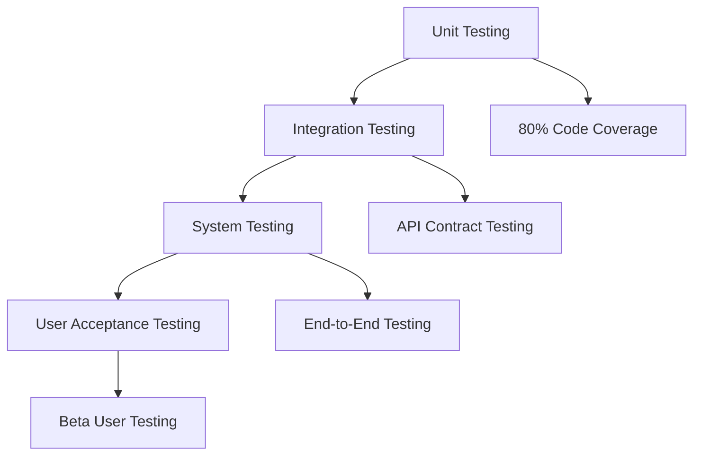
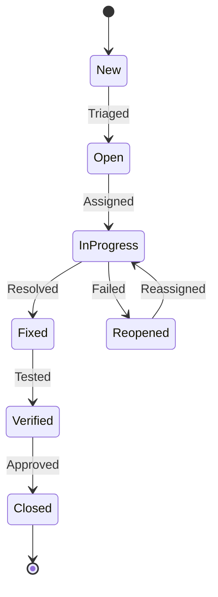
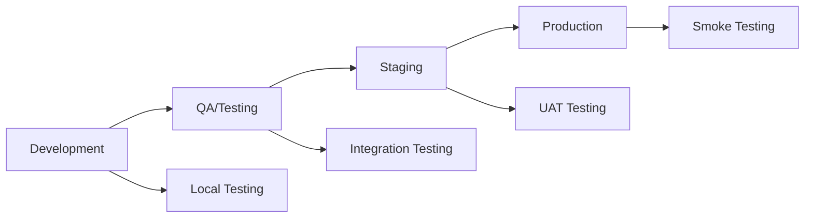
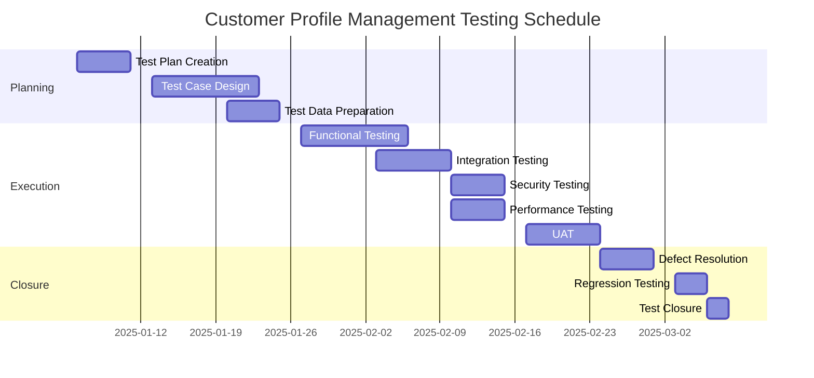
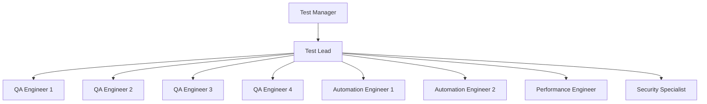
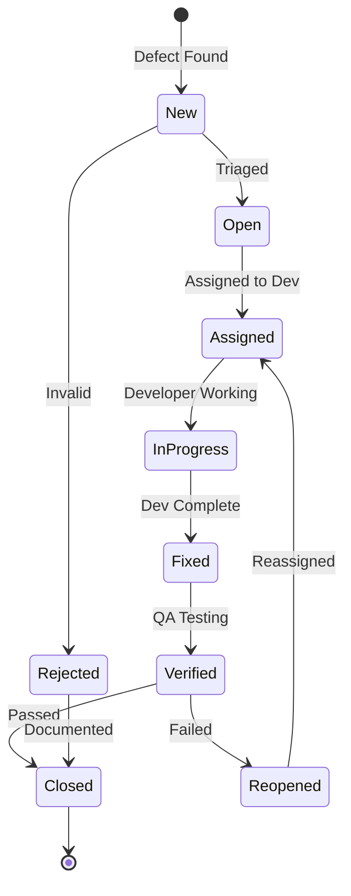

# Master Test Plan - Customer Profile Management

## Document Information
- **Project**: Pours Consumer Application
- **Test Area**: Customer Profile Management System
- **Version**: 1.0
- **Last Updated**: 2025-11-22
- **Status**: Active
- **Test Manager**: TBD
- **Test Lead**: TBD

---

## Table of Contents
1. [Executive Summary](#executive-summary)
2. [Test Scope](#test-scope)
3. [Test Strategy](#test-strategy)
4. [Test Environment](#test-environment)
5. [Test Schedule](#test-schedule)
6. [Resource Allocation](#resource-allocation)
7. [Entry and Exit Criteria](#entry-and-exit-criteria)
8. [Test Deliverables](#test-deliverables)
9. [Risk Management](#risk-management)
10. [Test Metrics and Reporting](#test-metrics-and-reporting)
11. [Defect Management](#defect-management)
12. [Test Traceability Matrix](#test-traceability-matrix)
13. [Appendices](#appendices)

---

## Executive Summary

### Purpose
This Master Test Plan defines the comprehensive testing approach for the Customer Profile Management system within the Pours Consumer application. It encompasses all features related to user authentication, profile management, rewards tracking, order history, payment management, password security, and biometric settings.

### Objectives
- Ensure all customer profile management features meet functional requirements
- Validate security and data privacy compliance (GDPR, CCPA, PCI DSS)
- Verify system performance under expected and peak load conditions
- Confirm seamless integration between profile management and related systems
- Validate user experience across all supported devices and browsers
- Ensure data integrity and consistency across all operations

### Key Features Under Test
1. **User Authentication** - Sign up, sign in, OTP verification, session management
2. **Profile Management** - Personal information, contact details, avatar upload
3. **Account Dashboard** - Analytics, spending patterns, insights
4. **Order History** - Past orders, filtering, sorting, re-ordering
5. **Payment Management** - Payment methods, default selection, transaction history
6. **Password & Security** - Password updates, strength validation, 2FA, password reset
7. **Rewards Program** - Points balance, tier progression, redemptions, referrals
8. **Biometric Settings** - Biometric authentication, device management, health monitoring

### Testing Timeline
- **Duration**: 8 weeks (2 sprints)
- **Test Planning**: Week 1
- **Test Design**: Week 2-3
- **Test Execution**: Week 4-7
- **Test Closure**: Week 8

### Quality Goals
- **Functional Coverage**: 100% of documented requirements
- **Code Coverage**: Minimum 80% for critical paths
- **Defect Detection Rate**: 95% of defects found before production
- **Automation Coverage**: 70% of regression tests automated
- **Performance**: 95th percentile response time < 2 seconds

---

## Test Scope

### In Scope

#### 1. Functional Testing

**Authentication Module**
- Email/OTP sign up flow
- Email/OTP sign in flow
- Demo session creation
- Password reset via email
- Session persistence and refresh
- Auto-logout on session expiry
- Multi-device session handling

**Profile Management Module**
- View profile summary
- Edit personal information (name, birthday, gender)
- Update contact details (email, phone)
- Update address information
- Upload/update avatar
- Delete avatar
- Profile data validation
- Real-time profile synchronization

**Account Dashboard Module**
- View spending patterns (weekly, monthly, yearly)
- View order frequency analytics
- View loyalty points earned over time
- Filter analytics by category
- Export analytics data
- Dashboard performance with large datasets

**Order History Module**
- View all past orders
- Filter orders by date range
- Filter orders by status
- Sort orders (date, amount, status)
- View detailed order information
- Re-order previous purchases
- Track order status in real-time
- Export order history

**Payment Management Module**
- Add new payment method (credit/debit card)
- View saved payment methods
- Set default payment method
- Update payment method details
- Remove payment method
- View payment transaction history
- Secure payment processing (PCI DSS)
- Stripe integration testing

**Password & Security Module**
- Update password with current password verification
- Password strength validation (real-time)
- Password requirements enforcement
- Password history checking (prevent reuse)
- Enable/disable 2FA (TOTP, SMS)
- View and download backup codes
- Login with 2FA
- Account lockout after failed attempts
- Password reset flow

**Rewards Program Module**
- View current points balance
- View tier status and progression
- Earn points (purchases, check-ins, referrals)
- Redeem rewards
- Track tier benefits
- Generate and share referral code
- View rewards history
- Track referral activity

**Biometric Settings Module**
- Enable biometric authentication (fingerprint, Face ID)
- Manage enrolled devices
- Configure biometric preferences
- Biometric health monitoring setup
- View biometric readings
- Receive health alerts
- Device-specific biometric features

#### 2. Integration Testing

**Backend Integration**
- Supabase authentication service
- Supabase database (PostgreSQL)
- Supabase Storage (avatar uploads, ID documents)
- Edge Functions (send-otp, verify-otp, validate-email)
- Email service (Resend API)
- SMS service (Twilio - for 2FA)
- Stripe payment gateway

**Frontend Integration**
- React component integration
- Context providers (Auth, Profile)
- React Query caching
- React Router navigation
- State management flow

**Cross-Module Integration**
- Profile ↔ Rewards (points display)
- Profile ↔ Orders (order history access)
- Profile ↔ Payments (payment methods)
- Authentication ↔ All modules (session validation)

#### 3. Security Testing

**Authentication Security**
- OTP code expiration
- OTP single-use validation
- Session token security
- JWT token expiration and refresh
- Brute force protection
- CSRF protection
- XSS vulnerability testing
- SQL injection testing

**Authorization Security**
- Row Level Security (RLS) policies
- User can only access own data
- Guest user access validation
- Admin privilege escalation testing
- API endpoint authorization

**Data Security**
- Password hashing verification
- Sensitive data encryption (at rest and in transit)
- PII data protection
- Payment data handling (PCI DSS)
- ID document storage security
- Avatar storage permissions

**Compliance Testing**
- GDPR compliance (data export, deletion)
- CCPA compliance
- PCI DSS compliance (payment data)
- Privacy policy adherence
- Cookie consent validation

#### 4. Performance Testing

**Load Testing**
- 100 concurrent users
- 500 concurrent users
- 1,000 concurrent users
- 10,000 concurrent users (peak)

**Stress Testing**
- Database query performance under load
- API response times under stress
- Edge Function scalability
- Storage upload/download performance

**Endurance Testing**
- 24-hour continuous operation
- Memory leak detection
- Resource utilization monitoring

**Performance Metrics**
- Page load time: < 2 seconds (p95)
- API response time: < 500ms (p95)
- Database query time: < 200ms (p95)
- Avatar upload time: < 3 seconds (5MB file)

#### 5. Usability Testing

**User Experience**
- Navigation intuitiveness
- Form validation feedback
- Error message clarity
- Success confirmation visibility
- Loading state indicators
- Responsive design (mobile, tablet, desktop)
- Accessibility (WCAG 2.1 AA)

**User Flows**
- New user sign up journey
- Returning user sign in journey
- Profile update journey
- Password reset journey
- Rewards redemption journey
- Order re-ordering journey

#### 6. Compatibility Testing

**Browsers**
- Chrome (latest 2 versions)
- Firefox (latest 2 versions)
- Safari (latest 2 versions)
- Edge (latest 2 versions)
- Mobile browsers (iOS Safari, Chrome Mobile)

**Devices**
- Desktop (Windows, macOS)
- Tablet (iPad, Android tablets)
- Mobile (iPhone, Android phones)
- Screen resolutions (1920×1080, 1366×768, 375×667)

**Operating Systems**
- Windows 10/11
- macOS Ventura/Sonoma
- iOS 16/17
- Android 12/13/14

#### 7. Data Integrity Testing

**Data Validation**
- Email format validation
- Phone number format validation
- Date validation (birthday, dates)
- Currency/amount validation
- File upload validation (type, size)

**Data Consistency**
- Profile data sync across sessions
- Points balance accuracy
- Order totals calculation
- Tier progression calculation
- Transaction history accuracy

**Database Testing**
- CRUD operations validation
- Foreign key constraints
- Triggers execution
- RLS policies enforcement
- Data migration scripts

### Out of Scope

**Explicitly Excluded**
- Venue management features
- Product catalog management
- Menu browsing and ordering flow (tested separately)
- Bartender/admin dashboards
- Sobriety monitoring features (tested separately)
- Abandoned cart functionality (tested separately)
- Marketing campaign features
- Third-party vendor integrations (except Stripe, Twilio, Resend)

**Future Phase Testing**
- React Native mobile app (separate test plan)
- Passkey authentication
- Social media OAuth
- Advanced biometric features
- AI personalization features

---

## Test Strategy

### Testing Approach

#### 1. Testing Levels



**Unit Testing (Developer-Led)**
- Test individual components in isolation
- Mock external dependencies
- Tools: Jest, React Testing Library
- Target: 80% code coverage for critical paths
- Executed: Continuously during development

**Integration Testing (QA-Led)**
- Test component interactions
- Test API integration points
- Test database operations
- Tools: Jest, Supertest, Postman
- Target: 100% of API endpoints tested
- Executed: After feature completion

**System Testing (QA-Led)**
- End-to-end user flows
- Cross-browser testing
- Performance testing
- Security testing
- Tools: Cypress, Playwright, JMeter
- Target: 100% of user stories tested
- Executed: In QA environment

**User Acceptance Testing (Product-Led)**
- Business requirements validation
- User experience validation
- Beta user feedback
- Tools: Manual testing, feedback forms
- Target: 100% of acceptance criteria validated
- Executed: In staging environment

#### 2. Test Types Distribution

| Test Type | Coverage Target | Automation % | Priority |
|-----------|----------------|--------------|----------|
| Functional Testing | 100% | 70% | Critical |
| Integration Testing | 100% | 80% | Critical |
| Security Testing | 100% | 60% | Critical |
| Performance Testing | Key scenarios | 90% | High |
| Usability Testing | Key flows | 30% | High |
| Compatibility Testing | Major browsers/devices | 50% | Medium |
| Data Integrity | 100% | 70% | Critical |

#### 3. Test Automation Strategy

**Automation Framework**
```
Framework: Cypress + Playwright
Language: TypeScript
CI/CD: GitHub Actions
Reporting: Allure Reports
```

**Automation Priorities**
1. **Critical Path (100% automation)**
   - User sign up and sign in
   - Profile creation and updates
   - Password management
   - Payment method management
   - Rewards redemption

2. **Regression Suite (70% automation)**
   - All CRUD operations
   - Navigation flows
   - Form validations
   - API integrations

3. **Smoke Tests (100% automation)**
   - Application launch
   - User authentication
   - Core navigation
   - Database connectivity

**Manual Testing Focus**
- Exploratory testing for edge cases
- Usability and UX evaluation
- Ad-hoc testing for new features
- Visual regression testing
- Accessibility testing

#### 4. Test Data Strategy

**Test Data Requirements**
```typescript
// User profiles with different states
- New users (no history)
- Active users (with orders, rewards)
- Premium tier users
- Guest users
- Locked accounts
- Deactivated accounts

// Payment methods
- Valid credit cards (test mode)
- Expired cards
- Declined cards
- Multiple payment methods

// Orders
- Pending orders
- Completed orders
- Cancelled orders
- Orders with different statuses

// Rewards
- Users at different tier levels
- Users with pending redemptions
- Users with expired rewards
- Users with referrals
```

**Test Data Management**
- Seed data scripts for database initialization
- Faker.js for generating realistic test data
- Dedicated test user accounts
- Automated data cleanup after test runs
- Production-like data volumes for performance testing

**Data Privacy**
- No production data in test environments
- Anonymized data for realistic scenarios
- Secure handling of test credentials
- Regular cleanup of test data

#### 5. Defect Management Strategy

**Defect Lifecycle**


**Defect Severity Levels**

| Severity | Definition | Response Time | Examples |
|----------|-----------|---------------|----------|
| Critical (S1) | System crash, data loss, security breach | 2 hours | - User data exposed<br>- Payment processing failure<br>- Authentication broken |
| High (S2) | Major feature broken, no workaround | 4 hours | - Cannot update profile<br>- Avatar upload fails<br>- Rewards not calculating |
| Medium (S3) | Feature broken, workaround exists | 1 business day | - Incorrect validation message<br>- UI alignment issues<br>- Filter not working |
| Low (S4) | Minor issue, cosmetic | Next sprint | - Typos<br>- Minor UI glitches<br>- Enhancement requests |

**Defect Priority Levels**

| Priority | Definition | Fix Timeline |
|----------|-----------|--------------|
| P0 | Blocker - Prevents release | Immediate |
| P1 | Critical - Must fix before release | Within sprint |
| P2 | High - Should fix before release | Next sprint |
| P3 | Medium - Can be deferred | Backlog |
| P4 | Low - Nice to have | Future consideration |

---

## Test Environment

### Environment Strategy



### Environment Specifications

#### 1. Development Environment

**Purpose**: Developer testing, unit tests, initial integration tests

**Configuration**
```yaml
Environment: Local + Lovable Preview
Frontend: http://localhost:5173
Backend: Supabase Project (Dev instance)
Database: PostgreSQL (Dev schema)
Storage: Supabase Storage (Dev bucket)
Email: Resend API (Test mode)
SMS: Twilio (Test credentials)
Stripe: Test mode
```

**Access**
- Developers: Full access
- QA: Read access for debugging
- Product: View access

**Data**
- Seed data with minimal records
- Mock data for quick testing
- Isolated from QA environment

#### 2. QA/Testing Environment

**Purpose**: Comprehensive testing, automated test execution, integration testing

**Configuration**
```yaml
Environment: Dedicated QA Server
Frontend: https://qa.pours-consumer.lovable.app
Backend: Supabase Project (QA instance)
Database: PostgreSQL (QA schema)
Storage: Supabase Storage (QA bucket)
Email: Resend API (Test mode, monitored)
SMS: Twilio (Test credentials)
Stripe: Test mode
CI/CD: GitHub Actions
```

**Access**
- QA: Full access
- Developers: Full access for debugging
- Product: View access

**Data**
- Comprehensive test data set
- Production-like data volumes
- Automated data refresh daily
- Separate test user pools

**Monitoring**
- Error tracking (Sentry)
- Performance monitoring (custom metrics)
- Log aggregation (Supabase logs)

#### 3. Staging Environment

**Purpose**: UAT, final validation before production, demo environment

**Configuration**
```yaml
Environment: Staging Server
Frontend: https://staging.pours-consumer.lovable.app
Backend: Supabase Project (Staging instance)
Database: PostgreSQL (Production clone)
Storage: Supabase Storage (Staging bucket)
Email: Resend API (Production mode, limited)
SMS: Twilio (Production credentials, limited)
Stripe: Test mode
```

**Access**
- Product: Full access
- QA: Full access
- Stakeholders: Demo access
- Beta users: Limited access

**Data**
- Production data snapshot (anonymized)
- Real-world scenarios
- Refreshed weekly from production

**Monitoring**
- Full production-like monitoring
- Performance benchmarking
- User behavior analytics

#### 4. Production Environment

**Purpose**: Live application, real users, production operations

**Configuration**
```yaml
Environment: Production
Frontend: https://pours-consumer.lovable.app
Backend: Supabase Project (Production)
Database: PostgreSQL (Production schema)
Storage: Supabase Storage (Production bucket)
Email: Resend API (Production mode)
SMS: Twilio (Production credentials)
Stripe: Live mode
```

**Access**
- Limited production access
- Admin access for support
- Read-only for monitoring

**Testing in Production**
- Smoke tests after deployment
- Canary deployments
- Feature flags for gradual rollout
- A/B testing infrastructure

### Environment Requirements

#### Hardware Requirements

**Client-Side**
- Desktop: 8GB RAM, modern browser
- Mobile: iPhone 12+ / Android flagship
- Tablet: iPad Air / Samsung Galaxy Tab

**Server-Side (Managed by Supabase)**
- Database: Scalable PostgreSQL instance
- Storage: Scalable object storage
- Edge Functions: Auto-scaling serverless

#### Software Requirements

**Frontend**
- Node.js 18+
- React 18+
- Vite 5+
- TypeScript 5+
- Cypress/Playwright for E2E tests

**Backend**
- Supabase CLI
- PostgreSQL 15+
- Deno (for Edge Functions)
- Resend SDK
- Twilio SDK
- Stripe SDK

**Testing Tools**
- Jest (unit testing)
- React Testing Library
- Cypress (E2E testing)
- Playwright (E2E testing)
- Postman (API testing)
- JMeter (performance testing)
- Lighthouse (performance auditing)
- axe DevTools (accessibility testing)

#### Test Data Requirements

**User Accounts**
```
- 10 test users (various states)
- 5 premium tier users
- 3 admin accounts
- 2 locked accounts
- 50 synthetic users (performance testing)
```

**Orders Data**
```
- 100+ test orders
- Various order statuses
- Different time ranges
- Multiple venues
```

**Rewards Data**
```
- Users at all tier levels
- Active redemptions
- Referral chains
- Transaction history
```

**Payment Methods**
```
- Test credit cards (Stripe test mode)
- Multiple payment methods per user
- Expired cards
- Invalid cards
```

---

## Test Schedule

### Overall Timeline



### Detailed Phase Breakdown

#### Phase 1: Test Planning (Week 1)
**Duration**: 5 business days  
**Dates**: Jan 6-10, 2025

**Activities**
- Review requirements documentation
- Identify test scenarios
- Define test strategy
- Set up test environments
- Prepare test plan document
- Stakeholder review and approval

**Deliverables**
- Master Test Plan (this document)
- Test environment setup guide
- Risk assessment document

**Resources**
- Test Manager: 100%
- Test Lead: 100%
- QA Engineers: 50%

#### Phase 2: Test Design (Weeks 2-3)
**Duration**: 10 business days  
**Dates**: Jan 13-24, 2025

**Activities**
- Write detailed test cases
- Design test data sets
- Create automation scripts framework
- Set up CI/CD pipelines
- Peer review test cases
- Finalize test scenarios

**Deliverables**
- Test case repository
- Test data scripts
- Automation framework
- Traceability matrix

**Resources**
- Test Lead: 100%
- QA Engineers: 100% (4 engineers)
- Automation Engineers: 100% (2 engineers)

#### Phase 3: Test Data Preparation (Week 3)
**Duration**: 5 business days  
**Dates**: Jan 20-24, 2025

**Activities**
- Generate test user accounts
- Create order history data
- Set up payment test data
- Prepare rewards data
- Configure test environments
- Validate test data integrity

**Deliverables**
- Test database with seed data
- Test user credentials document
- Data generation scripts

**Resources**
- QA Engineers: 50% (2 engineers)
- Database Admin: 50%

#### Phase 4: Functional Testing (Weeks 4-5)
**Duration**: 10 business days  
**Dates**: Jan 27 - Feb 7, 2025

**Test Execution by Feature**

**Authentication (2 days)**
- Sign up flows
- Sign in flows
- OTP verification
- Session management
- Password reset

**Profile Management (2 days)**
- Profile CRUD operations
- Avatar upload/update/delete
- Data validation
- Profile synchronization

**Account Dashboard (1 day)**
- Analytics display
- Data filtering
- Performance with large datasets

**Order History (2 days)**
- View orders
- Filter and sort
- Order details
- Re-ordering

**Payment Management (2 days)**
- Add/update/delete payment methods
- Default payment selection
- Payment history
- Stripe integration

**Password & Security (2 days)**
- Password updates
- Strength validation
- 2FA setup and login
- Account lockout

**Rewards (2 days)**
- Points balance
- Tier progression
- Redemptions
- Referrals

**Biometric Settings (1 day)**
- Biometric setup
- Device management
- Preferences

**Deliverables**
- Test execution reports
- Defect reports
- Coverage metrics

**Resources**
- QA Engineers: 100% (4 engineers)
- Test Lead: 100%

#### Phase 5: Integration Testing (Week 6)
**Duration**: 7 business days  
**Dates**: Feb 3-11, 2025

**Activities**
- API integration testing
- Database integration testing
- Third-party service integration
- Cross-module integration
- End-to-end user flows
- Edge Function testing

**Test Scenarios**
- Profile ↔ Rewards integration
- Authentication ↔ All modules
- Payment ↔ Orders
- Rewards ↔ Orders
- Email service integration
- SMS service integration
- Storage integration

**Deliverables**
- Integration test results
- API test collection (Postman)
- Integration defect reports

**Resources**
- QA Engineers: 100% (3 engineers)
- Backend Developer: 50% (support)

#### Phase 6: Security Testing (Week 7)
**Duration**: 5 business days  
**Dates**: Feb 10-14, 2025

**Activities**
- Authentication security testing
- Authorization (RLS) testing
- Data encryption validation
- Vulnerability scanning
- Penetration testing
- Compliance validation (GDPR, CCPA, PCI DSS)

**Test Scenarios**
- SQL injection attempts
- XSS vulnerability testing
- CSRF protection validation
- JWT token security
- Password hashing verification
- Rate limiting validation
- RLS policy testing

**Deliverables**
- Security test report
- Vulnerability assessment
- Compliance checklist
- Remediation recommendations

**Resources**
- Security Specialist: 100%
- QA Engineers: 50% (2 engineers)

#### Phase 7: Performance Testing (Week 7)
**Duration**: 5 business days  
**Dates**: Feb 10-14, 2025 (Parallel with Security)

**Activities**
- Load testing (100, 500, 1000, 10K users)
- Stress testing
- Endurance testing (24 hours)
- Database performance testing
- API response time testing
- Frontend performance testing

**Test Scenarios**
- Concurrent user logins
- Simultaneous profile updates
- Heavy order history loads
- Large reward transaction volumes
- Avatar upload under load
- Database query optimization

**Deliverables**
- Performance test report
- Load test results
- Performance baseline document
- Optimization recommendations

**Resources**
- Performance Engineer: 100%
- QA Engineers: 50% (1 engineer)

#### Phase 8: User Acceptance Testing (Week 8)
**Duration**: 7 business days  
**Dates**: Feb 17-25, 2025

**Activities**
- Product owner validation
- Business stakeholder review
- Beta user testing (if applicable)
- Usability testing
- Accessibility testing
- Final acceptance sign-off

**Test Scenarios**
- Complete user journeys
- Business requirement validation
- User experience evaluation
- Accessibility compliance
- Documentation review

**Deliverables**
- UAT test results
- User feedback report
- Acceptance sign-off document
- Release readiness assessment

**Resources**
- Product Owner: 100%
- QA Lead: 100%
- Beta Users: Variable
- Stakeholders: 25%

#### Phase 9: Defect Resolution (Week 9)
**Duration**: 5 business days  
**Dates**: Feb 24-28, 2025

**Activities**
- Defect triage and prioritization
- Critical defect fixes
- High priority defect fixes
- Defect verification
- Regression testing for fixes

**Deliverables**
- Defect resolution report
- Updated test results
- Fix verification reports

**Resources**
- Developers: 100% (3 developers)
- QA Engineers: 100% (4 engineers)
- Test Lead: 100%

#### Phase 10: Regression Testing (Week 10)
**Duration**: 3 business days  
**Dates**: Mar 3-5, 2025

**Activities**
- Execute automated regression suite
- Manual regression for critical paths
- Cross-browser regression
- Performance regression
- Final smoke tests

**Deliverables**
- Regression test report
- Final test summary
- Release recommendation

**Resources**
- QA Engineers: 100% (4 engineers)
- Automation Engineers: 100% (2 engineers)

#### Phase 11: Test Closure (Week 10)
**Duration**: 2 business days  
**Dates**: Mar 6-7, 2025

**Activities**
- Compile final test metrics
- Create test closure report
- Document lessons learned
- Archive test artifacts
- Knowledge transfer
- Release sign-off meeting

**Deliverables**
- Test closure report
- Test metrics dashboard
- Lessons learned document
- Test artifact archive

**Resources**
- Test Manager: 100%
- Test Lead: 100%

### Test Execution Schedule by Feature

| Feature | Test Cases | Est. Hours | Start Date | End Date | Assigned To |
|---------|-----------|-----------|-----------|---------|-------------|
| Authentication | 45 | 16h | Jan 27 | Jan 28 | QA-1, QA-2 |
| Profile Management | 60 | 16h | Jan 29 | Jan 30 | QA-2, QA-3 |
| Account Dashboard | 30 | 8h | Jan 31 | Jan 31 | QA-4 |
| Order History | 50 | 16h | Feb 3 | Feb 4 | QA-1, QA-4 |
| Payment Management | 55 | 16h | Feb 5 | Feb 6 | QA-2, QA-3 |
| Password & Security | 50 | 16h | Feb 7 | Feb 10 | QA-1, QA-4 |
| Rewards Program | 45 | 16h | Feb 7 | Feb 10 | QA-2, QA-3 |
| Biometric Settings | 25 | 8h | Feb 11 | Feb 11 | QA-4 |
| Integration Tests | 40 | 28h | Feb 3 | Feb 11 | QA-1, QA-2, QA-3 |
| Security Tests | 35 | 40h | Feb 10 | Feb 14 | Security-1, QA-4 |
| Performance Tests | 20 | 40h | Feb 10 | Feb 14 | Perf-1 |
| UAT | 30 | 35h | Feb 17 | Feb 25 | PO, QA-Lead |

**Total Estimated Test Effort**: 255 hours  
**Total Duration**: 8 weeks

---

## Resource Allocation

### Team Structure



### Roles and Responsibilities

#### Test Manager
**Responsibilities**
- Overall test strategy and planning
- Resource allocation and management
- Stakeholder communication
- Risk management
- Budget oversight
- Final test sign-off

**Allocation**: 50% throughout project

**Required Skills**
- Test management experience (5+ years)
- Risk assessment expertise
- Stakeholder management
- Budget management

#### Test Lead
**Responsibilities**
- Day-to-day test execution management
- Test case review and approval
- Defect triage and prioritization
- Test reporting and metrics
- Team coordination
- Environment management

**Allocation**: 100% throughout project

**Required Skills**
- Testing experience (3+ years)
- Test case design
- Defect management
- Team leadership

#### QA Engineers (4 resources)
**Responsibilities**
- Test case creation and execution
- Defect identification and reporting
- Test data preparation
- Manual and automated testing
- Test documentation
- Cross-browser testing

**Allocation**: 100% during execution phases

**Required Skills**
- Manual testing (2+ years)
- Test case design
- SQL knowledge
- API testing (Postman)
- Basic automation (nice to have)

**Specializations**
- QA-1: Authentication & Security focus
- QA-2: Profile & Payments focus
- QA-3: Orders & Integration focus
- QA-4: Dashboard & Rewards focus

#### Automation Engineers (2 resources)
**Responsibilities**
- Test automation framework development
- Automated test script creation
- CI/CD pipeline integration
- Test automation maintenance
- Automation metrics and reporting

**Allocation**: 
- 100% Weeks 2-3 (framework setup)
- 50% Weeks 4-10 (maintenance)

**Required Skills**
- TypeScript/JavaScript
- Cypress or Playwright
- CI/CD (GitHub Actions)
- API automation
- Test framework design

#### Performance Engineer (1 resource)
**Responsibilities**
- Performance test planning
- Load test script creation
- Performance test execution
- Performance analysis and reporting
- Performance optimization recommendations

**Allocation**: 100% Week 7 (5 days)

**Required Skills**
- JMeter or similar tools
- Performance testing methodology
- Database performance analysis
- APM tools experience
- Performance tuning

#### Security Specialist (1 resource)
**Responsibilities**
- Security test planning
- Vulnerability assessment
- Penetration testing
- Security compliance validation
- Security recommendations

**Allocation**: 100% Week 7 (5 days)

**Required Skills**
- Security testing experience
- OWASP Top 10 knowledge
- Compliance standards (GDPR, PCI DSS)
- Security tools (Burp Suite, OWASP ZAP)
- Risk assessment

#### Supporting Roles

**Product Owner**
- Requirements clarification
- UAT participation
- Acceptance sign-off
- **Allocation**: 25% Weeks 1-2, 100% Week 8

**Developers (3 resources)**
- Defect fixes
- Test environment support
- Test data support
- **Allocation**: Variable (on-demand for defect fixes)

**Database Administrator**
- Database setup and maintenance
- Test data scripts
- Performance tuning
- **Allocation**: 25% throughout project

**DevOps Engineer**
- CI/CD pipeline setup
- Environment provisioning
- Monitoring setup
- **Allocation**: 25% Weeks 1-3

### Resource Calendar

| Week | Phase | QA Engineers | Auto Engineers | Perf | Sec | Total FTE |
|------|-------|--------------|----------------|------|-----|-----------|
| 1 | Planning | 2 (50%) | 0 | 0 | 0 | 2.5 |
| 2-3 | Design | 4 (100%) | 2 (100%) | 0 | 0 | 6.5 |
| 4-5 | Functional | 4 (100%) | 1 (50%) | 0 | 0 | 5.5 |
| 6 | Integration | 3 (100%) | 1 (50%) | 0 | 0 | 4.5 |
| 7 | Security/Perf | 3 (75%) | 1 (50%) | 1 (100%) | 1 (100%) | 7.25 |
| 8 | UAT | 2 (50%) | 0 | 0 | 0 | 3.0 |
| 9 | Defect Fix | 4 (100%) | 1 (50%) | 0 | 0 | 5.5 |
| 10 | Regression | 4 (100%) | 2 (100%) | 0 | 0 | 7.0 |

**Total Effort**: ~41.75 person-weeks

### Training Requirements

**New Team Members**
- Application domain training: 8 hours
- Test tool training: 16 hours
- Supabase platform training: 8 hours
- Security standards training: 4 hours

**All Team Members**
- Test case design workshop: 4 hours
- Automation best practices: 4 hours
- Defect management training: 2 hours

---

## Entry and Exit Criteria

### Entry Criteria

#### For Test Planning Phase
- ✅ All requirements documents completed and approved
- ✅ Product roadmap finalized
- ✅ Test team assembled
- ✅ Test tools identified and licenses procured
- ✅ Initial risk assessment completed

#### For Test Design Phase
- ✅ Test plan approved by stakeholders
- ✅ Requirements traceability matrix created
- ✅ Test environment specifications defined
- ✅ Test data requirements identified
- ✅ Automation framework selected

#### For Test Execution Phase
- ✅ Test cases reviewed and approved
- ✅ Test environment set up and validated
- ✅ Test data prepared and loaded
- ✅ Automation framework ready
- ✅ Defect tracking system configured
- ✅ Build deployed to test environment
- ✅ Smoke tests passed
- ✅ Test team trained on application

#### For Integration Testing
- ✅ Unit testing completed (80% code coverage)
- ✅ All components individually tested
- ✅ API documentation available
- ✅ Integration test environment ready
- ✅ Test data for integration scenarios prepared

#### For Security Testing
- ✅ Functional testing completed
- ✅ Security test plan approved
- ✅ Security tools configured
- ✅ Compliance requirements documented
- ✅ Security specialist assigned

#### For Performance Testing
- ✅ Functional testing completed
- ✅ Performance requirements defined
- ✅ Performance test environment configured
- ✅ Load test scripts developed
- ✅ Baseline performance metrics established

#### For UAT Phase
- ✅ All critical and high defects resolved
- ✅ System testing completed
- ✅ UAT test cases prepared
- ✅ Staging environment ready
- ✅ UAT users identified and trained
- ✅ Acceptance criteria documented

### Exit Criteria

#### For Test Planning Phase
- ✅ Test plan document approved
- ✅ Test strategy agreed upon
- ✅ Resource allocation finalized
- ✅ Test schedule approved
- ✅ Risk mitigation plan created

#### For Test Design Phase
- ✅ All test cases written and reviewed
- ✅ Test data scripts created
- ✅ Automation framework implemented
- ✅ Traceability matrix completed
- ✅ Test case peer review completed

#### For Functional Testing
- ✅ 100% of planned test cases executed
- ✅ 95% test case pass rate
- ✅ All critical (S1) defects resolved
- ✅ All high (S2) defects resolved or deferred with approval
- ✅ Test execution report generated
- ✅ Functional coverage metrics achieved

#### For Integration Testing
- ✅ All integration scenarios tested
- ✅ API contracts validated
- ✅ End-to-end flows verified
- ✅ No critical integration defects open
- ✅ Integration test report completed

#### For Security Testing
- ✅ Security test plan executed
- ✅ No critical security vulnerabilities
- ✅ Compliance requirements validated
- ✅ Security test report completed
- ✅ Security sign-off obtained

#### For Performance Testing
- ✅ All performance scenarios executed
- ✅ Performance targets met:
  - Page load < 2s (p95)
  - API response < 500ms (p95)
  - 10K concurrent users supported
- ✅ No performance degradation identified
- ✅ Performance test report completed

#### For UAT Phase
- ✅ All UAT test cases executed
- ✅ Business acceptance obtained
- ✅ User feedback documented
- ✅ Accessibility compliance validated
- ✅ UAT sign-off received

#### For Test Closure
- ✅ All planned testing completed
- ✅ All critical and high defects resolved
- ✅ Medium defects resolved or deferred
- ✅ Test coverage > 95%
- ✅ Automation coverage > 70%
- ✅ Test closure report approved
- ✅ Release readiness certified
- ✅ Known issues documented
- ✅ Test artifacts archived

### Suspension and Resumption Criteria

#### Test Suspension Criteria
Testing will be suspended if:
- 🛑 More than 10 critical (S1) defects are open
- 🛑 Test environment is unstable or unavailable for > 4 hours
- 🛑 Major functionality is broken (authentication, database)
- 🛑 Build deployment fails repeatedly
- 🛑 Test data corruption occurs
- 🛑 Security breach detected

#### Test Resumption Criteria
Testing will resume when:
- ✅ Critical defects reduced to < 5 open issues
- ✅ Test environment restored and stable
- ✅ Major functionality restored
- ✅ Successful build deployed
- ✅ Test data restored
- ✅ Security issue resolved and verified

---

## Test Deliverables

### Test Planning Deliverables

| Deliverable | Description | Owner | Due Date |
|------------|-------------|-------|----------|
| Master Test Plan | This document | Test Manager | Week 1 |
| Test Strategy Document | Detailed testing approach | Test Lead | Week 1 |
| Risk Assessment | Identified risks and mitigation | Test Manager | Week 1 |
| Resource Plan | Team allocation and schedule | Test Manager | Week 1 |
| Test Environment Plan | Environment setup guide | Test Lead | Week 1 |

### Test Design Deliverables

| Deliverable | Description | Owner | Due Date |
|------------|-------------|-------|----------|
| Test Case Repository | All test cases in test management tool | QA Engineers | Week 3 |
| Test Data Scripts | Scripts to generate test data | QA Engineers | Week 3 |
| Automation Framework | Test automation infrastructure | Automation Engineers | Week 3 |
| Traceability Matrix | Requirements to test case mapping | Test Lead | Week 3 |
| API Test Collection | Postman/Newman collection | QA Engineers | Week 3 |

### Test Execution Deliverables

| Deliverable | Description | Owner | Due Date |
|------------|-------------|-------|----------|
| Daily Test Execution Report | Daily progress and results | QA Engineers | Daily |
| Weekly Test Status Report | Weekly summary to stakeholders | Test Lead | Weekly |
| Defect Reports | Logged defects with details | QA Engineers | As found |
| Test Execution Logs | Detailed execution logs | QA Engineers | Ongoing |
| Code Coverage Report | Unit test coverage metrics | Developers | Week 5 |

### Test Completion Deliverables

| Deliverable | Description | Owner | Due Date |
|------------|-------------|-------|----------|
| Functional Test Report | Functional testing summary | Test Lead | Week 6 |
| Integration Test Report | Integration testing results | Test Lead | Week 6 |
| Security Test Report | Security assessment results | Security Specialist | Week 7 |
| Performance Test Report | Performance testing outcomes | Performance Engineer | Week 7 |
| UAT Report | User acceptance testing summary | Product Owner | Week 8 |
| Test Metrics Dashboard | KPIs and metrics visualization | Test Manager | Week 10 |
| Test Closure Report | Final test summary | Test Manager | Week 10 |
| Lessons Learned Document | Insights and improvements | Test Manager | Week 10 |
| Release Notes | Known issues and limitations | Test Manager | Week 10 |

### Continuous Deliverables

| Deliverable | Frequency | Owner |
|------------|-----------|-------|
| Defect Trend Report | Weekly | Test Lead |
| Automation Coverage Report | Weekly | Automation Lead |
| Test Progress Dashboard | Daily | Test Lead |
| Risk Register Updates | Weekly | Test Manager |
| Regression Test Results | On-demand | QA Engineers |

---

## Risk Management

### Risk Identification and Assessment

#### High Priority Risks

**Risk 1: Insufficient Test Coverage Due to Tight Timeline**
- **Probability**: High (70%)
- **Impact**: High
- **Risk Score**: 7/10
- **Mitigation**:
  - Prioritize critical path testing
  - Implement risk-based testing approach
  - Increase automation coverage
  - Extend testing timeline if needed
  - Focus on high-risk areas first
- **Contingency**:
  - Defer low-priority features
  - Conduct post-release testing
  - Plan hotfix process

**Risk 2: Security Vulnerabilities Discovered Late**
- **Probability**: Medium (40%)
- **Impact**: Critical
- **Risk Score**: 8/10
- **Mitigation**:
  - Conduct security testing early (Week 7)
  - Implement security code reviews
  - Use automated security scanning
  - Engage security specialist early
  - Follow OWASP guidelines
- **Contingency**:
  - Delay release for critical fixes
  - Implement temporary mitigations
  - Plan security patch release

**Risk 3: Performance Issues Under Load**
- **Probability**: Medium (50%)
- **Impact**: High
- **Risk Score**: 7.5/10
- **Mitigation**:
  - Conduct performance testing early
  - Set performance budgets
  - Monitor database query performance
  - Implement caching strategies
  - Load test with realistic data volumes
- **Contingency**:
  - Optimize slow queries
  - Implement CDN
  - Scale infrastructure
  - Add performance monitoring

**Risk 4: Integration Issues with Third-Party Services**
- **Probability**: Medium (50%)
- **Impact**: High
- **Risk Score**: 7.5/10
- **Third-Party Dependencies**:
  - Stripe (payments)
  - Resend (email)
  - Twilio (SMS for 2FA)
  - Supabase (backend)
- **Mitigation**:
  - Test with sandbox/test environments
  - Mock external services for testing
  - Validate API contracts early
  - Have fallback mechanisms
  - Monitor third-party status pages
- **Contingency**:
  - Implement circuit breakers
  - Queue failed requests
  - Provide alternative flows

**Risk 5: Test Environment Instability**
- **Probability**: Medium (40%)
- **Impact**: Medium
- **Risk Score**: 6/10
- **Mitigation**:
  - Dedicated test environment
  - Infrastructure as code
  - Automated environment setup
  - Regular environment health checks
  - Backup/restore procedures
- **Contingency**:
  - Quick environment restoration
  - Temporary local testing
  - Cloud-based test environments

#### Medium Priority Risks

**Risk 6: Insufficient Test Data**
- **Probability**: Medium (40%)
- **Impact**: Medium
- **Risk Score**: 5/10
- **Mitigation**:
  - Automated test data generation
  - Seed scripts for common scenarios
  - Anonymized production data (staging)
  - Data generation libraries (Faker.js)
- **Contingency**:
  - Manual data creation
  - Use production data snapshot (anonymized)

**Risk 7: Key Personnel Unavailability**
- **Probability**: Low (20%)
- **Impact**: High
- **Risk Score**: 6/10
- **Mitigation**:
  - Cross-training team members
  - Documentation of critical processes
  - Backup resources identified
  - Knowledge sharing sessions
- **Contingency**:
  - Redistribute workload
  - Engage backup resources
  - Adjust timeline if needed

**Risk 8: Requirement Changes During Testing**
- **Probability**: Medium (50%)
- **Impact**: Medium
- **Risk Score**: 6/10
- **Mitigation**:
  - Freeze requirements before test execution
  - Change control process
  - Impact assessment for changes
  - Defer non-critical changes
- **Contingency**:
  - Re-test affected areas
  - Update test cases
  - Extend timeline for critical changes

**Risk 9: Browser/Device Compatibility Issues**
- **Probability**: Medium (40%)
- **Impact**: Medium
- **Risk Score**: 5.5/10
- **Mitigation**:
  - Test on all target browsers early
  - Use BrowserStack/Sauce Labs
  - Responsive design testing
  - Cross-browser automation
- **Contingency**:
  - Browser-specific fixes
  - Polyfills for compatibility
  - Document known limitations

**Risk 10: Defect Backlog Grows Too Large**
- **Probability**: Medium (40%)
- **Impact**: Medium
- **Risk Score**: 5.5/10
- **Mitigation**:
  - Daily defect triage
  - Prioritization framework
  - Developer collaboration
  - Automated testing to catch regressions
- **Contingency**:
  - Extended defect resolution phase
  - Defer low-priority defects
  - Increase development resources

#### Low Priority Risks

**Risk 11: Automation Framework Issues**
- **Probability**: Low (20%)
- **Impact**: Medium
- **Risk Score**: 4/10
- **Mitigation**:
  - Use proven frameworks (Cypress/Playwright)
  - Proof of concept early
  - Dedicated automation engineers
- **Contingency**:
  - Fall back to manual testing
  - Use alternative framework

**Risk 12: Accessibility Compliance Issues**
- **Probability**: Low (30%)
- **Impact**: Low
- **Risk Score**: 3.5/10
- **Mitigation**:
  - Automated accessibility testing (axe)
  - Accessibility guidelines followed
  - Accessibility review in design phase
- **Contingency**:
  - Post-release accessibility fixes
  - Prioritize critical issues

### Risk Monitoring

**Risk Review Frequency**: Weekly during test manager meetings

**Risk Tracking**:
- Risk register maintained and updated weekly
- New risks added as identified
- Risk scores re-evaluated based on progress
- Mitigation effectiveness assessed

**Escalation Path**:
1. Test Lead identifies risk
2. Test Manager assesses impact
3. High/Critical risks escalated to stakeholders
4. Mitigation plan approved
5. Implementation tracked

---

## Test Metrics and Reporting

### Key Performance Indicators (KPIs)

#### Test Execution Metrics

**Test Case Metrics**
```
- Total Test Cases: 455
- Test Cases Executed: Track daily
- Test Cases Passed: Target 95%+
- Test Cases Failed: Monitor and analyze
- Test Cases Blocked: Minimize
- Test Execution Progress: % Complete
```

**Coverage Metrics**
```
- Requirements Coverage: 100%
- Code Coverage: 80% (unit tests)
- Automation Coverage: 70%
- Browser Coverage: 100% of target browsers
- Device Coverage: 100% of target devices
```

**Velocity Metrics**
```
- Test Cases per Day: Track team velocity
- Test Execution Rate: Planned vs Actual
- Automation ROI: Time saved by automation
```

#### Defect Metrics

**Defect Discovery**
```
- Total Defects Found: Track throughout
- Defects by Severity: S1/S2/S3/S4 distribution
- Defects by Priority: P0/P1/P2/P3/P4
- Defects by Module: Identify problem areas
- Defect Detection Rate: Defects per test case
```

**Defect Resolution**
```
- Defects Resolved: Track daily
- Defects Verified: QA verification
- Defects Reopened: Track reopen rate
- Defect Resolution Time: Average time to fix
- Defect Aging: Open defects by age
```

**Defect Trends**
```
- Defect Discovery Curve: Track over time
- Defect Closure Curve: Monitor resolution
- Open Defect Trend: Active defects
- Defect Leakage: Defects found in later phases
```

#### Quality Metrics

**Test Effectiveness**
```
- Defect Rejection Rate: Invalid defects %
- Defect Recurrence Rate: Reopened defects %
- Critical Defects in Production: Target 0
- Test Case Defect Density: Defects per test case
```

**Test Efficiency**
```
- Test Execution Efficiency: Pass rate
- Automation Success Rate: Auto tests passing
- Test Environment Uptime: Availability %
- Test Data Readiness: Preparation time
```

#### Performance Metrics

**Application Performance**
```
- Page Load Time (p95): < 2 seconds
- API Response Time (p95): < 500ms
- Database Query Time (p95): < 200ms
- Avatar Upload Time: < 3 seconds (5MB)
- Concurrent User Capacity: 10,000 users
```

**Test Process Performance**
```
- Test Planning Accuracy: Planned vs Actual
- Defect Fix Rate: Fixes per day
- Regression Test Cycle Time: Time per run
- Mean Time to Detect (MTTD): Issue detection
- Mean Time to Resolve (MTTR): Issue resolution
```

### Reporting Structure

#### Daily Test Execution Report

**Audience**: Test team, developers  
**Frequency**: Daily during execution  
**Format**: Email summary + Dashboard

**Contents**:
- Test cases executed today
- Pass/Fail/Blocked summary
- New defects logged
- Defects verified
- Blockers and issues
- Tomorrow's plan

**Sample Format**:
```
Date: [Date]
Sprint: [Sprint Number]

Execution Summary:
- Total Test Cases Executed: 45
- Passed: 38 (84%)
- Failed: 5 (11%)
- Blocked: 2 (5%)

Defects:
- New Defects: 3 (1 S1, 2 S3)
- Defects Verified: 4
- Defects Reopened: 1

Highlights:
- Completed authentication module testing
- Found critical defect in OTP verification

Blockers:
- Test environment down for 2 hours

Tomorrow's Plan:
- Complete profile management testing
- Retest fixed defects from yesterday
```

#### Weekly Test Status Report

**Audience**: Stakeholders, management  
**Frequency**: Weekly  
**Format**: Formal report + Presentation

**Contents**:
- Overall test progress
- Test execution summary
- Defect summary and trends
- Coverage metrics
- Risk updates
- Milestone status
- Key achievements
- Issues and concerns
- Next week's plan

#### Test Completion Reports

**Functional Test Report** (Week 6)
- Functional testing summary
- Test case execution results
- Defect summary by module
- Coverage achieved
- Risks identified
- Recommendations

**Integration Test Report** (Week 6)
- Integration scenarios tested
- API contract validation results
- End-to-end flow results
- Integration defects
- Performance observations
- Recommendations

**Security Test Report** (Week 7)
- Security test plan execution
- Vulnerabilities identified
- Compliance validation results
- Risk assessment
- Remediation recommendations
- Sign-off status

**Performance Test Report** (Week 7)
- Performance test scenarios
- Load test results
- Stress test results
- Performance baselines
- Bottlenecks identified
- Optimization recommendations

**UAT Report** (Week 8)
- UAT test execution summary
- Business acceptance results
- User feedback
- Usability observations
- Accessibility compliance
- Sign-off documentation

#### Test Closure Report

**Audience**: All stakeholders  
**Timing**: End of testing (Week 10)  
**Format**: Formal document

**Contents**:
1. **Executive Summary**
   - Overall quality assessment
   - Release recommendation
   - Key achievements

2. **Test Execution Summary**
   - Total test cases executed
   - Pass/fail statistics
   - Coverage metrics
   - Automation metrics

3. **Defect Summary**
   - Total defects found
   - Defects by severity/priority
   - Defects resolved
   - Known issues in release

4. **Risk Assessment**
   - Residual risks
   - Risk mitigation status
   - Recommendations

5. **Lessons Learned**
   - What went well
   - What could be improved
   - Process improvements

6. **Test Artifacts**
   - Test case repository location
   - Defect database location
   - Test data location
   - Automation scripts location

7. **Recommendations**
   - Release readiness
   - Post-release monitoring
   - Future improvements

### Dashboards and Visualizations

**Real-Time Test Dashboard**
- Test execution progress (pie chart)
- Pass/Fail trend (line chart)
- Defect distribution by severity (bar chart)
- Defect aging (histogram)
- Test coverage (gauge)
- Automation coverage (gauge)
- Environment health status

**Defect Dashboard**
- Open defects by priority
- Defect discovery curve
- Defect resolution curve
- Mean time to resolve
- Defect distribution by module
- Defect reopen rate

**Performance Dashboard**
- Response time trends
- Throughput metrics
- Error rate
- Resource utilization
- Concurrent user capacity

---

## Defect Management

### Defect Lifecycle



### Defect Logging Guidelines

**Required Information**
```yaml
Defect ID: Auto-generated
Title: Clear, concise summary
Severity: S1/S2/S3/S4
Priority: P0/P1/P2/P3/P4
Module: Component affected
Environment: QA/Staging/Production
Build Version: Build number
Reporter: QA engineer name
Assigned To: Developer name
Date Reported: Timestamp

Description:
  - Clear description of issue
  - Impact on functionality
  - Affected user flows

Steps to Reproduce:
  1. Step-by-step instructions
  2. Precise and minimal
  3. Include test data used

Expected Result:
  - What should happen

Actual Result:
  - What actually happened

Attachments:
  - Screenshots
  - Console logs
  - Network logs
  - Video recording (if applicable)

Test Data:
  - User credentials
  - Input values
  - Prerequisites
```

### Defect Triage Process

**Daily Triage Meeting**
- **Time**: 10:00 AM daily during execution
- **Duration**: 30 minutes
- **Attendees**: Test Lead, Dev Lead, Product Owner
- **Agenda**:
  1. Review new defects
  2. Validate defect reports
  3. Assign severity and priority
  4. Assign to developers
  5. Set target resolution date

**Triage Criteria**

| Severity | Priority | Resolution Target |
|----------|----------|------------------|
| S1 (Critical) | P0 (Blocker) | 2 hours |
| S1 (Critical) | P1 (Critical) | 4 hours |
| S2 (High) | P1 (Critical) | 1 business day |
| S2 (High) | P2 (High) | 3 business days |
| S3 (Medium) | P2 (High) | 1 week |
| S3 (Medium) | P3 (Medium) | 2 weeks |
| S4 (Low) | P3 (Medium) | Next sprint |
| S4 (Low) | P4 (Low) | Backlog |

### Defect Resolution Process

**Developer Workflow**
1. Defect assigned
2. Reproduce issue locally
3. Root cause analysis
4. Implement fix
5. Unit test fix
6. Code review
7. Merge to test branch
8. Deploy to QA environment
9. Move defect to "Fixed" status
10. Add verification notes

**QA Verification Workflow**
1. Defect status = "Fixed"
2. Verify fix in QA environment
3. Execute related test cases
4. Perform regression testing
5. If passed:
   - Move to "Verified"
   - Add verification notes
   - Close defect
6. If failed:
   - Move to "Reopened"
   - Add detailed failure notes
   - Reassign to developer

### Defect Rejection Criteria

Defects will be rejected if:
- ❌ Not reproducible
- ❌ Working as designed (not a defect)
- ❌ Duplicate of existing defect
- ❌ Insufficient information to reproduce
- ❌ Out of scope for current release
- ❌ Environment-specific issue
- ❌ Test data issue

**Rejection Process**:
1. Add rejection reason
2. Move to "Rejected" status
3. Link to duplicate (if applicable)
4. Notify reporter
5. Close defect

### Defect Metrics and Tracking

**Defect Distribution Targets**

| Metric | Target | Actual | Status |
|--------|--------|--------|--------|
| Critical (S1) Defects | < 5% | TBD | 🟢 |
| High (S2) Defects | < 15% | TBD | 🟢 |
| Medium (S3) Defects | < 50% | TBD | 🟢 |
| Low (S4) Defects | < 30% | TBD | 🟢 |
| Defect Rejection Rate | < 10% | TBD | 🟢 |
| Defect Reopen Rate | < 5% | TBD | 🟢 |

**Defect Trend Analysis**

Track weekly:
- New defects logged
- Defects fixed
- Defects verified
- Defects reopened
- Open defect backlog
- Defect discovery rate
- Defect fix rate

**Red Flags** (Escalate immediately):
- 🚨 More than 10 S1 defects open
- 🚨 Defect discovery rate increasing
- 🚨 Defect fix rate decreasing
- 🚨 Reopen rate > 10%
- 🚨 Critical defect open > 48 hours

---

## Test Traceability Matrix

### Purpose
The Test Traceability Matrix ensures complete coverage of all requirements with corresponding test cases, providing bidirectional traceability from requirements to test cases and vice versa.

### Traceability Structure

```
Epic → User Story → Test Scenarios → Test Cases → Test Results
  ↓         ↓              ↓               ↓            ↓
Requirements ← Coverage Mapping ← Execution Status ← Defects
```

### Sample Traceability Matrix

| Epic ID | User Story ID | Requirement | Test Scenario ID | Test Case ID | Test Case Name | Priority | Status | Defects |
|---------|--------------|-------------|-----------------|--------------|----------------|----------|--------|---------|
| EPIC-AUTH-001 | US-AUTH.1 | User can sign up with email | TS-AUTH-001 | TC-AUTH-001 | Verify sign up with valid email | High | ✅ Pass | - |
| EPIC-AUTH-001 | US-AUTH.1 | User receives OTP code | TS-AUTH-002 | TC-AUTH-002 | Verify OTP email delivery | High | ✅ Pass | - |
| EPIC-AUTH-001 | US-AUTH.1 | User can verify OTP | TS-AUTH-003 | TC-AUTH-003 | Verify valid OTP acceptance | High | ❌ Fail | DEF-123 |
| EPIC-PROFILE-001 | US-PROFILE.1 | User can view profile | TS-PROF-001 | TC-PROF-001 | Verify profile display | Medium | ✅ Pass | - |
| EPIC-PROFILE-001 | US-PROFILE.2 | User can update profile | TS-PROF-002 | TC-PROF-002 | Verify profile update | High | ⏸️ Blocked | DEF-124 |

### Coverage Metrics

**Requirements Coverage**
```
Total Requirements: 120
Requirements with Test Cases: 120
Coverage: 100%
```

**Test Execution Coverage**
```
Total Test Cases: 455
Test Cases Executed: TBD
Test Cases Passed: TBD
Test Cases Failed: TBD
Test Cases Blocked: TBD
Execution Coverage: TBD%
```

### Detailed Traceability by Feature

#### Authentication Module
| User Story | Test Scenarios | Test Cases | Coverage |
|-----------|----------------|-----------|----------|
| US-AUTH.1 (Sign Up) | 8 | 25 | 100% |
| US-AUTH.2 (Sign In) | 6 | 15 | 100% |
| US-AUTH.3 (OTP Verification) | 5 | 12 | 100% |
| US-AUTH.4 (Session Management) | 4 | 10 | 100% |
| **Total** | **23** | **62** | **100%** |

#### Profile Management Module
| User Story | Test Scenarios | Test Cases | Coverage |
|-----------|----------------|-----------|----------|
| US-PROFILE.1 (View Profile) | 3 | 8 | 100% |
| US-PROFILE.2 (Update Profile) | 8 | 22 | 100% |
| US-PROFILE.3 (Avatar Upload) | 6 | 15 | 100% |
| US-PROFILE.4 (Data Validation) | 5 | 12 | 100% |
| **Total** | **22** | **57** | **100%** |

#### Account Dashboard Module
| User Story | Test Scenarios | Test Cases | Coverage |
|-----------|----------------|-----------|----------|
| US-DASHBOARD.1 (Spending Patterns) | 5 | 12 | 100% |
| US-DASHBOARD.2 (Analytics Filters) | 4 | 10 | 100% |
| US-DASHBOARD.3 (Data Export) | 2 | 5 | 100% |
| **Total** | **11** | **27** | **100%** |

#### Order History Module
| User Story | Test Scenarios | Test Cases | Coverage |
|-----------|----------------|-----------|----------|
| US-ORDER.1 (View Orders) | 4 | 10 | 100% |
| US-ORDER.2 (Filter Orders) | 6 | 15 | 100% |
| US-ORDER.3 (Order Details) | 5 | 12 | 100% |
| US-ORDER.4 (Re-order) | 3 | 8 | 100% |
| **Total** | **18** | **45** | **100%** |

#### Payment Management Module
| User Story | Test Scenarios | Test Cases | Coverage |
|-----------|----------------|-----------|----------|
| US-PAYMENT.1 (Add Payment) | 6 | 15 | 100% |
| US-PAYMENT.2 (View Payments) | 3 | 8 | 100% |
| US-PAYMENT.3 (Update Payment) | 4 | 10 | 100% |
| US-PAYMENT.4 (Delete Payment) | 3 | 7 | 100% |
| US-PAYMENT.5 (Payment History) | 4 | 10 | 100% |
| **Total** | **20** | **50** | **100%** |

#### Password & Security Module
| User Story | Test Scenarios | Test Cases | Coverage |
|-----------|----------------|-----------|----------|
| US-PASSWORD.1 (Update Password) | 6 | 15 | 100% |
| US-PASSWORD.2 (Password Strength) | 5 | 12 | 100% |
| US-PASSWORD.3 (Security Checks) | 5 | 12 | 100% |
| US-PASSWORD.4 (Password History) | 3 | 8 | 100% |
| US-PASSWORD.5 (2FA Setup) | 8 | 20 | 100% |
| US-PASSWORD.6 (Password Reset) | 5 | 12 | 100% |
| **Total** | **32** | **79** | **100%** |

#### Rewards Program Module
| User Story | Test Scenarios | Test Cases | Coverage |
|-----------|----------------|-----------|----------|
| US-REWARDS.1 (View Balance) | 3 | 8 | 100% |
| US-REWARDS.2 (Earn Points) | 6 | 15 | 100% |
| US-REWARDS.3 (Redeem Rewards) | 5 | 12 | 100% |
| US-REWARDS.4 (Tier Progression) | 4 | 10 | 100% |
| US-REWARDS.5 (Referrals) | 5 | 12 | 100% |
| US-REWARDS.6 (Rewards History) | 3 | 8 | 100% |
| **Total** | **26** | **65** | **100%** |

#### Biometric Settings Module
| User Story | Test Scenarios | Test Cases | Coverage |
|-----------|----------------|-----------|----------|
| US-BIOMETRIC.1 (Enable Biometric) | 5 | 12 | 100% |
| US-BIOMETRIC.2 (Device Management) | 4 | 10 | 100% |
| US-BIOMETRIC.3 (Preferences) | 3 | 8 | 100% |
| US-BIOMETRIC.4 (Health Monitoring) | 4 | 10 | 100% |
| **Total** | **16** | **40** | **100%** |

### Overall Traceability Summary

```
Total Epics: 8
Total User Stories: 48
Total Test Scenarios: 168
Total Test Cases: 455
Overall Coverage: 100%
```

---

## Appendices

### Appendix A: Test Case Template

```yaml
Test Case ID: TC-[MODULE]-[NUMBER]
Test Scenario ID: TS-[MODULE]-[NUMBER]
Related User Story: US-[FEATURE].[NUMBER]
Module: [Module Name]
Sub-Module: [Sub-module Name]

Title: [Clear, descriptive title]

Objective: 
  [What this test case validates]

Priority: High/Medium/Low
Test Type: Functional/Integration/Security/Performance
Execution Type: Manual/Automated

Preconditions:
  1. [Prerequisite 1]
  2. [Prerequisite 2]

Test Data:
  - Field 1: [Value]
  - Field 2: [Value]

Test Steps:
  Step 1: [Action]
    Expected: [Expected result]
  Step 2: [Action]
    Expected: [Expected result]
  Step 3: [Action]
    Expected: [Expected result]

Expected Result:
  [Overall expected outcome]

Postconditions:
  [State after test execution]

Tags: [tag1, tag2, tag3]
Estimated Time: [X minutes]
```

### Appendix B: Test Environment Setup Guide

**QA Environment Setup**

1. **Prerequisites**
   ```bash
   - Node.js 18+
   - Git
   - Supabase CLI
   - Cypress/Playwright
   ```

2. **Clone Repository**
   ```bash
   git clone [repository-url]
   cd pours-consumer
   ```

3. **Install Dependencies**
   ```bash
   npm install
   ```

4. **Configure Environment Variables**
   ```bash
   cp .env.example .env.qa
   # Edit .env.qa with QA credentials
   ```

5. **Initialize Database**
   ```bash
   npm run db:seed:qa
   ```

6. **Run Application**
   ```bash
   npm run dev
   ```

7. **Verify Setup**
   ```bash
   npm run test:smoke
   ```

### Appendix C: Defect Report Template

```yaml
Defect ID: [Auto-generated]
Title: [Brief, clear summary]

Severity: S1/S2/S3/S4
Priority: P0/P1/P2/P3/P4
Status: New/Open/In Progress/Fixed/Verified/Closed/Reopened

Module: [Module name]
Component: [Specific component]
Environment: QA/Staging/Production
Build/Version: [Build number]
Browser: [Browser and version]
Device: [Desktop/Mobile/Tablet]
OS: [Operating system]

Reporter: [QA engineer name]
Assigned To: [Developer name]
Date Reported: [Timestamp]
Target Resolution: [Date]

Description:
[Clear description of the issue and its impact]

Steps to Reproduce:
1. [Step 1]
2. [Step 2]
3. [Step 3]

Expected Result:
[What should happen]

Actual Result:
[What actually happened]

Test Data Used:
- Email: [test email]
- User ID: [user id]
- Other: [relevant data]

Attachments:
- Screenshot: [link]
- Console Log: [link]
- Network Log: [link]
- Video: [link]

Additional Notes:
[Any other relevant information]
```

### Appendix D: Test Execution Checklist

**Pre-Execution Checklist**
- [ ] Test environment is up and running
- [ ] Test data is loaded and validated
- [ ] Test cases are reviewed and approved
- [ ] Defect tracking system is ready
- [ ] Build is deployed and smoke tested
- [ ] Test team briefed on test objectives
- [ ] Test execution tools are configured

**Daily Execution Checklist**
- [ ] Environment health check completed
- [ ] Previous day's defects reviewed
- [ ] Test execution plan for today finalized
- [ ] Test data refreshed if needed
- [ ] Team standup completed
- [ ] Execution started and tracked
- [ ] New defects logged with details
- [ ] Daily report submitted

**Post-Execution Checklist**
- [ ] All planned test cases executed
- [ ] Test results documented
- [ ] Defects verified and closed
- [ ] Test metrics collected
- [ ] Test artifacts archived
- [ ] Test environment cleaned up
- [ ] Test summary report created
- [ ] Lessons learned documented

### Appendix E: Glossary

| Term | Definition |
|------|------------|
| **Acceptance Criteria** | Conditions that must be met for a user story to be considered complete |
| **Edge Function** | Serverless function deployed at the edge (Supabase/Deno) |
| **OTP** | One-Time Password for authentication |
| **RLS** | Row Level Security - Supabase database security feature |
| **Regression Testing** | Re-testing to ensure new changes haven't broken existing functionality |
| **Smoke Testing** | Basic testing to verify critical functionality works |
| **Traceability** | Ability to link requirements to test cases to execution results |
| **2FA** | Two-Factor Authentication for enhanced security |
| **UAT** | User Acceptance Testing - Final validation by business users |
| **Test Coverage** | Percentage of requirements/code tested |
| **Defect Leakage** | Defects that escape to later phases or production |
| **Test Oracle** | Mechanism to determine expected results |
| **Mock Data** | Fake data used for testing purposes |
| **Seed Data** | Initial data loaded into test database |
| **CI/CD** | Continuous Integration/Continuous Deployment |

### Appendix F: Tool Recommendations

**Test Management**
- Jira (with Xray or Zephyr plugin)
- TestRail
- Azure DevOps Test Plans

**Test Automation**
- Cypress (E2E testing)
- Playwright (E2E testing)
- Jest + React Testing Library (Unit/Component)

**API Testing**
- Postman
- Newman (Postman CLI)
- REST Client (VS Code extension)

**Performance Testing**
- JMeter
- k6
- Lighthouse

**Security Testing**
- OWASP ZAP
- Burp Suite
- npm audit
- Snyk

**Monitoring & Logging**
- Sentry (Error tracking)
- LogRocket (Session replay)
- Supabase Logs
- Google Analytics

**Browser Testing**
- BrowserStack
- Sauce Labs
- Local browsers

**Code Coverage**
- Istanbul
- Codecov
- SonarQube

---

## Document Approval

| Role | Name | Signature | Date |
|------|------|-----------|------|
| Test Manager | | | |
| Product Owner | | | |
| Engineering Manager | | | |
| QA Lead | | | |
| Security Lead | | | |

---

## Document History

| Version | Date | Author | Changes |
|---------|------|--------|---------|
| 1.0 | 2025-11-22 | QA Team | Initial Master Test Plan creation |

---

**Document Status**: Active  
**Next Review Date**: After Sprint 1 completion  
**Related Documents**:
- Product Requirements Documents (all features)
- Technical Architecture Document
- Security Standards Document
- Deployment Guide
